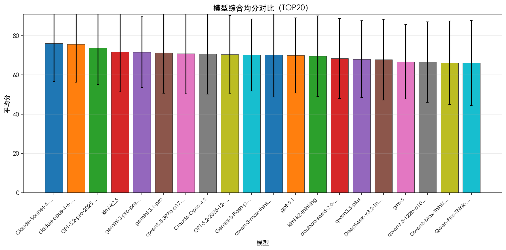
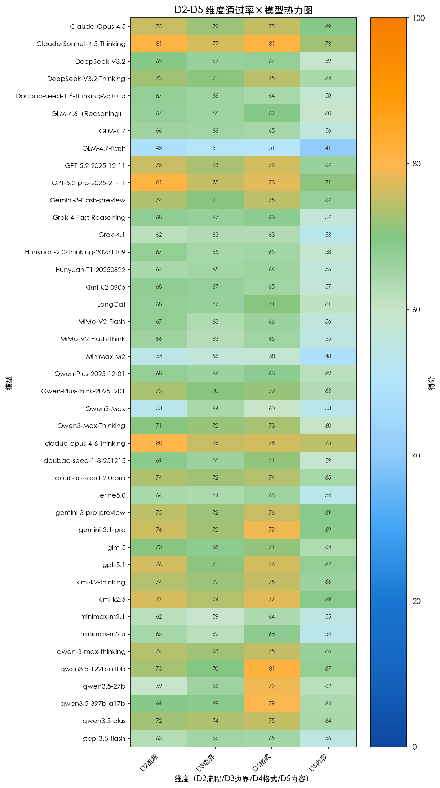
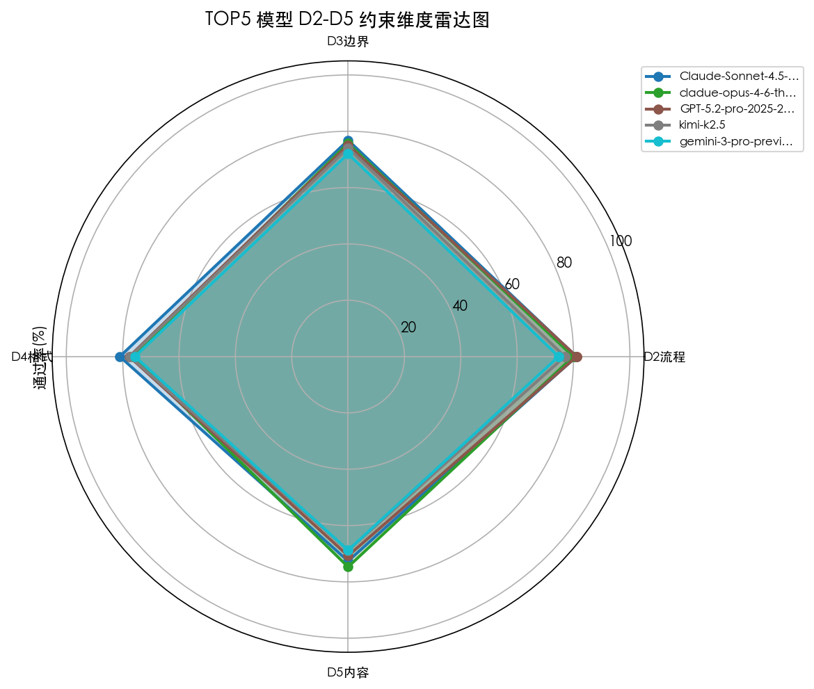
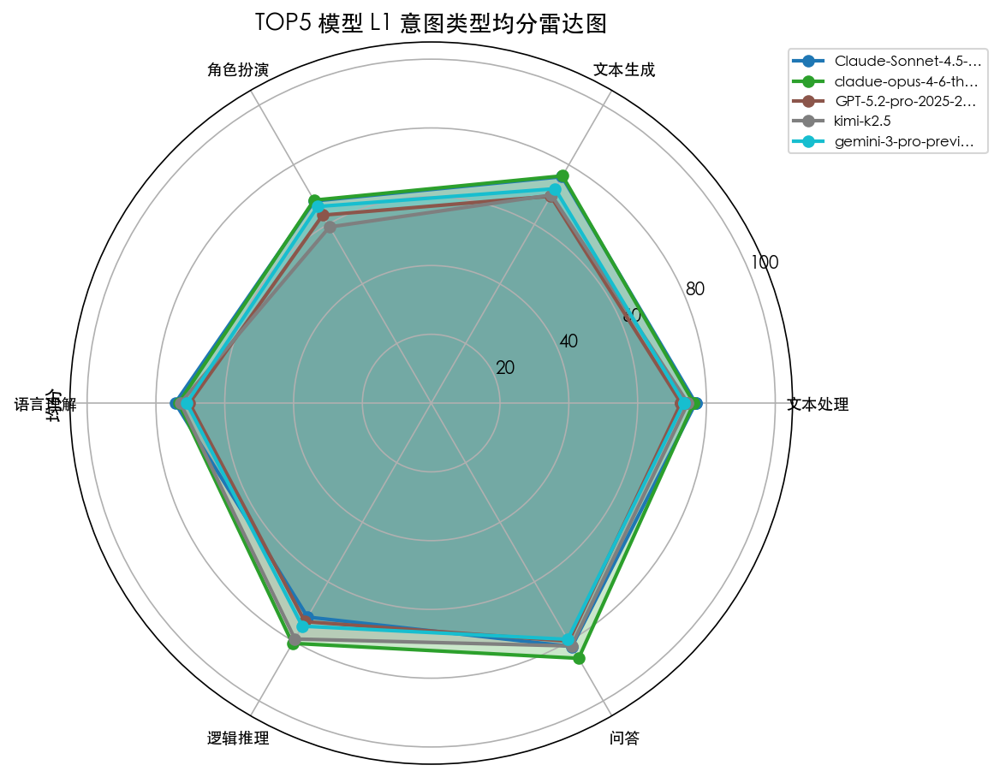
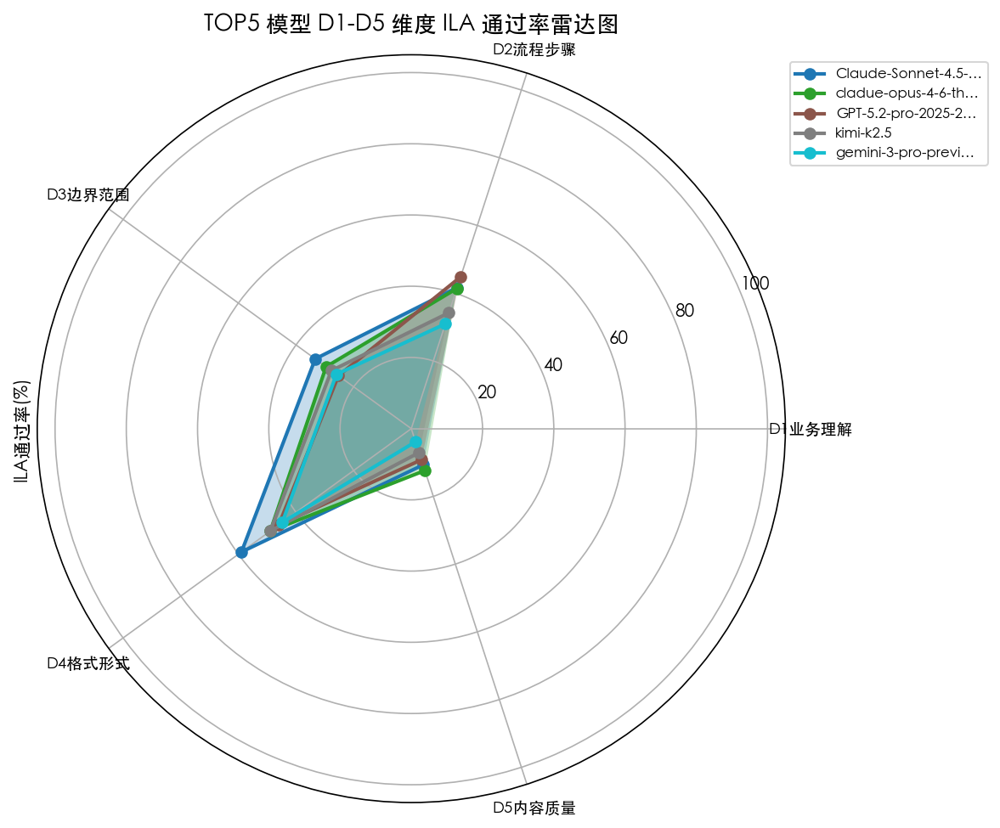
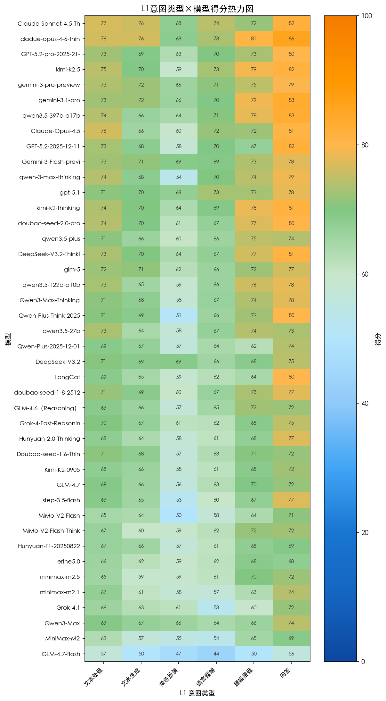
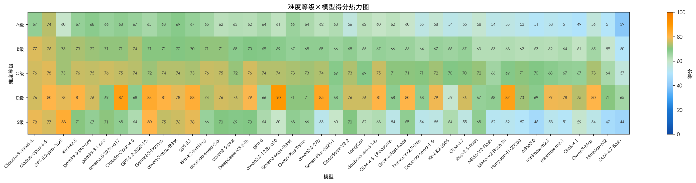
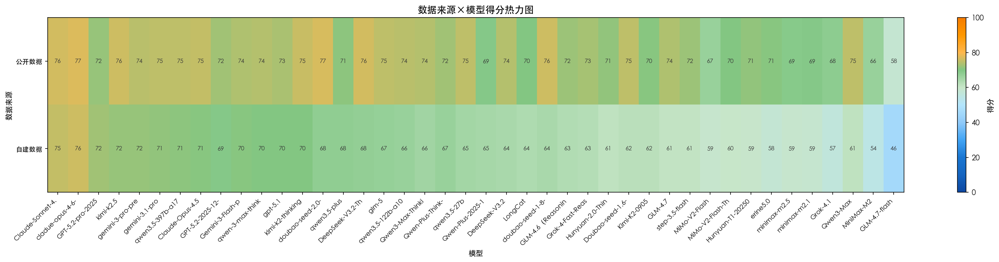
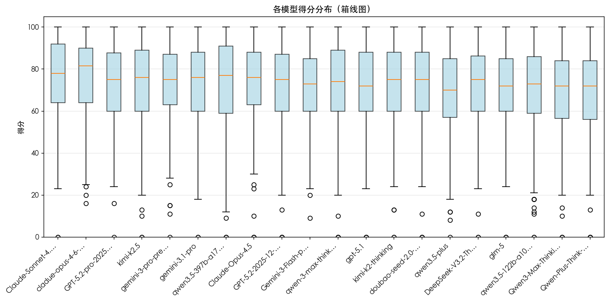
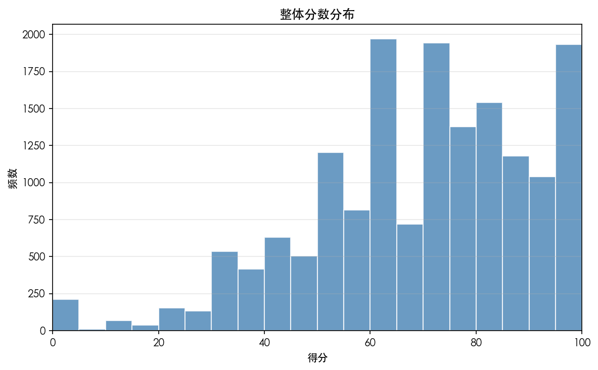

# CIF 指令遵循评测报告

> 生成时间: 2026-03-06 10:41:54  
> 评测模型: **42** 个 | 评测题目: **400** 道 | 总评测次数: **16430** | 公开: 198 题 | 自建: 202 题（纯人工: 85 | M合成: 117）


---

## 目录


1. [一、执行摘要](#一执行摘要)

2. [二、评测方法论](#二评测方法论)

3. [三、模型能力概览](#三模型能力概览)

4. [四、分维度与分意图能力洞察](#四分维度与分意图能力洞察)

5. [五、专家视角与可靠性](#五专家视角与可靠性)

6. [六、典型案例与价值题目](#六典型案例与价值题目)

7. [七、结论与建议](#七结论与建议)


---

## 一、执行摘要


**1.1 评测目的与背景**


本次评测旨在系统性评估大模型在真实复杂指令场景下的能力，通过多维度约束评测框架，打破传统基准的「分数天花板」，识别模型在语言理解、任务执行、边界遵守、格式规范等维度的差异与短板。


**1.2 评测对象与数据**


- 评测模型：42 个 | 评测题目：400 道 | 总评测次数：16430

- 公开数据题：198 题 | 自建数据题：202 题
（纯人工: 85 | M合成: 117）


- **公开 vs 纯人工自建均分差**：**16.78 分**（核心指标）


**1.3 核心结论**


- 自建题目上模型均分较公开低 16.78 分，纯人工自建更能反映真实业务难度。

- 专家纠偏后 TOP3：Claude-Sonnet-4.5-Thinking, cladue-opus-4-6-thinking, gemini-3-pro-preview。

- 整体人机排名一致性斯皮尔曼 ρ=0.79。


**1.4 主要建议**


- **选型方**：优先考虑专家纠偏排名与 L1 能力匹配，按场景选模型。

- **训练方**：强化 D2/D3/D5 等薄弱维度的训练与评测。

- **数据方**：增加高区分度自建题（H/R/HM），控制 M 合成题比例。


## 二、评测方法论


本评测采用三级分类体系：L1 指令结构、L2 约束功能、L3 约束类型。评分采用 AdvancedIF Rubrics 五维度（D1 业务理解、D2 流程步骤、D3 边界范围、D4 格式形式、D5 内容质量），按 D5=50%、D2=22%、D3=20%、D4=8% 加权聚合为主分数。数据来源包括公开基准与自建复杂指令集。专家纠偏：有专家打分的题目上以专家分替换模型自动分后重算均分。


## 三、模型能力概览


**3.1 综合排名**


_平均分=维度加权通过率（主分数），原均分(CLA)=约束通过率。_

| 排名 | 模型 | 评测数量 | 平均分 | 原均分(CLA) | 标准差 | 最高分 | 最低分 | 中位数 |
| --- | --- | --- | --- | --- | --- | --- | --- | --- |
| 1 | Claude-Sonnet-4.5-Thinking | 387 | 77.16 | 77.06 | 19.32 | 100.00 | 0.000 | 80.00 |
| 2 | cladue-opus-4-6-thinking | 400 | 76.33 | 76.95 | 19.65 | 100.00 | 8.000 | 81.03 |
| 3 | gemini-3-pro-preview | 399 | 75.42 | 75.95 | 20.35 | 100.00 | 6.000 | 79.33 |
| 4 | GPT-5.2-pro-2025-21-11 | 282 | 74.01 | 73.81 | 20.73 | 100.00 | 7.850 | 77.00 |
| 5 | Claude-Opus-4.5 | 354 | 73.97 | 74.20 | 20.44 | 100.00 | 0.000 | 77.60 |
| 6 | Gemini-3-Flash-preview | 399 | 73.71 | 74.27 | 20.71 | 100.00 | 6.670 | 77.00 |
| 7 | kimi-k2.5 | 400 | 73.65 | 73.97 | 20.92 | 100.00 | 0.000 | 77.00 |
| 8 | gemini-3.1-pro | 400 | 73.62 | 74.69 | 21.02 | 100.00 | 3.850 | 76.77 |
| 9 | doubao-seed-2.0-pro | 400 | 73.47 | 73.94 | 21.07 | 100.00 | 0.000 | 77.00 |
| 10 | qwen3.5-397b-a17b | 399 | 73.05 | 69.91 | 21.67 | 100.00 | 0.000 | 77.00 |
| 11 | DeepSeek-V3.2-Thinking | 380 | 72.78 | 73.15 | 20.37 | 100.00 | 8.000 | 76.48 |
| 12 | qwen-3-max-thinking | 400 | 72.58 | 73.04 | 21.94 | 100.00 | 0.000 | 76.77 |
| 13 | kimi-k2-thinking | 373 | 72.23 | 72.09 | 20.67 | 100.00 | 0.000 | 75.46 |
| 14 | glm-5 | 400 | 71.57 | 71.96 | 21.29 | 100.00 | 0.000 | 73.80 |
| 15 | qwen3.5-27b | 399 | 71.48 | 61.44 | 22.26 | 100.00 | 0.000 | 77.00 |


**3.1.1 数据可视化**
































**图表解读**：共 42 个模型，整体均分 69.1；ILA 9.72%；自建较公开低 16.78 分 - **角色扮演**：最佳 gemini-3-pro-preview，最差 GLM-4.7-flash，分数方差 677.98（方差越大区分度越高）


### 3.2 主分数与完全通过率


**主分数**：维度加权通过率（D5=50%, D2=22%, D3=20%, D4=8%），连续无断点。
**辅助指标**：① CLA 约束通过率（passed/total）；② ILA 完全通过率（所有检查点 PASS 的题目占比）；③ 各维度 D2/D3/D4/D5 通过率。

**各模型完全通过率**（下表仅展示前 15，完整见 Excel）：

| 模型 | 完全通过数 | 评测数 | 完全通过率(%) |
| --- | --- | --- | --- |
| Claude-Opus-4.5 | 38 | 333 | 11.41 |
| Claude-Sonnet-4.5-Thinking | 47 | 362 | 12.98 |
| DeepSeek-V3.2 | 32 | 369 | 8.670 |
| DeepSeek-V3.2-Thinking | 39 | 346 | 11.27 |
| Doubao-seed-1.6-Thinking-251015 | 36 | 353 | 10.20 |
| GLM-4.6（Reasoning） | 23 | 360 | 6.390 |
| GLM-4.7 | 42 | 365 | 11.51 |
| GLM-4.7-flash | 17 | 381 | 4.460 |
| GPT-5.2-2025-12-11 | 33 | 336 | 9.820 |
| GPT-5.2-pro-2025-21-11 | 34 | 246 | 13.82 |
| Gemini-3-Flash-preview | 39 | 365 | 10.68 |
| Grok-4-Fast-Reasoning | 34 | 381 | 8.920 |
| Grok-4.1 | 26 | 371 | 7.010 |
| Hunyuan-2.0-Thinking-20251109 | 29 | 370 | 7.840 |
| Hunyuan-T1-20250822 | 34 | 365 | 9.320 |


_全体完全通过率：1374/14129 = 9.72%_


### 3.3 维度能力摘要（D1–D5 ILA）


各维度 ILA = 该维度下全部检查点 PASS 的题目占比；上图雷达图更直观，下表供查阅（前 15）。

| 模型 | D1_ILA率(%) | D2_ILA率(%) | D3_ILA率(%) | D4_ILA率(%) | D5_ILA率(%) |
| --- | --- | --- | --- | --- | --- |
| Claude-Opus-4.5 | 100.00 | 43.54 | 36.64 | 69.37 | 21.02 |
| Claude-Sonnet-4.5-Thinking | 100.00 | 49.45 | 38.67 | 76.52 | 22.10 |
| DeepSeek-V3.2 | 100.00 | 36.04 | 32.52 | 72.36 | 15.18 |
| DeepSeek-V3.2-Thinking | 100.00 | 42.49 | 39.60 | 73.41 | 17.92 |
| Doubao-seed-1.6-Thinking-251015 | 100.00 | 41.93 | 36.83 | 67.42 | 15.86 |
| GLM-4.6（Reasoning） | 100.00 | 34.72 | 31.11 | 67.22 | 13.89 |
| GLM-4.7 | 100.00 | 36.16 | 35.07 | 68.77 | 16.44 |
| GLM-4.7-flash | 100.00 | 21.00 | 23.88 | 49.34 | 7.090 |
| GPT-5.2-2025-12-11 | 100.00 | 35.12 | 35.12 | 71.13 | 16.37 |
| GPT-5.2-pro-2025-21-11 | 0.000 | 45.12 | 39.84 | 72.76 | 22.36 |
| Gemini-3-Flash-preview | 100.00 | 43.56 | 35.07 | 74.52 | 20.27 |
| Grok-4-Fast-Reasoning | 0.000 | 34.38 | 29.40 | 70.60 | 12.60 |
| Grok-4.1 | 100.00 | 26.95 | 23.45 | 65.41 | 10.51 |
| Hunyuan-2.0-Thinking-20251109 | 100.00 | 32.70 | 29.19 | 69.46 | 13.24 |
| Hunyuan-T1-20250822 | 100.00 | 31.51 | 26.85 | 62.19 | 15.07 |


### 3.4 总体模型表现


共 42 个模型，整体均分 69.1；ILA 9.72%；自建较公开低 16.78 分


**分维度总体表现**


**D1 业务理解**：各模型 D1 业务理解 ILA 均约 73.0%，区间 0.0%–100.0%。


**D2 流程步骤**：各模型 D2 流程步骤 ILA 均约 37.9%，区间 21.0%–71.4%。该维度整体较难，易暴露模型短板。


**D3 边界范围**：各模型 D3 边界范围 ILA 均约 32.3%，区间 20.0%–39.8%。该维度整体较难，易暴露模型短板。


**D4 格式形式**：各模型 D4 格式形式 ILA 均约 68.5%，区间 49.3%–78.5%。


**D5 内容质量**：各模型 D5 内容质量 ILA 均约 15.2%，区间 0.0%–22.8%。该维度整体较难，易暴露模型短板。


## 四、分维度与分意图能力洞察


**4.1 L1 高区分度题目统计与能力总结**

按 L1 统计典型高区分度题目（区分度≥0.3），并借助统计与 LLM 分析各 L1 上的模型表现。

| L1 | 总题目数 | 高区分度题目数 | 占比(%) |
| --- | --- | --- | --- |
| 文本处理 | 174 | 77 | 44.30 |
| 语言理解 | 81 | 61 | 75.30 |
| 文本生成 | 66 | 33 | 50.00 |
| 逻辑推理 | 33 | 25 | 75.80 |
| 问答 | 30 | 11 | 36.70 |
| 角色扮演 | 15 | 7 | 46.70 |
|  | 1 | 1 | 100.00 |


**角色扮演**：(分析异常: 请求失败: 很抱歉，当前请求命中资源限制策略。)


**逻辑推理**：(分析异常: 请求失败: 很抱歉，当前请求命中资源限制策略。)


**语言理解**：(分析异常: 请求失败: 很抱歉，当前请求命中资源限制策略。)


**文本生成**：(分析异常: 请求失败: 很抱歉，当前请求命中资源限制策略。)


**文本处理**：(分析异常: 请求失败: 很抱歉，当前请求命中资源限制策略。)


**问答**：(分析异常: 请求失败: 很抱歉，当前请求命中资源限制策略。)


**4.2 意图级别分析（方差 TOP10）**


方差越大区分度越高。

| 排名 | 意图 | 题目数 | 平均分数方差 | 最佳模型 | 最差模型 | 各模型平均分 |
| --- | --- | --- | --- | --- | --- | --- |
| 1 | 角色扮演 | 15 | 677.98 | gemini-3-pro-preview | GLM-4.7-flash | gemini-3-pro-preview: 71.07, Claude-Sonnet-4.5-Thinking: 70.00, gpt-5.1: 68.33, cladue-opus-4-6-thinking: 67.13, gemini-3.1-pro: 66.40, Gemini-3-Flash-preview: 65.00, DeepSeek-V3.2: 64.67, Qwen3-Max: 64.47, qwen3.5-397b-a17b: 64.07, GPT-5.2-pro-2025-21-11: 63.40, doubao-seed-2.0-pro: 62.93, doubao-seed-1-8-251215: 60.80, DeepSeek-V3.2-Thinking: 60.64, LongCat: 58.80, erine5.0: 58.47, Grok-4.1: 58.20, qwen3.5-plus: 58.07, kimi-k2-thinking: 57.93, glm-5: 57.53, Hunyuan-2.0-Thinking-20251109: 57.47, qwen3.5-27b: 57.47, qwen3.5-122b-a10b: 56.80, Hunyuan-T1-20250822: 56.67, minimax-m2.1: 56.60, MiMo-V2-Flash-Think: 56.47, Grok-4-Fast-Reasoning: 56.07, kimi-k2.5: 55.53, Qwen3-Max-Thinking: 55.27, Doubao-seed-1.6-Thinking-251015: 55.00, Claude-Opus-4.5: 55.00, Kimi-K2-0905: 54.87, Qwen-Plus-2025-12-01: 54.53, GLM-4.7: 53.73, MiniMax-M2: 53.60, Qwen-Plus-Think-20251201: 53.50, minimax-m2.5: 53.47, GLM-4.6（Reasoning）: 50.43, GPT-5.2-2025-12-11: 50.07, step-3.5-flash: 48.47, qwen-3-max-thinking: 48.07, MiMo-V2-Flash: 47.36, GLM-4.7-flash: 46.27 |
| 2 | 逻辑推理 | 33 | 670.14 | kimi-k2.5 | GLM-4.7-flash | kimi-k2.5: 82.30, doubao-seed-2.0-pro: 79.76, gemini-3.1-pro: 79.55, qwen3.5-122b-a10b: 78.55, gemini-3-pro-preview: 78.42, kimi-k2-thinking: 78.34, cladue-opus-4-6-thinking: 78.00, GLM-4.6（Reasoning）: 77.28, qwen3.5-397b-a17b: 76.58, DeepSeek-V3.2-Thinking: 76.07, Qwen3-Max-Thinking: 75.90, GLM-4.7: 75.79, glm-5: 75.76, qwen-3-max-thinking: 75.61, GPT-5.2-pro-2025-21-11: 75.52, Gemini-3-Flash-preview: 75.21, qwen3.5-plus: 74.48, doubao-seed-1-8-251215: 73.94, gpt-5.1: 73.29, qwen3.5-27b: 73.27, Qwen-Plus-Think-20251201: 73.09, Doubao-seed-1.6-Thinking-251015: 72.15, Claude-Opus-4.5: 71.76, erine5.0: 70.33, Hunyuan-T1-20250822: 69.97, Hunyuan-2.0-Thinking-20251109: 69.36, Kimi-K2-0905: 69.25, minimax-m2.5: 68.24, GPT-5.2-2025-12-11: 67.63, Claude-Sonnet-4.5-Thinking: 67.33, step-3.5-flash: 67.21, Grok-4-Fast-Reasoning: 66.70, MiMo-V2-Flash-Think: 66.56, LongCat: 66.21, DeepSeek-V3.2: 65.21, Qwen3-Max: 63.97, minimax-m2.1: 61.97, Qwen-Plus-2025-12-01: 59.24, MiMo-V2-Flash: 58.45, MiniMax-M2: 58.30, Grok-4.1: 55.00, GLM-4.7-flash: 46.12 |
| 3 | 语言理解 | 81 | 571.16 | gemini-3-pro-preview | GLM-4.7-flash | gemini-3-pro-preview: 79.96, Gemini-3-Flash-preview: 76.14, Claude-Sonnet-4.5-Thinking: 75.96, gpt-5.1: 73.92, cladue-opus-4-6-thinking: 72.59, GPT-5.2-pro-2025-21-11: 71.67, Claude-Opus-4.5: 71.09, gemini-3.1-pro: 71.02, GPT-5.2-2025-12-11: 69.85, kimi-k2.5: 69.66, qwen3.5-397b-a17b: 68.89, doubao-seed-2.0-pro: 68.54, qwen-3-max-thinking: 68.08, kimi-k2-thinking: 67.91, doubao-seed-1-8-251215: 67.70, glm-5: 67.58, qwen3.5-plus: 67.50, DeepSeek-V3.2-Thinking: 66.87, qwen3.5-27b: 66.16, DeepSeek-V3.2: 65.41, qwen3.5-122b-a10b: 65.32, Qwen3-Max-Thinking: 64.43, Qwen-Plus-2025-12-01: 64.33, Qwen-Plus-Think-20251201: 64.33, GLM-4.6（Reasoning）: 64.20, GLM-4.7: 63.98, Doubao-seed-1.6-Thinking-251015: 63.62, Kimi-K2-0905: 62.55, Hunyuan-T1-20250822: 62.04, erine5.0: 61.60, MiMo-V2-Flash-Think: 61.22, LongCat: 61.00, Qwen3-Max: 60.38, minimax-m2.5: 60.27, step-3.5-flash: 59.90, Hunyuan-2.0-Thinking-20251109: 59.35, Grok-4-Fast-Reasoning: 59.21, MiMo-V2-Flash: 56.58, minimax-m2.1: 54.30, Grok-4.1: 51.63, MiniMax-M2: 47.61, GLM-4.7-flash: 43.91 |
| 4 | 文本生成 | 66 | 470.25 | Claude-Sonnet-4.5-Thinking | GLM-4.7-flash | Claude-Sonnet-4.5-Thinking: 76.35, cladue-opus-4-6-thinking: 74.40, gpt-5.1: 70.99, gemini-3-pro-preview: 70.77, glm-5: 70.70, gemini-3.1-pro: 70.69, GPT-5.2-pro-2025-21-11: 70.34, doubao-seed-2.0-pro: 69.97, kimi-k2.5: 69.58, qwen3.5-397b-a17b: 69.56, Qwen-Plus-Think-20251201: 69.45, kimi-k2-thinking: 69.42, Qwen-Plus-2025-12-01: 68.90, Qwen3-Max-Thinking: 68.74, Gemini-3-Flash-preview: 68.56, qwen3.5-27b: 68.55, DeepSeek-V3.2-Thinking: 68.32, doubao-seed-1-8-251215: 68.31, Doubao-seed-1.6-Thinking-251015: 68.20, qwen-3-max-thinking: 67.92, GPT-5.2-2025-12-11: 67.45, Claude-Opus-4.5: 67.39, DeepSeek-V3.2: 67.20, Kimi-K2-0905: 67.01, qwen3.5-122b-a10b: 66.92, Qwen3-Max: 66.53, qwen3.5-plus: 65.40, LongCat: 65.38, Grok-4-Fast-Reasoning: 65.31, Hunyuan-T1-20250822: 64.77, step-3.5-flash: 64.65, Hunyuan-2.0-Thinking-20251109: 63.89, GLM-4.7: 63.48, Grok-4.1: 63.06, MiMo-V2-Flash: 63.00, GLM-4.6（Reasoning）: 61.81, erine5.0: 61.62, minimax-m2.1: 60.29, MiMo-V2-Flash-Think: 60.26, minimax-m2.5: 57.49, MiniMax-M2: 54.39, GLM-4.7-flash: 48.66 |
| 5 | 文本处理 | 174 | 448.57 | Claude-Sonnet-4.5-Thinking | GLM-4.7-flash | Claude-Sonnet-4.5-Thinking: 78.36, Claude-Opus-4.5: 76.09, cladue-opus-4-6-thinking: 75.60, DeepSeek-V3.2-Thinking: 75.40, doubao-seed-2.0-pro: 74.61, qwen3.5-27b: 74.48, qwen-3-max-thinking: 74.43, qwen3.5-397b-a17b: 74.41, Doubao-seed-1.6-Thinking-251015: 73.92, GPT-5.2-pro-2025-21-11: 73.71, kimi-k2-thinking: 73.62, kimi-k2.5: 73.39, glm-5: 73.24, qwen3.5-122b-a10b: 73.05, gemini-3.1-pro: 72.65, doubao-seed-1-8-251215: 72.62, Qwen3-Max-Thinking: 72.17, gemini-3-pro-preview: 72.13, Gemini-3-Flash-preview: 72.04, GLM-4.6（Reasoning）: 71.93, DeepSeek-V3.2: 71.87, qwen3.5-plus: 71.70, GLM-4.7: 71.51, GPT-5.2-2025-12-11: 71.24, Qwen-Plus-Think-20251201: 70.68, LongCat: 70.60, Grok-4-Fast-Reasoning: 69.37, step-3.5-flash: 69.03, gpt-5.1: 68.64, Hunyuan-2.0-Thinking-20251109: 68.34, Qwen-Plus-2025-12-01: 67.84, Hunyuan-T1-20250822: 67.83, MiMo-V2-Flash-Think: 67.47, Qwen3-Max: 67.38, Kimi-K2-0905: 67.23, minimax-m2.1: 66.92, erine5.0: 66.76, Grok-4.1: 65.63, MiMo-V2-Flash: 64.74, minimax-m2.5: 64.72, MiniMax-M2: 62.70, GLM-4.7-flash: 58.46 |
| 6 | 问答 | 30 | 317.45 | cladue-opus-4-6-thinking | GLM-4.7-flash | cladue-opus-4-6-thinking: 86.23, GPT-5.2-2025-12-11: 83.00, qwen3.5-397b-a17b: 82.77, gemini-3.1-pro: 82.58, Claude-Sonnet-4.5-Thinking: 81.44, Claude-Opus-4.5: 81.31, GPT-5.2-pro-2025-21-11: 80.95, kimi-k2-thinking: 80.88, DeepSeek-V3.2-Thinking: 80.69, kimi-k2.5: 79.89, doubao-seed-2.0-pro: 79.81, gemini-3-pro-preview: 79.76, qwen3.5-122b-a10b: 79.67, qwen3.5-27b: 79.37, qwen-3-max-thinking: 78.68, doubao-seed-1-8-251215: 78.64, Qwen-Plus-Think-20251201: 78.51, gpt-5.1: 78.39, LongCat: 77.98, Gemini-3-Flash-preview: 77.87, Hunyuan-2.0-Thinking-20251109: 77.29, step-3.5-flash: 76.98, Qwen3-Max-Thinking: 76.75, glm-5: 76.68, qwen3.5-plus: 76.28, Grok-4-Fast-Reasoning: 76.04, Qwen3-Max: 75.84, minimax-m2.1: 74.46, MiMo-V2-Flash-Think: 73.85, DeepSeek-V3.2: 73.76, Grok-4.1: 72.89, Qwen-Plus-2025-12-01: 72.77, Kimi-K2-0905: 72.68, GLM-4.6（Reasoning）: 72.18, MiMo-V2-Flash: 71.48, minimax-m2.5: 71.13, GLM-4.7: 71.02, Doubao-seed-1.6-Thinking-251015: 70.15, Hunyuan-T1-20250822: 69.24, MiniMax-M2: 68.88, erine5.0: 68.81, GLM-4.7-flash: 56.29 |


## 五、专家视角与可靠性


**5.1 专家纠偏排名**（前 15，完整见 Excel）


| 排名 | 模型 | 纠偏后均分 | 原始均分 | 差异 | 专家题目数 | 总题目数 | 专家覆盖率 | 原始排名 | 排名变化 |
| --- | --- | --- | --- | --- | --- | --- | --- | --- | --- |
| 1 | Claude-Sonnet-4.5-Thinking | 77.05 | 77.16 | -0.110 | 38 | 387 | 38/387 (9.8%) | 1 | 0 |
| 2 | cladue-opus-4-6-thinking | 76.33 | 76.33 | -0.000 | 0 | 400 | 0/400 (0.0%) | 2 | 0 |
| 3 | gemini-3-pro-preview | 75.14 | 75.42 | -0.280 | 42 | 399 | 42/399 (10.5%) | 3 | 0 |
| 4 | GPT-5.2-pro-2025-21-11 | 74.88 | 74.01 | 0.870 | 25 | 282 | 25/282 (8.9%) | 4 | 0 |
| 5 | Claude-Opus-4.5 | 73.96 | 73.97 | -0.010 | 37 | 354 | 37/354 (10.5%) | 5 | 0 |
| 6 | kimi-k2.5 | 73.89 | 73.65 | 0.240 | 41 | 400 | 41/400 (10.2%) | 7 | 1 |
| 7 | gemini-3.1-pro | 73.62 | 73.62 | -0.000 | 0 | 400 | 0/400 (0.0%) | 8 | 1 |
| 8 | Gemini-3-Flash-preview | 73.58 | 73.71 | -0.130 | 37 | 399 | 37/399 (9.3%) | 6 | -2 |
| 9 | doubao-seed-2.0-pro | 73.47 | 73.47 | -0.000 | 0 | 400 | 0/400 (0.0%) | 9 | 0 |
| 10 | qwen3.5-397b-a17b | 73.05 | 73.05 | 0.000 | 0 | 399 | 0/399 (0.0%) | 10 | 0 |
| 11 | DeepSeek-V3.2-Thinking | 73.02 | 72.78 | 0.240 | 34 | 380 | 34/380 (8.9%) | 11 | 0 |
| 12 | qwen-3-max-thinking | 72.51 | 72.58 | -0.070 | 40 | 400 | 40/400 (10.0%) | 12 | 0 |
| 13 | kimi-k2-thinking | 72.31 | 72.23 | 0.080 | 35 | 373 | 35/373 (9.4%) | 13 | 0 |
| 14 | gpt-5.1 | 71.77 | 71.39 | 0.380 | 40 | 389 | 40/389 (10.3%) | 16 | 2 |
| 15 | glm-5 | 71.57 | 71.57 | -0.000 | 0 | 400 | 0/400 (0.0%) | 14 | -1 |


**5.2 专家评测题目榜单**


仅统计**有专家打分**的题目×模型，按专家均分排名（前 10）。

| 排名 | 模型 | 专家题数量 | 专家均分 | 专家标准差 | 最高分 | 最低分 | 模型均分(专家题上) |
| --- | --- | --- | --- | --- | --- | --- | --- |
| 1 | GPT-5.2-pro-2025-21-11 | 25 | 86.40 | 15.91 | 100.00 | 50.00 | 76.58 |
| 2 | Gemini-3-Flash-preview | 37 | 77.16 | 23.43 | 100.00 | 19.00 | 78.56 |
| 3 | GLM-4.7 | 26 | 77.15 | 25.25 | 100.00 | 23.00 | 76.11 |
| 4 | kimi-k2.5 | 41 | 75.44 | 22.57 | 100.00 | 20.00 | 73.07 |
| 5 | gemini-3-pro-preview | 42 | 73.29 | 25.53 | 100.00 | 0.000 | 75.95 |
| 6 | GPT-5.2-2025-12-11 | 34 | 71.97 | 26.90 | 100.00 | 0.000 | 72.45 |
| 7 | gpt-5.1 | 40 | 71.83 | 22.81 | 100.00 | 10.00 | 68.11 |
| 8 | Claude-Sonnet-4.5-Thinking | 38 | 71.61 | 27.97 | 100.00 | 0.000 | 72.76 |
| 9 | Qwen-Plus-Think-20251201 | 32 | 70.53 | 27.86 | 100.00 | 0.000 | 63.72 |
| 10 | Qwen3-Max-Thinking | 40 | 69.58 | 25.97 | 100.00 | 15.00 | 65.55 |


**5.3 人机一致性**


- **皮尔逊_r**：0.800 _（线性相关，0~1 越高越一致，看趋势吻合度）_

- **斯皮尔曼_ρ**：0.788 _（排名相关，-1~1 越高越一致）_

- **ICC(2,1)**：0.792 _（绝对一致性）_

- **MAE**：12.820 _（平均绝对误差，越小越好）_

- **RMSE**：18.880 _（均方根误差）_

- **归一化MAE**：0.128 _（相对误差 0~1 越小越好）_

- **样本量**：1125 | **题目数**：49 | **模型数**：32


按模型统计其打分与专家打分的一致性（皮尔逊、准确率、容差准确率、ICC、MAE等），排名靠前表示与专家越一致。

| 与专家一致性排名 | 模型 | 样本量 | 皮尔逊_r | 斯皮尔曼_ρ | ICC(2,1) | 准确率(%) | 容差准确率_±0.5分(%) | MAE | 归一化MAE | 模型均分 | 专家均分 | 均分差 |
| --- | --- | --- | --- | --- | --- | --- | --- | --- | --- | --- | --- | --- |
| 1 | LongCat | 35 | 0.889 | 0.896 | 0.876 | 20.00 | 20.00 | 10.97 | 0.110 | 59.54 | 57.49 | 2.060 |
| 2 | GLM-4.7-flash | 35 | 0.832 | 0.850 | 0.833 | 28.60 | 28.60 | 12.63 | 0.126 | 40.37 | 41.91 | -1.540 |
| 3 | minimax-m2.1 | 33 | 0.843 | 0.845 | 0.825 | 9.100 | 9.100 | 14.64 | 0.146 | 48.94 | 53.27 | -4.330 |
| 4 | DeepSeek-V3.2 | 35 | 0.856 | 0.843 | 0.839 | 11.40 | 11.40 | 10.23 | 0.102 | 58.46 | 62.23 | -3.770 |
| 5 | Qwen-Plus-2025-12-01 | 34 | 0.836 | 0.838 | 0.813 | 14.70 | 14.70 | 13.94 | 0.139 | 61.62 | 58.62 | 3.000 |
| 6 | MiMo-V2-Flash | 33 | 0.816 | 0.827 | 0.794 | 12.10 | 12.10 | 12.42 | 0.124 | 52.61 | 48.73 | 3.880 |
| 7 | erine5.0 | 33 | 0.858 | 0.823 | 0.857 | 24.20 | 24.20 | 11.27 | 0.113 | 58.70 | 58.39 | 0.300 |
| 8 | doubao-seed-1-8-251215 | 34 | 0.795 | 0.814 | 0.782 | 17.60 | 17.60 | 11.82 | 0.123 | 66.85 | 67.26 | -0.410 |
| 9 | Hunyuan-T1-20250822 | 33 | 0.812 | 0.812 | 0.814 | 27.30 | 27.30 | 11.27 | 0.113 | 61.82 | 62.67 | -0.850 |
| 10 | Claude-Sonnet-4.5-Thinking | 38 | 0.823 | 0.807 | 0.821 | 21.10 | 21.10 | 10.87 | 0.109 | 69.79 | 71.61 | -1.820 |
| 11 | gemini-3-pro-preview | 42 | 0.803 | 0.799 | 0.790 | 19.00 | 19.00 | 10.88 | 0.109 | 75.26 | 73.29 | 1.980 |
| 12 | kimi-k2.5 | 41 | 0.808 | 0.793 | 0.789 | 24.40 | 24.40 | 9.220 | 0.092 | 70.37 | 75.44 | -5.070 |
| 13 | Grok-4-Fast-Reasoning | 36 | 0.817 | 0.789 | 0.800 | 16.70 | 16.70 | 12.58 | 0.126 | 56.39 | 60.97 | -4.580 |
| 14 | Qwen-Plus-Think-20251201 | 32 | 0.803 | 0.784 | 0.779 | 12.50 | 12.50 | 11.81 | 0.118 | 63.97 | 70.53 | -6.560 |
| 15 | Kimi-K2-0905 | 34 | 0.799 | 0.779 | 0.796 | 26.50 | 26.50 | 12.85 | 0.129 | 54.94 | 57.62 | -2.680 |
| 16 | GLM-4.6（Reasoning） | 34 | 0.797 | 0.776 | 0.788 | 14.70 | 14.70 | 12.94 | 0.129 | 61.53 | 62.82 | -1.290 |
| 17 | Doubao-seed-1.6-Thinking-251015 | 35 | 0.809 | 0.768 | 0.798 | 14.30 | 14.30 | 11.74 | 0.117 | 62.29 | 66.71 | -4.430 |
| 18 | Qwen3-Max | 36 | 0.812 | 0.760 | 0.793 | 19.40 | 19.40 | 13.78 | 0.138 | 49.06 | 44.78 | 4.280 |
| 19 | GPT-5.2-2025-12-11 | 34 | 0.812 | 0.732 | 0.814 | 23.50 | 23.50 | 10.59 | 0.106 | 70.50 | 71.97 | -1.470 |
| 20 | kimi-k2-thinking | 35 | 0.773 | 0.727 | 0.775 | 11.40 | 11.40 | 13.80 | 0.138 | 63.71 | 65.57 | -1.860 |
| 21 | DeepSeek-V3.2-Thinking | 34 | 0.772 | 0.718 | 0.765 | 14.70 | 14.70 | 12.00 | 0.132 | 63.71 | 68.06 | -4.350 |
| 22 | Qwen3-Max-Thinking | 40 | 0.728 | 0.715 | 0.712 | 15.00 | 15.00 | 15.53 | 0.162 | 63.30 | 69.58 | -6.280 |
| 23 | GLM-4.7 | 26 | 0.703 | 0.710 | 0.705 | 19.20 | 19.20 | 13.58 | 0.154 | 74.04 | 77.15 | -3.120 |
| 24 | GPT-5.2-pro-2025-21-11 | 25 | 0.623 | 0.710 | 0.519 | 28.00 | 28.00 | 12.32 | 0.202 | 75.52 | 86.40 | -10.88 |
| 25 | MiMo-V2-Flash-Think | 34 | 0.754 | 0.707 | 0.731 | 11.80 | 11.80 | 15.97 | 0.160 | 57.06 | 59.79 | -2.740 |
| 26 | MiniMax-M2 | 37 | 0.698 | 0.696 | 0.695 | 21.60 | 21.60 | 16.19 | 0.162 | 41.92 | 43.14 | -1.220 |
| 27 | qwen-3-max-thinking | 40 | 0.714 | 0.690 | 0.699 | 12.50 | 12.50 | 16.18 | 0.162 | 67.00 | 66.42 | 0.580 |
| 28 | gpt-5.1 | 40 | 0.726 | 0.688 | 0.722 | 20.00 | 20.00 | 10.60 | 0.118 | 68.78 | 71.83 | -3.050 |
| 29 | Claude-Opus-4.5 | 37 | 0.662 | 0.665 | 0.652 | 13.50 | 13.50 | 14.41 | 0.144 | 62.00 | 63.49 | -1.490 |
| 30 | Hunyuan-2.0-Thinking-20251109 | 34 | 0.668 | 0.650 | 0.657 | 17.60 | 17.60 | 15.62 | 0.156 | 58.06 | 55.62 | 2.440 |
| 31 | Grok-4.1 | 39 | 0.721 | 0.630 | 0.706 | 12.80 | 12.80 | 15.08 | 0.151 | 43.10 | 42.64 | 0.460 |
| 32 | Gemini-3-Flash-preview | 37 | 0.659 | 0.611 | 0.663 | 21.60 | 21.60 | 12.51 | 0.154 | 76.00 | 77.16 | -1.160 |


| 分析维度 | 模型数量 | 排名一致性_斯皮尔曼 | 完全一致模型数 | 完全一致比例 | 平均绝对偏差 | 最大偏差 |
| --- | --- | --- | --- | --- | --- | --- |
| 整体排名 | 32 | 0.964 | 2 | 0.062 | 2.060 | 5 |


## 六、典型案例与价值题目


**6.1 价值题目 TOP20**


- **第三梯队**：Claude-Sonnet-4.5-Thinking（77.2 分）, cladue-opus-4-6-thinking（76.3 分）, gemini-3-pro-preview（75.4 分）, GPT-5.2-pro-2025-21-11（74.0 分）, Claude-Opus-4.5（74.0 分）, Gemini-3-Flash-preview（73.7 分）, kimi-k2.5（73.7 分）, gemini-3.1-pro（73.6 分）, doubao-seed-2.0-pro（73.5 分）, qwen3.5-397b-a17b（73.0 分）, DeepSeek-V3.2-Thinking（72.8 分）, qwen-3-max-thinking（72.6 分）, kimi-k2-thinking（72.2 分）, glm-5（71.6 分）, qwen3.5-27b（71.5 分）, gpt-5.1（71.4 分）, doubao-seed-1-8-251215（71.2 分）, Qwen3-Max-Thinking（71.0 分）, qwen3.5-122b-a10b（71.0 分）, GPT-5.2-2025-12-11（70.7 分）, qwen3.5-plus（70.4 分）, Qwen-Plus-Think-20251201（70.0 分）

- **第四梯队**：DeepSeek-V3.2（69.9 分）, Doubao-seed-1.6-Thinking-251015（69.8 分）, GLM-4.6（Reasoning）（68.9 分）, GLM-4.7（68.8 分）, LongCat（68.4 分）, Grok-4-Fast-Reasoning（67.1 分）, Kimi-K2-0905（67.0 分）, Hunyuan-2.0-Thinking-20251109（66.8 分）, Qwen-Plus-2025-12-01（66.5 分）, step-3.5-flash（66.4 分）, erine5.0（66.0 分）, Hunyuan-T1-20250822（65.6 分）, Qwen3-Max（65.2 分）, MiMo-V2-Flash-Think（64.6 分）, minimax-m2.1（63.7 分）, MiMo-V2-Flash（63.2 分）, minimax-m2.5（62.9 分）, Grok-4.1（62.5 分）, MiniMax-M2（57.7 分）, GLM-4.7-flash（51.7 分）


| 排名 | qid | L1 | L2 | 数据来源 | 预设难度 | 模型均分 | 区分度_D值 | 综合价值分 | 最佳模型 | 最差模型 |
| --- | --- | --- | --- | --- | --- | --- | --- | --- | --- | --- |
| 1 | 329 | 语言理解 | 高阶语言理解 | M | B级 | 59.86 | 0.964 | 0.724 | Gemini-3-Flash-preview | Doubao-seed-1.6-Thinking-251015 |
| 2 | 399 | 文本处理 | 分类标记 | HM | A级 | 24.88 | 0.664 | 0.700 | kimi-k2.5 | GLM-4.6（Reasoning） |
| 3 | 119 | 角色扮演 | 通用角色扮演 | nlp_cif | C级 | 28.69 | 0.819 | 0.688 | Grok-4.1 | Claude-Opus-4.5 |
| 4 | 213 | 文本生成 | 数据合成 | R | B级 | 19.27 | 0.604 | 0.656 | Claude-Sonnet-4.5-Thinking | DeepSeek-V3.2 |
| 5 | 398 | 语言理解 | 基础语言理解 | HM | A级 | 52.16 | 0.743 | 0.611 | Gemini-3-Flash-preview | GLM-4.7 |
| 6 | 104 | 语言理解 | 高阶语言理解 | nlp_cif | B级 | 36.21 | 0.717 | 0.598 | GPT-5.2-2025-12-11 | Gemini-3-Flash-preview |
| 7 | 199 | 语言理解 | 基础语言理解 | H | A级 | 52.79 | 0.698 | 0.596 | GPT-5.2-2025-12-11 | LongCat |
| 8 | 156 | 文本处理 | 信息结构化 | nlp_cif | B级 | 43.57 | 0.744 | 0.590 | GLM-4.7 | Hunyuan-2.0-Thinking-20251109 |

_（完整价值题目 TOP20 见 Excel 分析报告）_


**6.2 典型案例**


### 案例 1: Q399


- **L1**: 文本处理 | **L3**: 评估打分 | **难度**: A级 / 61.00分 | **分数范围**: 100.0

#### 题目内容


> 你是指令检测大师，根据指令在各种约束类型上的表现和实现难度。你非常清楚地知道什么样的指令模型可以完成到什么程度。你能有针对性地对一个指令的不同要求进行回复质量的预测，从而有针对性地评估回复内容。

指令知识体系：
一、指令结构
主任务：概括核心任务，通过关键词句明确做什么。会在主任务中定义抽象理想的目标，文风体裁等比较宏大方向的要求。
规则教学：可能存在部分用户自定义的规则体系，分类等完成主任务操作强相关，必须了解的知识体系。
知识背景：解析任务输入材料，进行深入分析需要的背景知识，主要是文化背景，作用类似典故引用，或用作后续的参考索引来源。
任务逻辑：具体个性化的任务执行步骤，通过单点堆积、...


#### 模型分档表现


- **本题最佳**：kimi-k2.5（100.0 分）

- **第三档（低分）**：GLM-4.7、GLM-4.7-flash、GPT-5.2-2025-12-11、Grok-4-Fast-Reasoning、Grok-4.1、Hunyuan-2.0-Thinking-20251109、Kimi-K2-0905、LongCat…


#### 本题目各模型维度表现（D2/D3/D4/D5 通过情况）


```
- Qwen3-Max: 流程步骤:0/5 | 边界范围:0/6 | 格式形式:0/2 | 内容质量:0/9
- qwen3.5-122b-a10b: 流程步骤:2/5 | 边界范围:0/6 | 格式形式:2/2 | 内容质量:3/9
- qwen3.5-plus: 流程步骤:1/5 | 边界范围:1/6 | 格式形式:2/2 | 内容质量:3/9
- Claude-Opus-4.5: 流程步骤:5/5 | 边界范围:5/6 | 格式形式:2/2 | 内容质量:7/9
- Claude-Sonnet-4.5-Thinking: 流程步骤:1/5 | 边界范围:0/6 | 格式形式:2/2 | 内容质量:3/9
- DeepSeek-V3.2: 流程步骤:1/5 | 边界范围:0/6 | 格式形式:1/2 | 内容质量:0/9
- DeepSeek-V3.2-Thinking: 流程步骤:0/5 | 边界范围:0/6 | 格式形式:2/2 | 内容质量:0/9
- Doubao-seed-1.6-Thinking-251015: 流程步骤:2/5 | 边界范围:2/6 | 格式形式:2/2 | 内容质量:3/9
- GLM-4.6（Reasoning）: 流程步骤:0/5 | 边界范围:0/6 | 格式形式:0/2 | 内容质量:0/9
- GLM-4.7: 流程步骤:0/5 | 边界范围:0/6 | 格式形式:0/2 | 内容质量:0/9
- GLM-4.7-flash: 流程步骤:0/5 | 边界范围:0/6 | 格式形式:0/2 | 内容质量:0/9
- GPT-5.2-2025-12-11: 流程步骤:0/5 | 边界范围:0/6 | 格式形式:0/2 | 内容质量:0/9
- Gemini-3-Flash-preview: 流程步骤:5/5 | 边界范围:5/6 | 格式形式:2/2 | 内容质量:9/9
- Grok-4-Fast-Reasoning: 流程步骤:0/5 | 边界范围:0/6 | 格式形式:0/2 | 内容质量:0/9
- Grok-4.1: 流程步骤:0/5 | 边界范围:0/6 | 格式形式:0/2 | 内容质量:0/9
- Hunyuan-2.0-Thinking-20251109: 流程步骤:0/5 | 边界范围:0/6 | 格式形式:0/2 | 内容质量:0/9
- Hunyuan-T1-20250822: 流程步骤:1/5 | 边界范围:0/6 | 格式形式:1/2 | 内容质量:0/9
- Kimi-K2-0905: 流程步骤:0/5 | 边界范围:0/6 | 格式形式:0/2 | 内容质量:0/9
- LongCat: 流程步骤:0/5 | 边界范围:0/6 | 格式形式:0/2 | 内容质量:0/9
- MiMo-V2-Flash: 流程步骤:1/5 | 边界范围:0/6 | 格式形式:1/2 | 内容质量:0/9
- MiMo-V2-Flash-Think: 流程步骤:1/5 | 边界范围:2/6 | 格式形式:2/2 | 内容质量:4/9
- MiniMax-M2: 流程步骤:1/5 | 边界范围:0/6 | 格式形式:0/2 | 内容质量:1/9
- Qwen-Plus-2025-12-01: 流程步骤:1/5 | 边界范围:0/6 | 格式形式:2/2 | 内容质量:2/9
- Qwen-Plus-Think-20251201: 流程步骤:0/5 | 边界范围:0/6 | 格式形式:0/2 | 内容质量:0/9
- Qwen3-Max-Thinking: 流程步骤:2/5 | 边界范围:0/6 | 格式形式:2/2 | 内容质量:0/9
- cladue-opus-4-6-thinking: 流程步骤:4/5 | 边界范围:4/6 | 格式形式:2/2 | 内容质量:6/9
- doubao-seed-1-8-251215: 流程步骤:1/5 | 边界范围:0/6 | 格式形式:2/2 | 内容质量:3/9
- doubao-seed-2.0-pro: 流程步骤:1/5 | 边界范围:0/6 | 格式形式:1/2 | 内容质量:0/9
- erine5.0: 流程步骤:0/5 | 边界范围:0/6 | 格式形式:0/2 | 内容质量:0/9
- gemini-3-pro-preview: 流程步骤:2/5 | 边界范围:0/6 | 格式形式:2/2 | 内容质量:3/9
- gemini-3.1-pro: 流程步骤:1/5 | 边界范围:2/6 | 格式形式:2/2 | 内容质量:3/9
- glm-5: 流程步骤:1/5 | 边界范围:2/6 | 格式形式:2/2 | 内容质量:3/9
- gpt-5.1: 流程步骤:2/5 | 边界范围:2/6 | 格式形式:2/2 | 内容质量:4/9
- kimi-k2-thinking: 流程步骤:0/5 | 边界范围:0/6 | 格式形式:0/2 | 内容质量:0/9
- kimi-k2.5: 流程步骤:5/5 | 边界范围:6/6 | 格式形式:2/2 | 内容质量:9/9
- minimax-m2.1: 流程步骤:0/5 | 边界范围:0/6 | 格式形式:0/2 | 内容质量:0/9
- minimax-m2.5: 流程步骤:0/5 | 边界范围:0/6 | 格式形式:0/2 | 内容质量:0/9
- step-3.5-flash: 流程步骤:0/5 | 边界范围:0/6 | 格式形式:0/2 | 内容质量:1/9
```


#### 专家意见


搞错分析对象，只做标记不做分析，指令要求只理解了最粗浅的部分。 | 元指令分析对，但是对复杂度的理解不是很到位。 | 完全不用这么复杂呀，这个主要任务和分析对象都正确了。同学打分62.9分，但是整个指令的核心完成度非常高，理解了嵌套，搞正确了分析对象，标记大方向都正确，至少80分以上呀。 | 理解了核心任务，标记形式大部分正确，但是不应该执行这个分析对象，构造了素材不对。 | C3 多处解析错误导致后续约束类型等判断错误； 0 0.00
C4 解析错误，规则教学属于材料里面的，不属于指令结构；且结构分类错误； 0 0.00
C5 多处标记错误；缺少条件判断等类型； 0 0.00
C6 存在后面有2个约束类型标记的情况； 2 1.51
C7 前面约束类型标记错误，导致个数统计错误，分数存在偏差； 5 9.41


43分

——分析对象错，执行了多个任务。 | 分析对象正确，大致的标记正确，但是整个标记逻辑非常混乱。形式格式乱。可以再看下上面类似情况，对比打分。
比claude4.5的情况混乱，但是没有执行不该执行的素材构造。利弊参半，可以均分。 | 1.C1应该为0分，未按照四个字母进行相应行动；
2.C2应该为0分，未按照行动方位和钟表点位表示；
3.C3应该为0分，未根据当前情景去行进方向
4.C4应该为0分，未分析马里奥接下来的行动和生命财富状态；
5.C5应该为0分，未按照输出格式进行输出

——分析错对象，完全忽略素材构造指令了，不合理。 形式遵循一部分

同学判断打分为0分的理由不到位。 | 分析对象错误并且完全搞错标记形式 | 1.C5应该为0分，未按照输出格式进行输出

同学的校准分是：79.34

——同学没有理解指令的任务，不理解嵌套指令，这个应该是区分度最大的题，这个输出材料构造的都应该是0分，不是单纯格式问题 | 部分微瑕疵，马里奥输出不应该标记。其他认识都很完美，可以算比参考答案优秀的答案。 | 输出格式更好，理解复杂度标记计算的核心逻辑，但是嵌套指令识别错误。

完全忽略材料指令。
 | 分析错误对象 | 分析对象错误 | 分析错对象 | 理解核心要做复杂度，但是分析对象存在拼接情况，逻辑问题非常严重。 | 分析对象错误并且执行了两个任务，完全没有边界感 | 3层指令都执行了，每个部分都不是很到位。 | 合理核心任务，执行最外层，输出不至于0分。 | 这个对整个复杂度标记的判断没有逻辑，拆分也不合理，只理解了要做复杂判断和标记。 | 分析对象搞错 | 搞错分析对象，并且标记形式非常粗糙，不符合基本形式。 | 前面都对的，结果分析标记的时候又混入马里奥约束了。只做对一半 | C1未对输入的指令进行结构解析，得分0分
C2未严格按照指令结构类型的定义来判断输入指令各个部分的性质，根据性质来确定元素类型，得分0分
C3未在原始指令中用【】在对应结构前面标记出来，得分0分
C4未在不同的结构之间换行，换行之间用“------”分隔开，得分0分 | 开头的嵌套分析是合理的，但是还是忽略了素材构造指令本身。不理解这一中间层嵌套在整个指令中的作用。属于分析错对象。 | 这个理解了要评估的核心这里指令，嵌套指令理解正确，但是输出格式和素材理解错误，标记错误。 | 分析错误对象，标记形式混乱。 | 完全忍住没有标记马里奥，复杂度合理。形式标记基本正确。 | 执行了马里奥，完全忽略了复杂度评估。


---


### 案例 2: Q301


- **L1**: 语言理解 | **L3**: 语篇理解 | **难度**: C级 / 38.00分 | **分数范围**: 100.0

#### 题目内容


> 直接给出答案，不要有多余的分析：


City Official: At City Hospital, uninsured patients tend to have shorter stays and fewer procedures performed than do insured patients, even though insured patients, on average, have slightly less serious medical problems at the time of admission to the hospital than uninsured pa...


#### 模型分档表现


- **本题最佳**：Claude-Sonnet-4.5-Thinking（100.0 分）

- **第三档（低分）**：qwen3.5-plus、minimax-m2.1、MiMo-V2-Flash-Think、Claude-Opus-4.5、GLM-4.6（Reasoning）、Grok-4.1、Hunyuan-2.0-Thinking-20251109、MiMo-V2-Flash…


#### 本题目各模型维度表现（D2/D3/D4/D5 通过情况）


```
- Qwen3-Max: 流程步骤:3/3 | 边界范围:3/3 | 格式形式:1/1 | 内容质量:4/4
- qwen-3-max-thinking: 流程步骤:2/3 | 边界范围:2/3 | 格式形式:1/1 | 内容质量:0/4
- qwen3.5-plus: 流程步骤:3/3 | 边界范围:3/3 | 格式形式:1/1 | 内容质量:4/4
- Claude-Opus-4.5: 流程步骤:0/3 | 边界范围:0/3 | 格式形式:0/1 | 内容质量:3/4
- Claude-Sonnet-4.5-Thinking: 流程步骤:3/3 | 边界范围:3/3 | 格式形式:1/1 | 内容质量:4/4
- DeepSeek-V3.2: 流程步骤:3/3 | 边界范围:3/3 | 格式形式:1/1 | 内容质量:4/4
- DeepSeek-V3.2-Thinking: 流程步骤:3/3 | 边界范围:3/3 | 格式形式:1/1 | 内容质量:4/4
- Doubao-seed-1.6-Thinking-251015: 流程步骤:0/3 | 边界范围:0/3 | 格式形式:0/1 | 内容质量:0/4
- GLM-4.6（Reasoning）: 流程步骤:2/3 | 边界范围:1/3 | 格式形式:1/1 | 内容质量:0/4
- GLM-4.7: 流程步骤:3/3 | 边界范围:3/3 | 格式形式:1/1 | 内容质量:4/4
- GLM-4.7-flash: 流程步骤:3/3 | 边界范围:3/3 | 格式形式:1/1 | 内容质量:4/4
- GPT-5.2-2025-12-11: 流程步骤:3/3 | 边界范围:3/3 | 格式形式:1/1 | 内容质量:4/4
- GPT-5.2-pro-2025-21-11: 流程步骤:3/3 | 边界范围:3/3 | 格式形式:1/1 | 内容质量:4/4
- Gemini-3-Flash-preview: 流程步骤:3/3 | 边界范围:3/3 | 格式形式:1/1 | 内容质量:4/4
- Grok-4-Fast-Reasoning: 流程步骤:3/3 | 边界范围:3/3 | 格式形式:1/1 | 内容质量:4/4
- Grok-4.1: 流程步骤:2/3 | 边界范围:1/3 | 格式形式:1/1 | 内容质量:1/4
- Hunyuan-2.0-Thinking-20251109: 流程步骤:2/3 | 边界范围:1/3 | 格式形式:1/1 | 内容质量:0/4
- Hunyuan-T1-20250822: 流程步骤:3/3 | 边界范围:3/3 | 格式形式:1/1 | 内容质量:4/4
- Kimi-K2-0905: 流程步骤:3/3 | 边界范围:3/3 | 格式形式:1/1 | 内容质量:4/4
- LongCat: 流程步骤:3/3 | 边界范围:3/3 | 格式形式:1/1 | 内容质量:4/4
- MiMo-V2-Flash: 流程步骤:2/3 | 边界范围:1/3 | 格式形式:1/1 | 内容质量:0/4
- MiMo-V2-Flash-Think: 流程步骤:2/3 | 边界范围:0/3 | 格式形式:0/1 | 内容质量:4/4
- MiniMax-M2: 流程步骤:2/3 | 边界范围:1/3 | 格式形式:1/1 | 内容质量:0/4
- Qwen-Plus-2025-12-01: 流程步骤:0/3 | 边界范围:0/3 | 格式形式:0/1 | 内容质量:2/4
- Qwen-Plus-Think-20251201: 流程步骤:3/3 | 边界范围:3/3 | 格式形式:1/1 | 内容质量:4/4
- Qwen3-Max-Thinking: 流程步骤:3/3 | 边界范围:3/3 | 格式形式:1/1 | 内容质量:4/4
- cladue-opus-4-6-thinking: 流程步骤:3/3 | 边界范围:3/3 | 格式形式:1/1 | 内容质量:4/4
- doubao-seed-1-8-251215: 流程步骤:3/3 | 边界范围:3/3 | 格式形式:1/1 | 内容质量:4/4
- doubao-seed-2.0-pro: 流程步骤:2/3 | 边界范围:1/3 | 格式形式:1/1 | 内容质量:0/4
- erine5.0: 流程步骤:3/3 | 边界范围:3/3 | 格式形式:1/1 | 内容质量:4/4
- gemini-3-pro-preview: 流程步骤:3/3 | 边界范围:3/3 | 格式形式:1/1 | 内容质量:4/4
- gemini-3.1-pro: 流程步骤:3/3 | 边界范围:3/3 | 格式形式:1/1 | 内容质量:4/4
- glm-5: 流程步骤:3/3 | 边界范围:3/3 | 格式形式:1/1 | 内容质量:4/4
- gpt-5.1: 流程步骤:3/3 | 边界范围:3/3 | 格式形式:1/1 | 内容质量:4/4
- kimi-k2-thinking: 流程步骤:3/3 | 边界范围:3/3 | 格式形式:1/1 | 内容质量:4/4
- kimi-k2.5: 流程步骤:3/3 | 边界范围:3/3 | 格式形式:1/1 | 内容质量:4/4
- minimax-m2.1: 流程步骤:2/3 | 边界范围:0/3 | 格式形式:0/1 | 内容质量:4/4
- minimax-m2.5: 流程步骤:3/3 | 边界范围:3/3 | 格式形式:1/1 | 内容质量:4/4
- step-3.5-flash: 流程步骤:2/3 | 边界范围:1/3 | 格式形式:1/1 | 内容质量:0/4
```


---


### 案例 3: Q398


- **L1**: 语言理解 | **L3**: 字词句理解 | **难度**: A级 / 68.00分 | **分数范围**: 95.0

#### 题目内容


> 给定汉字部件库：木、口、亻(单人旁)、扌(提手旁)、女
任务说明：
某文字游戏需要根据部件组合规则生成汉字，你需要完成以下工作：

1. 从部件库中任选2-3个部件，组合成10个真实存在的常用汉字（常用定义为《现代汉语常用字表》3500字内），每个汉字使用的部件不得完全相同；在同一个字中部件允许重复。
2. 对生成的10个汉字，标注其总笔画数；
3. 从这10个汉字中筛选出所有左右结构的字，计算"左右结构字数量"占总数的百分比；
4. 按以下条件对10个汉字重新排序：优先按部件数量（少到多），部件数量相同则按笔画数（少到多）排序；
5. 禁止使用生僻字（如通用规范汉字表三级字）

输出形式：
...


#### 模型分档表现


- **本题最佳**：Gemini-3-Flash-preview（95.0 分）

- **第三档（低分）**：minimax-m2.5、Grok-4-Fast-Reasoning、Qwen-Plus-2025-12-01、Qwen3-Max、cladue-opus-4-6-thinking、DeepSeek-V3.2、Grok-4.1、Kimi-K2-0905…


#### 本题目各模型维度表现（D2/D3/D4/D5 通过情况）


```
- Qwen3-Max: 流程步骤:1/4 | 边界范围:2/4 | 格式形式:1/2 | 内容质量:2/12
- qwen-3-max-thinking: 流程步骤:2/4 | 边界范围:2/4 | 格式形式:1/2 | 内容质量:5/12
- qwen3.5-plus: 流程步骤:3/4 | 边界范围:2/4 | 格式形式:1/2 | 内容质量:8/12
- Claude-Opus-4.5: 流程步骤:4/4 | 边界范围:2/4 | 格式形式:1/2 | 内容质量:8/12
- Claude-Sonnet-4.5-Thinking: 流程步骤:4/4 | 边界范围:0/4 | 格式形式:1/2 | 内容质量:8/12
- DeepSeek-V3.2: 流程步骤:1/4 | 边界范围:1/4 | 格式形式:1/2 | 内容质量:1/12
- Doubao-seed-1.6-Thinking-251015: 流程步骤:3/4 | 边界范围:2/4 | 格式形式:1/2 | 内容质量:10/12
- GLM-4.6（Reasoning）: 流程步骤:1/4 | 边界范围:3/4 | 格式形式:1/2 | 内容质量:5/12
- GLM-4.7: 流程步骤:0/4 | 边界范围:0/4 | 格式形式:0/2 | 内容质量:0/12
- GLM-4.7-flash: 流程步骤:0/4 | 边界范围:0/4 | 格式形式:0/2 | 内容质量:0/12
- GPT-5.2-2025-12-11: 流程步骤:4/4 | 边界范围:2/4 | 格式形式:1/2 | 内容质量:12/12
- Gemini-3-Flash-preview: 流程步骤:4/4 | 边界范围:4/4 | 格式形式:1/2 | 内容质量:12/12
- Grok-4-Fast-Reasoning: 流程步骤:1/4 | 边界范围:2/4 | 格式形式:1/2 | 内容质量:2/12
- Grok-4.1: 流程步骤:1/4 | 边界范围:2/4 | 格式形式:1/2 | 内容质量:2/12
- Hunyuan-2.0-Thinking-20251109: 流程步骤:0/4 | 边界范围:0/4 | 格式形式:0/2 | 内容质量:2/12
- Kimi-K2-0905: 流程步骤:0/4 | 边界范围:1/4 | 格式形式:1/2 | 内容质量:2/12
- LongCat: 流程步骤:4/4 | 边界范围:4/4 | 格式形式:2/2 | 内容质量:10/12
- MiMo-V2-Flash: 流程步骤:0/4 | 边界范围:0/4 | 格式形式:0/2 | 内容质量:0/12
- MiMo-V2-Flash-Think: 流程步骤:1/4 | 边界范围:2/4 | 格式形式:1/2 | 内容质量:6/12
- MiniMax-M2: 流程步骤:0/4 | 边界范围:0/4 | 格式形式:0/2 | 内容质量:0/12
- Qwen-Plus-2025-12-01: 流程步骤:1/4 | 边界范围:2/4 | 格式形式:1/2 | 内容质量:3/12
- Qwen-Plus-Think-20251201: 流程步骤:2/4 | 边界范围:2/4 | 格式形式:1/2 | 内容质量:7/12
- Qwen3-Max-Thinking: 流程步骤:1/4 | 边界范围:2/4 | 格式形式:1/2 | 内容质量:5/12
- cladue-opus-4-6-thinking: 流程步骤:3/4 | 边界范围:1/4 | 格式形式:1/2 | 内容质量:2/12
- doubao-seed-1-8-251215: 流程步骤:4/4 | 边界范围:3/4 | 格式形式:0/2 | 内容质量:10/12
- doubao-seed-2.0-pro: 流程步骤:4/4 | 边界范围:2/4 | 格式形式:1/2 | 内容质量:9/12
- erine5.0: 流程步骤:3/4 | 边界范围:2/4 | 格式形式:1/2 | 内容质量:7/12
- gemini-3-pro-preview: 流程步骤:4/4 | 边界范围:3/4 | 格式形式:1/2 | 内容质量:11/12
- gemini-3.1-pro: 流程步骤:4/4 | 边界范围:3/4 | 格式形式:1/2 | 内容质量:10/12
- glm-5: 流程步骤:3/4 | 边界范围:1/4 | 格式形式:1/2 | 内容质量:7/12
- gpt-5.1: 流程步骤:3/4 | 边界范围:3/4 | 格式形式:1/2 | 内容质量:6/12
- kimi-k2.5: 流程步骤:3/4 | 边界范围:3/4 | 格式形式:1/2 | 内容质量:12/12
- minimax-m2.1: 流程步骤:0/4 | 边界范围:0/4 | 格式形式:0/2 | 内容质量:4/12
- minimax-m2.5: 流程步骤:2/4 | 边界范围:1/4 | 格式形式:1/2 | 内容质量:2/12
- step-3.5-flash: 流程步骤:3/4 | 边界范围:3/4 | 格式形式:1/2 | 内容质量:7/12
```


#### 专家意见


合理 | 缺乏占比统计 | 组合字和笔画占比都对。 | 较多不符合的字，都超过一半的错误了。 | 和，好，沐，等5个字不符合要求，没有统计占比，基本理解很差 | 合理 | 两个字不符合要求 | 这么牛，全对，对汉字部首的理解这么强悍？！ | 完美对应 | 很多字不符合要求，笔画也错误 | 完全不理解任务需求 | 没有组合部件，有不属于的字。没有占比，理解更差 | 占比对排序对，字符合要求 | 混乱输出 | 字符合要求但是没有排序，也没有统计 | 引入不符合要求的字，排序错误。占比错误。 | 杳(11)不符合要求，并且也没有排序 | 从字不对，除非单人变形。但是没有占比 | 第一个字不是 | 没有占比，字基本都符合组合要求。 | 从字不太对，其他字都符合要求 | 第一个字不对，字符合要求。占比一样。也正确了很多。 | 缺乏占比，其他都OK


---


### 案例 4: Q199


- **L1**: 语言理解 | **L3**: 字词句理解 | **难度**: A级 / 63.00分 | **分数范围**: 95.0

#### 题目内容


> 作为对联专家，你需要解析对出来的对联质量如何。给不同的对联打分。

对联规则：上下联要求对仗工整，平仄协调。如果上联是平仄仄，下联需要是仄平平。平仄相对。

任务逻辑：
1. 任务会输入一个上联，你需要标记上联平仄，给出下联要求的平仄，输出格式需要一行上联，一行上联平仄，一行下联平仄要求。
2. 输入数个待评估下联，你需要标记每一个下联的平仄，并评估每一个下联是否和平仄要求一致，如果有几个不一致就扣减对应比例的得分，满分10分。
3. 解析每一个下联的意象，将上下联意象关联起来做一个不超过80字的说明。并另起一行，以【意象境界】开头来解析对应意象故事的境界高低，境界是否足够高看意境或意象是否足...


#### 模型分档表现


- **本题最佳**：GPT-5.2-2025-12-11（95.0 分）

- **第三档（低分）**：Claude-Sonnet-4.5-Thinking、DeepSeek-V3.2、Hunyuan-T1-20250822、Kimi-K2-0905、MiMo-V2-Flash、step-3.5-flash、Qwen3-Max、DeepSeek-V3.2-Thinking…


#### 本题目各模型维度表现（D2/D3/D4/D5 通过情况）


```
- Claude-Sonnet-4.5-Thinking: 流程步骤:4/5 | 边界范围:4/5 | 格式形式:1/2 | 内容质量:4/11
- DeepSeek-V3.2: 流程步骤:4/5 | 边界范围:3/5 | 格式形式:0/2 | 内容质量:1/11
- DeepSeek-V3.2-Thinking: 流程步骤:2/5 | 边界范围:4/5 | 格式形式:0/2 | 内容质量:1/11
- Doubao-seed-1.6-Thinking-251015: 流程步骤:5/5 | 边界范围:4/5 | 格式形式:1/2 | 内容质量:3/11
- GLM-4.7: 流程步骤:4/5 | 边界范围:5/5 | 格式形式:2/2 | 内容质量:4/11
- GLM-4.7-flash: 流程步骤:2/5 | 边界范围:3/5 | 格式形式:0/2 | 内容质量:1/11
- GPT-5.2-2025-12-11: 流程步骤:5/5 | 边界范围:5/5 | 格式形式:2/2 | 内容质量:10/11
- Gemini-3-Flash-preview: 流程步骤:5/5 | 边界范围:5/5 | 格式形式:2/2 | 内容质量:9/11
- Grok-4-Fast-Reasoning: 流程步骤:4/5 | 边界范围:5/5 | 格式形式:2/2 | 内容质量:3/11
- Grok-4.1: 流程步骤:3/5 | 边界范围:4/5 | 格式形式:1/2 | 内容质量:3/11
- Hunyuan-T1-20250822: 流程步骤:2/5 | 边界范围:3/5 | 格式形式:0/2 | 内容质量:2/11
- Kimi-K2-0905: 流程步骤:2/5 | 边界范围:4/5 | 格式形式:1/2 | 内容质量:3/11
- LongCat: 流程步骤:0/5 | 边界范围:0/5 | 格式形式:0/2 | 内容质量:0/11
- MiMo-V2-Flash: 流程步骤:2/5 | 边界范围:4/5 | 格式形式:1/2 | 内容质量:4/11
- MiMo-V2-Flash-Think: 流程步骤:3/5 | 边界范围:5/5 | 格式形式:1/2 | 内容质量:4/11
- MiniMax-M2: 流程步骤:0/5 | 边界范围:0/5 | 格式形式:0/2 | 内容质量:0/11
- Qwen-Plus-2025-12-01: 流程步骤:5/5 | 边界范围:5/5 | 格式形式:2/2 | 内容质量:7/11
- Qwen-Plus-Think-20251201: 流程步骤:5/5 | 边界范围:3/5 | 格式形式:1/2 | 内容质量:6/11
- cladue-opus-4-6-thinking: 流程步骤:4/5 | 边界范围:3/5 | 格式形式:2/2 | 内容质量:4/11
- gemini-3-pro-preview: 流程步骤:5/5 | 边界范围:5/5 | 格式形式:2/2 | 内容质量:9/11
- gpt-5.1: 流程步骤:5/5 | 边界范围:4/5 | 格式形式:2/2 | 内容质量:8/11
- kimi-k2.5: 流程步骤:5/5 | 边界范围:5/5 | 格式形式:2/2 | 内容质量:10/11
- minimax-m2.1: 流程步骤:2/5 | 边界范围:3/5 | 格式形式:0/2 | 内容质量:1/11
- minimax-m2.5: 流程步骤:4/5 | 边界范围:3/5 | 格式形式:1/2 | 内容质量:4/11
- step-3.5-flash: 流程步骤:3/5 | 边界范围:3/5 | 格式形式:1/2 | 内容质量:5/11
- Qwen3-Max: 流程步骤:1/5 | 边界范围:4/5 | 格式形式:0/2 | 内容质量:3/11
- qwen3.5-plus: 流程步骤:5/5 | 边界范围:5/5 | 格式形式:2/2 | 内容质量:6/11
```


#### 专家意见


裁决准确，基本只做了简单的链式操作，但是完成质量每个维度都很差。 | 基础的平仄理解多处错误。
意境解析体现文化理解能力较弱。 | 平仄错误
境界解析和故事都理解错位，整体不可用。 | 平仄基本理解正确。
文化内涵，语义深度理解不足。
故事和打分理由融合在一起，不充分不具体。 | 故事和境界解析都分开，平仄理解都对，质量更高。
主观内容质量上，和人类专家的略有差异，但整体理解意境到位。
LLM判决部分错误，分数加上。 | 一个平仄的扣分不太对，其他都好，意境解析不对。 | 平仄几乎理解不到位，意境分析不合理，只有做了每一个环节的动作而已，只有勉强输出了格式。但做的质量都很差，几乎全部不可用。 | 裁判打分合理，整体的质量够高，差异非常大。可作为典型正向案例。 | 模型几乎全方位都对齐人类标准，对意境的解析和评估比较更符合人类专家的评估水准。整体质量较高。裁判模型认定分词格式和预期输出的不同扣分了，但严格意义来说分词后是更好的输出逻辑。有比指令要求更优化，应该加分。 | 这个分数合理，比上一个42的确实要好一些。 | 这个分析牛逼，分数合理 | 故事解析非常粗糙；
平仄理解基本都不对。
只是机械做了一些要求，内容质量都很差。 | 故事写成赏析；
平仄理解错误；
打分理由不充分。
综合具体情况分数应该更低。 | 较多错误。 | 输出混乱 | 平仄和意境都分析不到位。基本只有执行了操作要求，内容质量不行。 | 这个eval应该有些幻觉，但是原始模型回复质量挺好的，基础平仄全部理解正确，意境分析部分还有较大差距 | 全部是思考分析的内容，没有系统输出完整回复，其实不应该这么高分。观察细节发现基本的思考中体现平仄的理解是到位的，但是意境解析打分不符合人类专家认知。 | 平仄判断和打分都正确，意境解析有一定倾向一致性。合理打分。 | 平仄基本都对，但是意境解析都不太对，理由单薄不够充分。而且相比其他答案，意境故事和打分理由混在一起了，内容的组织逻辑不够清晰。 | 基本都对，但是意境解析和打分有局限。 | 意境故事和打分理由混合，并且不够充分具体。
平仄理解和标记都正确，但是意境解析单薄不太正确。 | LLM这次的评估翻车，但是核心原始回复的质量确实不太对，平仄理解正确，但是扣分不对，意境扣分过于严重。其他细节部分的评估都是准确的。有重大错误都需要低于60分。 | 在意境故事和文化境界高低的评估上过于没有轻重，和人类专家的评估差异非常大。并且有些基础的平仄理解错误。裁判打分合理，专家依据严重性可以酌情扣5分 | 已确认，整体的ai分析可靠，回复质量很高，偏主观内容质量部分有优化空间。区分度大致和标准答案类似。 | 只做了执行动作，每个环节的内容质量都不对，字数个数都不一致。完全不可用。 | 没有分析完，基础平仄理解的错误，意境完全不行。只做了执行动作，且执行不完整。 | 合理，主要是意境区分度，打分的评估不太准确，大部分方向都是正确的。但是相比上一个回复多错了一个基础问题，平仄判断。得分更低才合适。


---


### 案例 5: Q314


- **L1**: 逻辑推理 | **L3**: 文字推理 | **难度**: C级 / 36.00分 | **分数范围**: 78.0

#### 题目内容


> 只给出答案，然后换行。提供不到100字的解析即可，最后要总结出具体的考点。

回答下面的题目并给出答案、考点和解析。


----------


A product that represents a clear technological advance over competing products can generally command a high price. Because technological advances tend to be quickly surpassed and companies want to make large profits while t...


#### 模型分档表现


- **本题最佳**：DeepSeek-V3.2（100.0 分）

- **第三档（低分）**：doubao-seed-1-8-251215、minimax-m2.1、cladue-opus-4-6-thinking、Claude-Opus-4.5、Claude-Sonnet-4.5-Thinking、GLM-4.7-flash、Qwen3-Max、glm-5…


#### 本题目各模型维度表现（D2/D3/D4/D5 通过情况）


```
- Qwen3-Max: 流程步骤:1/3 | 边界范围:2/3 | 格式形式:2/2 | 内容质量:2/10
- qwen-3-max-thinking: 流程步骤:1/3 | 边界范围:1/3 | 格式形式:2/2 | 内容质量:2/10
- qwen3.5-plus: 流程步骤:3/3 | 边界范围:3/3 | 格式形式:2/2 | 内容质量:10/10
- Claude-Opus-4.5: 流程步骤:3/3 | 边界范围:1/3 | 格式形式:2/2 | 内容质量:10/10
- Claude-Sonnet-4.5-Thinking: 流程步骤:3/3 | 边界范围:1/3 | 格式形式:2/2 | 内容质量:10/10
- DeepSeek-V3.2: 流程步骤:3/3 | 边界范围:3/3 | 格式形式:2/2 | 内容质量:10/10
- DeepSeek-V3.2-Thinking: 流程步骤:3/3 | 边界范围:3/3 | 格式形式:2/2 | 内容质量:10/10
- Doubao-seed-1.6-Thinking-251015: 流程步骤:3/3 | 边界范围:3/3 | 格式形式:2/2 | 内容质量:10/10
- GLM-4.6（Reasoning）: 流程步骤:3/3 | 边界范围:2/3 | 格式形式:2/2 | 内容质量:10/10
- GLM-4.7: 流程步骤:3/3 | 边界范围:3/3 | 格式形式:2/2 | 内容质量:10/10
- GLM-4.7-flash: 流程步骤:2/3 | 边界范围:1/3 | 格式形式:2/2 | 内容质量:10/10
- GPT-5.2-2025-12-11: 流程步骤:3/3 | 边界范围:3/3 | 格式形式:2/2 | 内容质量:10/10
- GPT-5.2-pro-2025-21-11: 流程步骤:3/3 | 边界范围:3/3 | 格式形式:2/2 | 内容质量:10/10
- Gemini-3-Flash-preview: 流程步骤:3/3 | 边界范围:3/3 | 格式形式:2/2 | 内容质量:10/10
- Grok-4-Fast-Reasoning: 流程步骤:3/3 | 边界范围:3/3 | 格式形式:2/2 | 内容质量:10/10
- Grok-4.1: 流程步骤:3/3 | 边界范围:3/3 | 格式形式:2/2 | 内容质量:10/10
- Hunyuan-2.0-Thinking-20251109: 流程步骤:3/3 | 边界范围:2/3 | 格式形式:2/2 | 内容质量:10/10
- Hunyuan-T1-20250822: 流程步骤:3/3 | 边界范围:2/3 | 格式形式:2/2 | 内容质量:10/10
- Kimi-K2-0905: 流程步骤:3/3 | 边界范围:2/3 | 格式形式:2/2 | 内容质量:10/10
- LongCat: 流程步骤:1/3 | 边界范围:1/3 | 格式形式:2/2 | 内容质量:0/10
- MiMo-V2-Flash: 流程步骤:3/3 | 边界范围:2/3 | 格式形式:2/2 | 内容质量:10/10
- MiMo-V2-Flash-Think: 流程步骤:1/3 | 边界范围:1/3 | 格式形式:2/2 | 内容质量:0/10
- MiniMax-M2: 流程步骤:1/3 | 边界范围:1/3 | 格式形式:2/2 | 内容质量:0/10
- Qwen-Plus-2025-12-01: 流程步骤:3/3 | 边界范围:3/3 | 格式形式:2/2 | 内容质量:10/10
- Qwen-Plus-Think-20251201: 流程步骤:3/3 | 边界范围:2/3 | 格式形式:2/2 | 内容质量:10/10
- Qwen3-Max-Thinking: 流程步骤:3/3 | 边界范围:3/3 | 格式形式:2/2 | 内容质量:10/10
- cladue-opus-4-6-thinking: 流程步骤:3/3 | 边界范围:1/3 | 格式形式:2/2 | 内容质量:10/10
- doubao-seed-1-8-251215: 流程步骤:3/3 | 边界范围:2/3 | 格式形式:2/2 | 内容质量:10/10
- doubao-seed-2.0-pro: 流程步骤:3/3 | 边界范围:3/3 | 格式形式:2/2 | 内容质量:10/10
- erine5.0: 流程步骤:1/3 | 边界范围:1/3 | 格式形式:2/2 | 内容质量:1/10
- gemini-3-pro-preview: 流程步骤:3/3 | 边界范围:3/3 | 格式形式:2/2 | 内容质量:10/10
- gemini-3.1-pro: 流程步骤:3/3 | 边界范围:3/3 | 格式形式:2/2 | 内容质量:10/10
- glm-5: 流程步骤:1/3 | 边界范围:1/3 | 格式形式:2/2 | 内容质量:2/10
- gpt-5.1: 流程步骤:3/3 | 边界范围:3/3 | 格式形式:2/2 | 内容质量:10/10
- kimi-k2-thinking: 流程步骤:1/3 | 边界范围:1/3 | 格式形式:2/2 | 内容质量:0/10
- kimi-k2.5: 流程步骤:3/3 | 边界范围:3/3 | 格式形式:2/2 | 内容质量:10/10
- minimax-m2.1: 流程步骤:3/3 | 边界范围:2/3 | 格式形式:2/2 | 内容质量:10/10
- minimax-m2.5: 流程步骤:3/3 | 边界范围:3/3 | 格式形式:2/2 | 内容质量:10/10
- step-3.5-flash: 流程步骤:3/3 | 边界范围:3/3 | 格式形式:2/2 | 内容质量:10/10
```


#### 专家意见


超出字数要求 | 忽略中文指令


---


### 案例 6: Q218


- **L1**: 文本处理 | **L3**: 编辑校对 | **难度**: C级 / 38.00分 | **分数范围**: 59.0

#### 题目内容


> 作为英语老师，你需要批改同学的作业，给他们打分，并且给优秀的同学鼓励，给犯错严重的同学更多的讲解。
任务逻辑是：
满分同学获得一朵小红花🌺，给他“再接再厉”的鼓励。
有错误的同学需要一句话总结错误点。
错误超过30%的同学需要额外提醒对方“重新学习语法！”

不同同学的答案批改后，需要用表格形式输出每个同学的得分情况，奖励，评语，对应列如无信息，就留空。

下面是需要批改的题和几位同学的答案：

--------
English Error Correction Exercise

**Instructions:** There are 10 errors altogether in the ...


#### 模型分档表现


- **本题最佳**：gemini-3.1-pro（59.0 分）

- **第三档（低分）**：MiniMax-M2、gpt-5.1、qwen3.5-122b-a10b、qwen3.5-27b、qwen3.5-397b-a17b、DeepSeek-V3.2-Thinking、GLM-4.7、MiMo-V2-Flash-Think…


#### 本题目各模型维度表现（D2/D3/D4/D5 通过情况）


```
- Qwen3-Max: 流程步骤:1/5 | 边界范围:2/4 | 格式形式:0/2 | 内容质量:0/11
- qwen-3-max-thinking: 流程步骤:3/5 | 边界范围:3/4 | 格式形式:2/2 | 内容质量:4/11
- qwen3.5-plus: 流程步骤:2/5 | 边界范围:2/4 | 格式形式:2/2 | 内容质量:0/11
- Claude-Opus-4.5: 流程步骤:3/5 | 边界范围:3/4 | 格式形式:2/2 | 内容质量:1/11
- Claude-Sonnet-4.5-Thinking: 流程步骤:2/5 | 边界范围:2/4 | 格式形式:2/2 | 内容质量:2/11
- DeepSeek-V3.2: 流程步骤:3/5 | 边界范围:2/4 | 格式形式:2/2 | 内容质量:1/11
- DeepSeek-V3.2-Thinking: 流程步骤:3/5 | 边界范围:2/4 | 格式形式:2/2 | 内容质量:0/11
- Doubao-seed-1.6-Thinking-251015: 流程步骤:3/5 | 边界范围:2/4 | 格式形式:2/2 | 内容质量:3/11
- GLM-4.6（Reasoning）: 流程步骤:2/5 | 边界范围:3/4 | 格式形式:2/2 | 内容质量:1/11
- GLM-4.7: 流程步骤:2/5 | 边界范围:2/4 | 格式形式:2/2 | 内容质量:0/11
- GLM-4.7-flash: 流程步骤:2/5 | 边界范围:2/4 | 格式形式:2/2 | 内容质量:0/11
- GPT-5.2-2025-12-11: 流程步骤:2/5 | 边界范围:2/4 | 格式形式:2/2 | 内容质量:1/11
- Grok-4-Fast-Reasoning: 流程步骤:2/5 | 边界范围:3/4 | 格式形式:2/2 | 内容质量:0/11
- Grok-4.1: 流程步骤:3/5 | 边界范围:2/4 | 格式形式:2/2 | 内容质量:2/11
- Hunyuan-2.0-Thinking-20251109: 流程步骤:3/5 | 边界范围:3/4 | 格式形式:2/2 | 内容质量:0/11
- Hunyuan-T1-20250822: 流程步骤:3/5 | 边界范围:3/4 | 格式形式:2/2 | 内容质量:0/11
- Kimi-K2-0905: 流程步骤:1/5 | 边界范围:0/4 | 格式形式:2/2 | 内容质量:0/11
- LongCat: 流程步骤:3/5 | 边界范围:3/4 | 格式形式:2/2 | 内容质量:3/11
- MiMo-V2-Flash: 流程步骤:0/5 | 边界范围:0/4 | 格式形式:1/2 | 内容质量:0/11
- MiMo-V2-Flash-Think: 流程步骤:1/5 | 边界范围:1/4 | 格式形式:2/2 | 内容质量:0/11
- MiniMax-M2: 流程步骤:1/5 | 边界范围:0/4 | 格式形式:2/2 | 内容质量:0/11
- Qwen-Plus-2025-12-01: 流程步骤:2/5 | 边界范围:1/4 | 格式形式:2/2 | 内容质量:0/11
- Qwen3-Max-Thinking: 流程步骤:2/5 | 边界范围:3/4 | 格式形式:2/2 | 内容质量:0/11
- cladue-opus-4-6-thinking: 流程步骤:2/5 | 边界范围:3/4 | 格式形式:2/2 | 内容质量:4/11
- doubao-seed-2.0-pro: 流程步骤:2/5 | 边界范围:3/4 | 格式形式:2/2 | 内容质量:2/11
- erine5.0: 流程步骤:2/5 | 边界范围:1/4 | 格式形式:2/2 | 内容质量:0/11
- gemini-3-pro-preview: 流程步骤:3/5 | 边界范围:3/4 | 格式形式:2/2 | 内容质量:3/11
- gemini-3.1-pro: 流程步骤:4/5 | 边界范围:2/4 | 格式形式:2/2 | 内容质量:3/11
- glm-5: 流程步骤:3/5 | 边界范围:3/4 | 格式形式:2/2 | 内容质量:1/11
- gpt-5.1: 流程步骤:2/5 | 边界范围:2/4 | 格式形式:1/2 | 内容质量:0/11
- kimi-k2.5: 流程步骤:3/5 | 边界范围:2/4 | 格式形式:2/2 | 内容质量:1/11
- minimax-m2.1: 流程步骤:2/5 | 边界范围:3/4 | 格式形式:2/2 | 内容质量:3/11
- minimax-m2.5: 流程步骤:2/5 | 边界范围:2/4 | 格式形式:2/2 | 内容质量:4/11
- step-3.5-flash: 流程步骤:3/5 | 边界范围:3/4 | 格式形式:2/2 | 内容质量:1/11
```


#### 专家意见


只分析到了B，也没有给出最终的表格，A的错误分析对 | B和C中部分对，C中很多错误没发现 | 满分搞错，B和C各找出2个错 | A不合理，B、C部分合理，BC评语合理 | B中找到1个，C分析不够清晰 | 满分搞错，B和C中各找出1个 | A和B正确，C中部分对，回复重复 | B中找对1个 | 分析的不对 | 分析较少，B中找了两个，完全不对应额外提醒 | A对，C部分合理但解释不清 | A的分析不对，也不应有小红花，B中部分对 | A和B部分合理，C的找出错误少 | C居然分数最高，逻辑判断错误就不应该得分，理解和执行要同步。 | 完全不对 | B和C中找对部分 | 全给小红花 | A9分但评语给错，错误也不对；B和C部分对 | B中分析有1个合理 | 存在重大错误。 | 只有B正确找出其中1个错误 | ABC三个指出的错误都不对 | A对，B和C分析出了大部分问题，B没有给到正确评语 | 只有B正确找出其中1个错误，A分数对但错误没找对，C完全没找到错，很大问题，同时对应提醒、小红花也有问题 | B和C中各找出2个


---


### 案例 7: Q391


- **L1**: 文本生成 | **L3**: 数据构造 | **难度**: A级 / 68.00分 | **分数范围**: 44.0

#### 题目内容


> 威诺格拉德模式句对生成指令

任务目标

生成符合威诺格拉德模式的句对，用于测试语言理解和常识推理能力。

生成要求

一、结构约束

锚定性成分设计
每个句对必须包含一个共同的锚定性小句或词语
锚定成分中必须包含至少2个可被指代的名词实体
锚定词（动词/名词）需要为后续推理提供概念支撑
锚定成分的语义需要足够丰富，能够支持多种逻辑关联

目标代词设置
两个句子的后段必须包含相同的目标代词（他/她/它/他们/这/那等）
目标代词必须在语法上可以回指锚定成分中的多个名词
目标代词的位置应在后段的主语或宾语位置

触发词设计
每个句子的后段必须包含一个不同的触发词语
触发词必须能够明确消解代词歧义...


#### 模型分档表现


- **本题最佳**：gemini-3-pro-preview（44.0 分）

- **第三档（低分）**：GLM-4.7-flash、doubao-seed-2.0-pro、Claude-Sonnet-4.5-Thinking、Hunyuan-2.0-Thinking-20251109、Hunyuan-T1-20250822、Qwen3-Max-Thinking、doubao-seed-1-8-251215、erine5.0…


#### 本题目各模型维度表现（D2/D3/D4/D5 通过情况）


```
- Qwen3-Max: 流程步骤:1/5 | 边界范围:0/9 | 格式形式:1/2 | 内容质量:1/9
- qwen-3-max-thinking: 流程步骤:3/5 | 边界范围:0/9 | 格式形式:1/2 | 内容质量:3/9
- qwen3.5-122b-a10b: 流程步骤:1/5 | 边界范围:0/9 | 格式形式:1/2 | 内容质量:3/9
- qwen3.5-plus: 流程步骤:2/5 | 边界范围:2/9 | 格式形式:1/2 | 内容质量:5/9
- Claude-Opus-4.5: 流程步骤:0/5 | 边界范围:0/9 | 格式形式:1/2 | 内容质量:2/9
- Claude-Sonnet-4.5-Thinking: 流程步骤:1/5 | 边界范围:0/9 | 格式形式:1/2 | 内容质量:3/9
- DeepSeek-V3.2: 流程步骤:0/5 | 边界范围:0/9 | 格式形式:1/2 | 内容质量:7/9
- DeepSeek-V3.2-Thinking: 流程步骤:3/5 | 边界范围:0/9 | 格式形式:1/2 | 内容质量:6/9
- Doubao-seed-1.6-Thinking-251015: 流程步骤:1/5 | 边界范围:0/9 | 格式形式:1/2 | 内容质量:6/9
- GLM-4.6（Reasoning）: 流程步骤:1/5 | 边界范围:0/9 | 格式形式:1/2 | 内容质量:0/9
- GLM-4.7: 流程步骤:2/5 | 边界范围:0/9 | 格式形式:1/2 | 内容质量:0/9
- GLM-4.7-flash: 流程步骤:0/5 | 边界范围:1/9 | 格式形式:1/2 | 内容质量:3/9
- Grok-4-Fast-Reasoning: 流程步骤:1/5 | 边界范围:1/9 | 格式形式:1/2 | 内容质量:1/9
- Grok-4.1: 流程步骤:1/5 | 边界范围:1/9 | 格式形式:1/2 | 内容质量:1/9
- Hunyuan-2.0-Thinking-20251109: 流程步骤:1/5 | 边界范围:0/9 | 格式形式:1/2 | 内容质量:3/9
- Hunyuan-T1-20250822: 流程步骤:1/5 | 边界范围:0/9 | 格式形式:1/2 | 内容质量:3/9
- LongCat: 流程步骤:2/5 | 边界范围:0/9 | 格式形式:1/2 | 内容质量:0/9
- MiMo-V2-Flash: 流程步骤:2/5 | 边界范围:0/9 | 格式形式:1/2 | 内容质量:3/9
- MiMo-V2-Flash-Think: 流程步骤:1/5 | 边界范围:1/9 | 格式形式:2/2 | 内容质量:0/9
- MiniMax-M2: 流程步骤:0/5 | 边界范围:0/9 | 格式形式:1/2 | 内容质量:2/9
- Qwen-Plus-Think-20251201: 流程步骤:1/5 | 边界范围:1/9 | 格式形式:1/2 | 内容质量:0/9
- Qwen3-Max-Thinking: 流程步骤:0/5 | 边界范围:0/9 | 格式形式:1/2 | 内容质量:3/9
- cladue-opus-4-6-thinking: 流程步骤:3/5 | 边界范围:0/9 | 格式形式:1/2 | 内容质量:3/9
- doubao-seed-1-8-251215: 流程步骤:1/5 | 边界范围:0/9 | 格式形式:1/2 | 内容质量:3/9
- erine5.0: 流程步骤:1/5 | 边界范围:0/9 | 格式形式:1/2 | 内容质量:0/9
- gemini-3-pro-preview: 流程步骤:2/5 | 边界范围:2/9 | 格式形式:1/2 | 内容质量:6/9
- gemini-3.1-pro: 流程步骤:3/5 | 边界范围:0/9 | 格式形式:1/2 | 内容质量:6/9
- glm-5: 流程步骤:2/5 | 边界范围:0/9 | 格式形式:1/2 | 内容质量:0/9
- gpt-5.1: 流程步骤:2/5 | 边界范围:2/9 | 格式形式:1/2 | 内容质量:6/9
- kimi-k2-thinking: 流程步骤:1/5 | 边界范围:0/9 | 格式形式:1/2 | 内容质量:0/9
- kimi-k2.5: 流程步骤:2/5 | 边界范围:1/9 | 格式形式:2/2 | 内容质量:4/9
- minimax-m2.1: 流程步骤:0/5 | 边界范围:0/9 | 格式形式:1/2 | 内容质量:3/9
- minimax-m2.5: 流程步骤:1/5 | 边界范围:0/9 | 格式形式:1/2 | 内容质量:1/9
- step-3.5-flash: 流程步骤:4/5 | 边界范围:0/9 | 格式形式:1/2 | 内容质量:3/9
```


#### 专家意见


没看出来比23分的高明在哪里，手动调整下 | 只能有一堆核心动词语义相反，但是全部都不满足。只有基础的格式形式分类给点分。 | 只有两个可以用，其他都不理解，标准不对。只能得到10%的分，其他形式格式都很统一，容易实现，基础上加一些分即可。 | 相比其他的还是有部分句子对是符合要求的。 | 整体题目比较难，多数都无法达到客观标准，验证修复了rubrics， 评估相对准确，确实可以衡量出这道题的水平。


---


## 七、结论与建议


**7.1 假设验证**


- 自建题目更能区分模型：公开 vs 纯人工自建均分差（见执行摘要）。

- 模型重格式轻逻辑：D2/D3/D5 通过率普遍低于 D4，见第三章。

- 专家纠偏影响排名：纠偏前后变化见第五章。


**7.2 分角色建议**


- **选型方**：结合 L1 能力总结与专家纠偏排名，按场景选模型。

- **训练方**：加强 D2/D3/D5 相关约束的训练与评测。

- **数据方**：增加高区分度自建题（H/R/HM），控制 M 合成题比例。


**7.3 模型能力分档**


- **第三梯队**：Claude-Sonnet-4.5-Thinking（77.2 分）, cladue-opus-4-6-thinking（76.3 分）, gemini-3-pro-preview（75.4 分）, GPT-5.2-pro-2025-21-11（74.0 分）, Claude-Opus-4.5（74.0 分）, Gemini-3-Flash-preview（73.7 分）, kimi-k2.5（73.7 分）, gemini-3.1-pro（73.6 分）, doubao-seed-2.0-pro（73.5 分）, qwen3.5-397b-a17b（73.0 分）, DeepSeek-V3.2-Thinking（72.8 分）, qwen-3-max-thinking（72.6 分）, kimi-k2-thinking（72.2 分）, glm-5（71.6 分）, qwen3.5-27b（71.5 分）, gpt-5.1（71.4 分）, doubao-seed-1-8-251215（71.2 分）, Qwen3-Max-Thinking（71.0 分）, qwen3.5-122b-a10b（71.0 分）, GPT-5.2-2025-12-11（70.7 分）, qwen3.5-plus（70.4 分）, Qwen-Plus-Think-20251201（70.0 分）

- **第四梯队**：DeepSeek-V3.2（69.9 分）, Doubao-seed-1.6-Thinking-251015（69.8 分）, GLM-4.6（Reasoning）（68.9 分）, GLM-4.7（68.8 分）, LongCat（68.4 分）, Grok-4-Fast-Reasoning（67.1 分）, Kimi-K2-0905（67.0 分）, Hunyuan-2.0-Thinking-20251109（66.8 分）, Qwen-Plus-2025-12-01（66.5 分）, step-3.5-flash（66.4 分）, erine5.0（66.0 分）, Hunyuan-T1-20250822（65.6 分）, Qwen3-Max（65.2 分）, MiMo-V2-Flash-Think（64.6 分）, minimax-m2.1（63.7 分）, MiMo-V2-Flash（63.2 分）, minimax-m2.5（62.9 分）, Grok-4.1（62.5 分）, MiniMax-M2（57.7 分）, GLM-4.7-flash（51.7 分）


**意图级别洞察**


- **角色扮演**：最佳 gemini-3-pro-preview，最差 GLM-4.7-flash，分数方差 677.98（方差越大区分度越高）

- **逻辑推理**：最佳 kimi-k2.5，最差 GLM-4.7-flash，分数方差 670.14（方差越大区分度越高）

- **语言理解**：最佳 gemini-3-pro-preview，最差 GLM-4.7-flash，分数方差 571.16（方差越大区分度越高）

- **文本生成**：最佳 Claude-Sonnet-4.5-Thinking，最差 GLM-4.7-flash，分数方差 470.25（方差越大区分度越高）

- **文本处理**：最佳 Claude-Sonnet-4.5-Thinking，最差 GLM-4.7-flash，分数方差 448.57（方差越大区分度越高）

- **问答**：最佳 cladue-opus-4-6-thinking，最差 GLM-4.7-flash，分数方差 317.45（方差越大区分度越高）


**场景化选型指南**


| 应用场景 | 首选模型 | 次选模型 | 避免使用 |
| --- | --- | --- | --- |
| 角色扮演 | gemini-3-pro-preview | Claude-Sonnet-4.5-Thinking | GLM-4.7-flash |
| 逻辑推理 | kimi-k2.5 | doubao-seed-2.0-pro | GLM-4.7-flash |
| 语言理解 | gemini-3-pro-preview | Gemini-3-Flash-preview | GLM-4.7-flash |
| 文本生成 | Claude-Sonnet-4.5-Thinking | cladue-opus-4-6-thinking | GLM-4.7-flash |
| 文本处理 | Claude-Sonnet-4.5-Thinking | Claude-Opus-4.5 | GLM-4.7-flash |
| 问答 | cladue-opus-4-6-thinking | GPT-5.2-2025-12-11 | GLM-4.7-flash |


**模型能力提升路径**


- **Claude-Sonnet-4.5-Thinking**：夯实基础，重点加强流程步骤（D2）与格式形式（D4）

- **cladue-opus-4-6-thinking**：夯实基础，重点加强流程步骤（D2）与格式形式（D4）

- **gemini-3-pro-preview**：夯实基础，重点加强流程步骤（D2）与格式形式（D4）

- **GPT-5.2-pro-2025-21-11**：夯实基础，重点加强流程步骤（D2）与格式形式（D4）

- **Claude-Opus-4.5**：夯实基础，重点加强流程步骤（D2）与格式形式（D4）

- **Gemini-3-Flash-preview**：夯实基础，重点加强流程步骤（D2）与格式形式（D4）

- **kimi-k2.5**：夯实基础，重点加强流程步骤（D2）与格式形式（D4）

- **gemini-3.1-pro**：夯实基础，重点加强流程步骤（D2）与格式形式（D4）

- **doubao-seed-2.0-pro**：夯实基础，重点加强流程步骤（D2）与格式形式（D4）

- **qwen3.5-397b-a17b**：夯实基础，重点加强流程步骤（D2）与格式形式（D4）

- **DeepSeek-V3.2-Thinking**：夯实基础，重点加强流程步骤（D2）与格式形式（D4）

- **qwen-3-max-thinking**：夯实基础，重点加强流程步骤（D2）与格式形式（D4）

- **kimi-k2-thinking**：夯实基础，重点加强流程步骤（D2）与格式形式（D4）

- **glm-5**：夯实基础，重点加强流程步骤（D2）与格式形式（D4）

- **qwen3.5-27b**：夯实基础，重点加强流程步骤（D2）与格式形式（D4）

- **gpt-5.1**：夯实基础，重点加强流程步骤（D2）与格式形式（D4）

- **doubao-seed-1-8-251215**：夯实基础，重点加强流程步骤（D2）与格式形式（D4）

- **Qwen3-Max-Thinking**：夯实基础，重点加强流程步骤（D2）与格式形式（D4）

- **qwen3.5-122b-a10b**：夯实基础，重点加强流程步骤（D2）与格式形式（D4）

- **GPT-5.2-2025-12-11**：夯实基础，重点加强流程步骤（D2）与格式形式（D4）

- **qwen3.5-plus**：夯实基础，重点加强流程步骤（D2）与格式形式（D4）

- **Qwen-Plus-Think-20251201**：夯实基础，重点加强流程步骤（D2）与格式形式（D4）

- **DeepSeek-V3.2**：均分 69.9，需系统性提升，建议从 D2 操作执行逻辑入手

- **Doubao-seed-1.6-Thinking-251015**：均分 69.8，需系统性提升，建议从 D2 操作执行逻辑入手

- **GLM-4.6（Reasoning）**：均分 68.9，需系统性提升，建议从 D2 操作执行逻辑入手

- **GLM-4.7**：均分 68.8，需系统性提升，建议从 D2 操作执行逻辑入手

- **LongCat**：均分 68.4，需系统性提升，建议从 D2 操作执行逻辑入手

- **Grok-4-Fast-Reasoning**：均分 67.1，需系统性提升，建议从 D2 操作执行逻辑入手

- **Kimi-K2-0905**：均分 67.0，需系统性提升，建议从 D2 操作执行逻辑入手

- **Hunyuan-2.0-Thinking-20251109**：均分 66.8，需系统性提升，建议从 D2 操作执行逻辑入手

- **Qwen-Plus-2025-12-01**：均分 66.5，需系统性提升，建议从 D2 操作执行逻辑入手

- **step-3.5-flash**：均分 66.4，需系统性提升，建议从 D2 操作执行逻辑入手

- **erine5.0**：均分 66.0，需系统性提升，建议从 D2 操作执行逻辑入手

- **Hunyuan-T1-20250822**：均分 65.6，需系统性提升，建议从 D2 操作执行逻辑入手

- **Qwen3-Max**：均分 65.2，需系统性提升，建议从 D2 操作执行逻辑入手

- **MiMo-V2-Flash-Think**：均分 64.6，需系统性提升，建议从 D2 操作执行逻辑入手

- **minimax-m2.1**：均分 63.7，需系统性提升，建议从 D2 操作执行逻辑入手

- **MiMo-V2-Flash**：均分 63.2，需系统性提升，建议从 D2 操作执行逻辑入手

- **minimax-m2.5**：均分 62.9，需系统性提升，建议从 D2 操作执行逻辑入手

- **Grok-4.1**：均分 62.5，需系统性提升，建议从 D2 操作执行逻辑入手

- **MiniMax-M2**：均分 57.7，需系统性提升，建议从 D2 操作执行逻辑入手

- **GLM-4.7-flash**：均分 51.7，需系统性提升，建议从 D2 操作执行逻辑入手

## 附录


_以下为精简统计，完整表格与多维透视见 Excel 分析报告。_


**按 Source 分组得分**（前 5 行）


| source | 分组 | 题目数 | 模型均分 | 标准差 |
| --- | --- | --- | --- | --- |
| H | 自建数据 | 40 | 55.79 | 22.09 |
| HM | 自建数据 | 18 | 52.02 | 23.21 |
| M | 自建数据 | 117 | 68.72 | 18.48 |
| R | 自建数据 | 26 | 61.42 | 27.84 |
| nlp_cif | 公开数据 | 60 | 68.72 | 23.95 |


**分数分布**（前 10）


| 模型 | 总题目数 | 0-20分 | 20-40分 | 40-60分 | 60-80分 | 80-100分 |
| --- | --- | --- | --- | --- | --- | --- |
| Claude-Opus-4.5 | 354 | 6题 (1.7%) | 19题 (5.4%) | 69题 (19.5%) | 108题 (30.5%) | 152题 (42.9%) |
| Claude-Sonnet-4.5-Thinking | 387 | 4题 (1.0%) | 20题 (5.2%) | 56题 (14.5%) | 124题 (32.0%) | 183题 (47.3%) |
| DeepSeek-V3.2 | 400 | 8题 (2.0%) | 30题 (7.5%) | 97题 (24.2%) | 140题 (35.0%) | 125题 (31.2%) |
| DeepSeek-V3.2-Thinking | 380 | 4题 (1.1%) | 21题 (5.5%) | 79题 (20.8%) | 125题 (32.9%) | 151题 (39.7%) |
| Doubao-seed-1.6-Thinking-251015 | 390 | 10题 (2.6%) | 24题 (6.2%) | 95题 (24.4%) | 132题 (33.8%) | 129题 (33.1%) |
| GLM-4.6（Reasoning） | 382 | 7题 (1.8%) | 36题 (9.4%) | 97题 (25.4%) | 117题 (30.6%) | 125题 (32.7%) |
| GLM-4.7 | 400 | 12题 (3.0%) | 34题 (8.5%) | 105题 (26.2%) | 117题 (29.2%) | 132题 (33.0%) |
| GLM-4.7-flash | 400 | 65题 (16.2%) | 57题 (14.2%) | 116题 (29.0%) | 97题 (24.2%) | 65题 (16.2%) |
| GPT-5.2-2025-12-11 | 369 | 8题 (2.2%) | 31题 (8.4%) | 83题 (22.5%) | 112题 (30.4%) | 135题 (36.6%) |
| GPT-5.2-pro-2025-21-11 | 282 | 4题 (1.4%) | 20题 (7.1%) | 59题 (20.9%) | 83题 (29.4%) | 116题 (41.1%) |


**维度得失分统计**


| 模型 | D1 | D2通过率 | D3通过率 | D4通过率 | D5通过率 |
| --- | --- | --- | --- | --- | --- |
| Claude-Opus-4.5 | 100.00 | 78.60 | 75.67 | 80.33 | 70.42 |
| Claude-Sonnet-4.5-Thinking | 100.00 | 81.53 | 76.83 | 85.71 | 73.78 |
| DeepSeek-V3.2 | 100.00 | 74.50 | 72.92 | 82.92 | 63.85 |
| DeepSeek-V3.2-Thinking | 100.00 | 77.52 | 75.96 | 82.68 | 67.43 |
| Doubao-seed-1.6-Thinking-251015 | 100.00 | 75.14 | 73.09 | 79.69 | 64.12 |
| GLM-4.6（Reasoning） | 100.00 | 72.89 | 72.70 | 78.48 | 63.43 |
| GLM-4.7 | 100.00 | 73.49 | 72.70 | 78.96 | 63.32 |
| GLM-4.7-flash | 100.00 | 55.14 | 58.81 | 61.74 | 43.72 |
| GPT-5.2-2025-12-11 | 100.00 | 75.04 | 73.63 | 81.70 | 65.92 |
| GPT-5.2-pro-2025-21-11 | 50.00 | 78.60 | 75.42 | 83.03 | 69.18 |
| Gemini-3-Flash-preview | 100.00 | 78.31 | 75.61 | 83.85 | 69.78 |
| Grok-4-Fast-Reasoning | 50.00 | 72.11 | 70.68 | 82.29 | 60.28 |
| Grok-4.1 | 100.00 | 68.37 | 66.29 | 78.85 | 54.89 |
| Hunyuan-2.0-Thinking-20251109 | 100.00 | 72.07 | 70.57 | 80.94 | 61.02 |
| Hunyuan-T1-20250822 | 100.00 | 69.12 | 69.01 | 75.00 | 60.07 |
| Kimi-K2-0905 | 100.00 | 71.23 | 71.21 | 80.60 | 61.29 |
| LongCat | 100.00 | 72.13 | 71.50 | 80.71 | 62.61 |
| MiMo-V2-Flash | 100.00 | 69.29 | 67.64 | 78.25 | 56.95 |
| MiMo-V2-Flash-Think | 100.00 | 69.13 | 70.10 | 75.41 | 57.61 |
| MiniMax-M2 | 50.00 | 60.99 | 62.45 | 70.56 | 51.94 |
| Qwen-Plus-2025-12-01 | 100.00 | 70.06 | 68.64 | 79.03 | 61.52 |
| Qwen-Plus-Think-20251201 | 100.00 | 73.93 | 74.38 | 81.43 | 64.61 |
| Qwen3-Max |  | 65.76 | 70.54 | 75.48 | 59.50 |
| Qwen3-Max-Thinking | 50.00 | 76.68 | 75.21 | 83.36 | 64.32 |
| cladue-opus-4-6-thinking | 100.00 | 80.58 | 77.29 | 84.48 | 73.74 |
| doubao-seed-1-8-251215 | 50.00 | 75.89 | 73.39 | 81.89 | 66.27 |
| doubao-seed-2.0-pro | 100.00 | 77.73 | 75.33 | 85.23 | 68.83 |
| erine5.0 |  | 70.47 | 70.16 | 78.74 | 59.33 |
| gemini-3-pro-preview | 100.00 | 79.61 | 76.94 | 84.54 | 71.95 |
| gemini-3.1-pro | 100.00 | 77.81 | 76.19 | 86.14 | 69.66 |
| glm-5 | 50.00 | 75.68 | 73.98 | 86.52 | 66.27 |
| gpt-5.1 | 50.00 | 75.54 | 73.43 | 80.22 | 66.51 |
| kimi-k2-thinking | 0.000 | 77.47 | 73.91 | 83.12 | 66.69 |
| kimi-k2.5 | 100.00 | 78.22 | 75.46 | 85.36 | 68.83 |
| minimax-m2.1 | 50.00 | 66.71 | 66.31 | 74.89 | 57.74 |
| minimax-m2.5 | 50.00 | 68.20 | 66.22 | 77.70 | 56.36 |
| qwen-3-max-thinking | 100.00 | 77.12 | 76.19 | 83.03 | 67.93 |
| qwen3.5-122b-a10b |  | 69.39 | 60.78 | 73.33 | 48.25 |
| qwen3.5-27b |  | 79.75 | 56.79 | 61.54 | 58.03 |
| qwen3.5-397b-a17b |  | 85.37 | 73.81 | 73.81 | 62.86 |
| qwen3.5-plus | 100.00 | 74.51 | 74.39 | 81.84 | 64.56 |
| step-3.5-flash | 100.00 | 70.84 | 72.15 | 77.89 | 59.52 |


**题目质量分析**（前 10，完整见 Excel）


| 排名 | qid | L1 | L3 | 难度等级 | 平均质量分 | 分数范围 | 区分度指数_D | 综合质量分 | 题目质量等级 |
| --- | --- | --- | --- | --- | --- | --- | --- | --- | --- |
| 1 | 110 | 语言理解 | 诗词理解 | B级 | 69.30 | 100.00 | 0.671 | 56.99 | 中等 |
| 2 | 262 | 文本处理 | 情感识别 | S级 | 53.73 | 76.00 | 0.522 | 55.70 | 中等 |
| 3 | 400 | 文本处理 | 评估打分 | A级 | 67.22 | 100.00 | 0.544 | 55.14 | 中等 |
| 4 | 301 | 语言理解 | 语篇理解 | C级 | 80.88 | 100.00 | 0.673 | 54.82 | 中等 |
| 5 | 329 | 语言理解 | 弱智吧 | B级 | 59.86 | 100.00 | 0.963 | 54.68 | 中等 |
| 6 | 230 | 文本处理 | 信息抽取 | B级 | 75.36 | 70.00 | 0.422 | 54.67 | 中等 |
| 7 | 281 | 文本处理 | 评估打分 | A级 | 52.82 | 91.00 | 0.642 | 54.64 | 中等 |
| 8 | 393 | 文本生成 | 数据构造 | B级 | 61.77 | 61.00 | 0.423 | 54.55 | 中等 |
| 9 | 241 | 问答 | 数据构造 | A级 | 70.36 | 63.00 | 0.426 | 54.23 | 中等 |
| 10 | 360 | 语言理解 | 指代消解 | B级 | 60.80 | 95.00 | 0.536 | 54.19 | 中等 |


