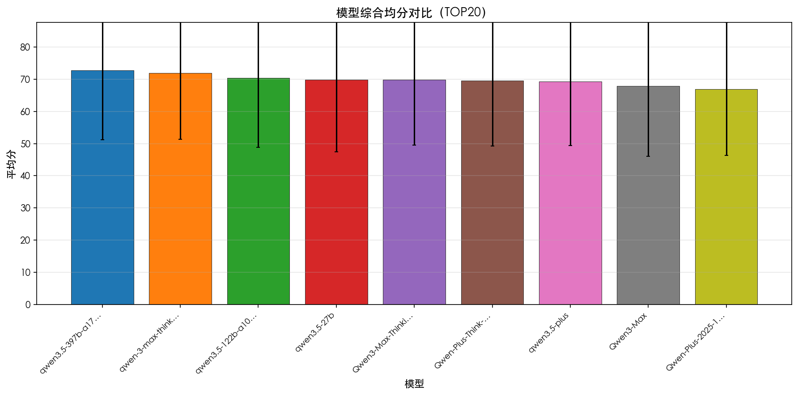
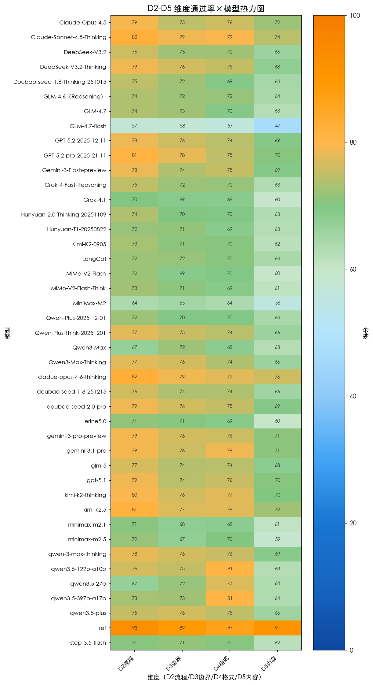
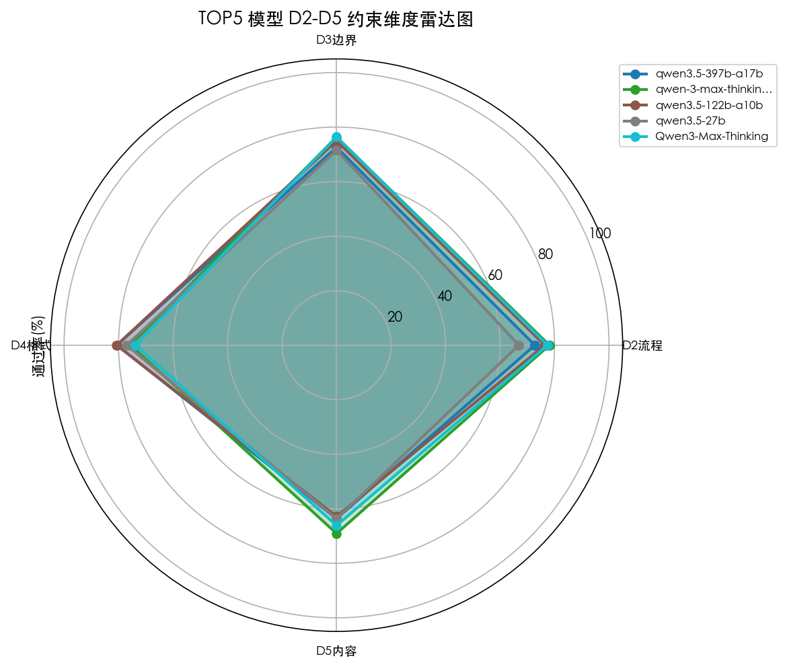
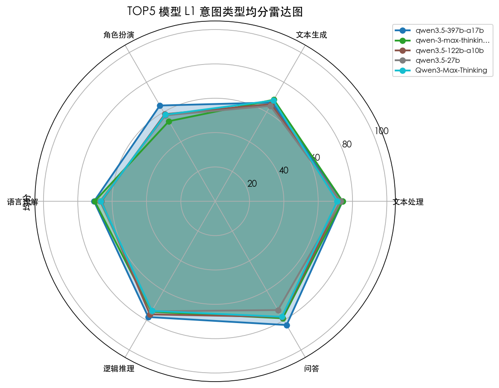
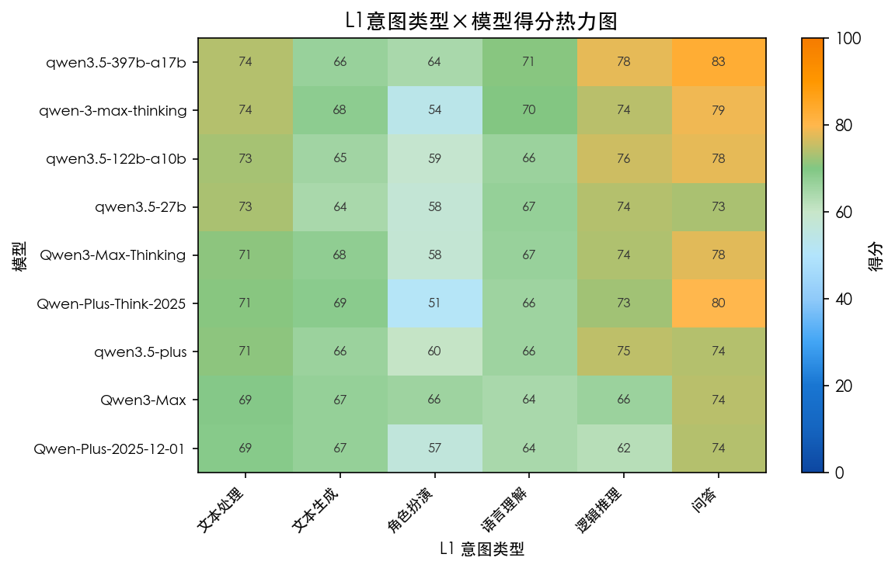
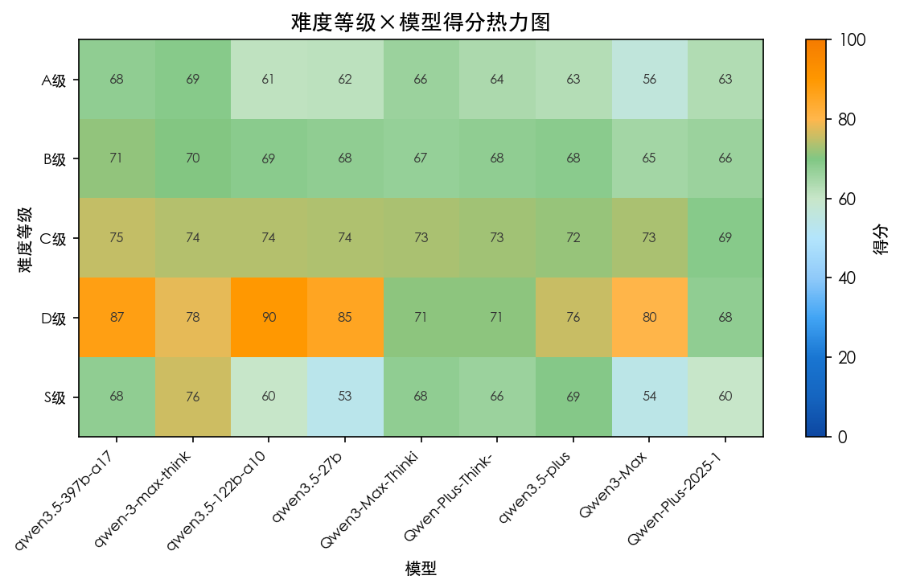
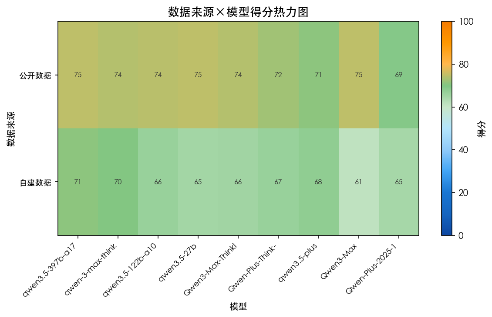
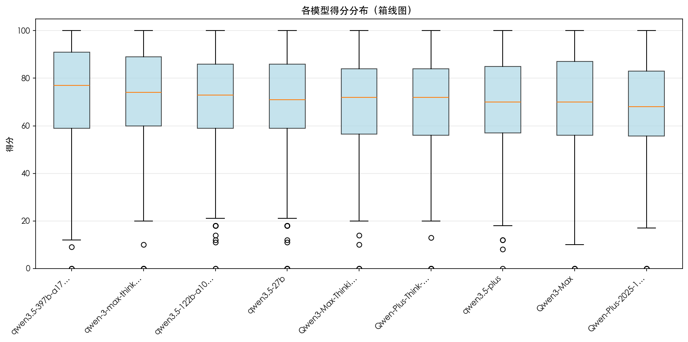
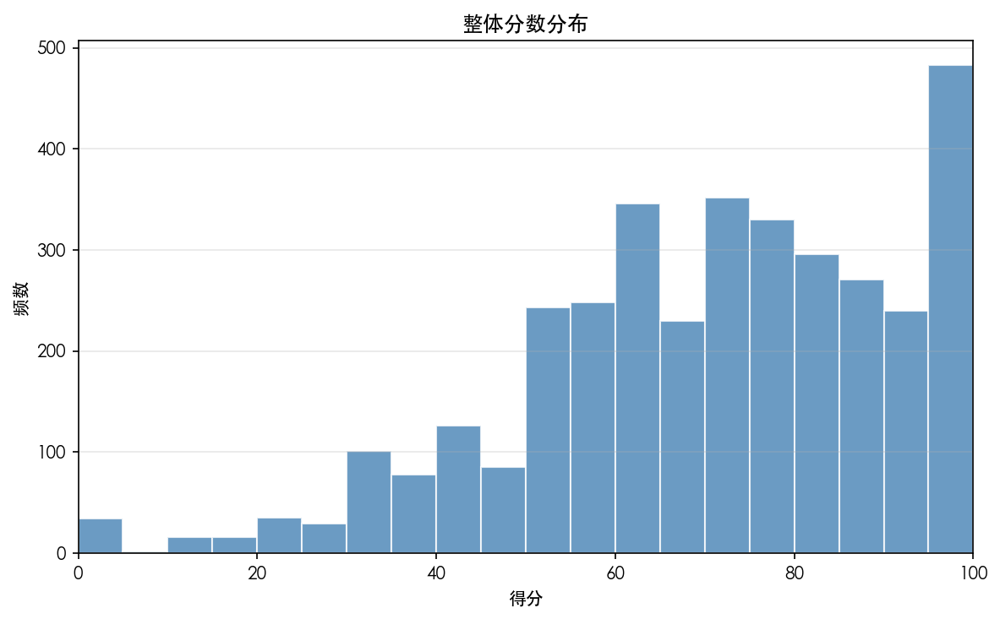

# Qwen 系列评测专项报告
> 生成时间: 2026-03-06 19:43:23  
> 系列模型数: **9** | 评测题目数: **401**

---
**目录**：1. [系列总览](#1-系列总览) | 2. [按数据来源分组](#2-按数据来源分组) | 3. [版本纵向对比](#3-版本纵向对比) | 4. [系列横向对比](#4-系列横向对比) | 5. [维度深度分析](#5-维度深度分析) | 6. [D 维度得失分](#6-d-维度得失分) | 7. [优劣势分析](#7-优劣势分析) | 8. [厂商视角小结](#8-厂商视角小结) | 9. [重点模型做错题案例分析](#9-重点模型做错题案例分析) | 10. [典型案例](#10-典型案例) | 11. [Badcase 案例分析](#11-badcase-案例分析)

---
## 1. 系列总览
### 本系列模型整体表现
| 系列内排名 | 模型 | 评测题目数 | 评测数量 | 平均分 | 标准差 | 中位数 | 最高分 | 最低分 | 题目覆盖率(%) |
| --- | --- | --- | --- | --- | --- | --- | --- | --- | --- |
| 1 | qwen3.5-397b-a17b | 400 | 399 | 72.77 | 21.51 | 77.00 | 100.00 | 0.000 | 99.80 |
| 2 | qwen-3-max-thinking | 400 | 400 | 71.98 | 20.69 | 74.00 | 100.00 | 0.000 | 99.80 |
| 3 | qwen3.5-122b-a10b | 400 | 399 | 70.39 | 21.56 | 73.00 | 100.00 | 0.000 | 99.80 |
| 4 | qwen3.5-27b | 400 | 399 | 69.90 | 22.45 | 71.00 | 100.00 | 0.000 | 99.80 |
| 5 | Qwen3-Max-Thinking | 379 | 379 | 69.82 | 20.32 | 72.00 | 100.00 | 0.000 | 94.50 |
| 6 | Qwen-Plus-Think-20251201 | 385 | 385 | 69.61 | 20.37 | 72.00 | 100.00 | 0.000 | 96.00 |
| 7 | qwen3.5-plus | 400 | 400 | 69.33 | 19.87 | 70.00 | 100.00 | 0.000 | 99.80 |
| 8 | Qwen3-Max | 400 | 400 | 67.86 | 21.87 | 70.00 | 100.00 | 0.000 | 99.80 |
| 9 | Qwen-Plus-2025-12-01 | 400 | 400 | 67.01 | 20.66 | 68.00 | 100.00 | 0.000 | 99.80 |
### 各系列横向对比（Mann-Whitney U 显著性检验）
| 系列排名 | 所属系列 | 系列平均分 | 模型数量 | 显著性p值 | 差异显著 |
| --- | --- | --- | --- | --- | --- |
| — | Qwen（本系列） | 69.85 | 9 | — | — |
| 1 | 其他 | 69.05 | 34 | 0.090 | 否 |

### 数据可视化




























## 2. 按数据来源分组
本系列在公开数据与自建数据上的得分分布（与主体报告 source 八值分组一致）：
| 数据来源 | 本系列均分 | 标准差 | 评测数量 |
| --- | --- | --- | --- |
| 公开数据 | 73.26 | 20.81 | 1779 |
| 自建数据 | 66.45 | 20.87 | 1776 |

## 3. 版本纵向对比
### 本系列版本排名
| 版本排名 | 模型版本 | 评测题目数 | 评测数量 | 平均分 | 标准差 | 中位数 | 最高分 | 最低分 |
| --- | --- | --- | --- | --- | --- | --- | --- | --- |
| 1 | qwen3.5-397b-a17b | 400 | 399 | 72.77 | 21.51 | 77.00 | 100.00 | 0.000 |
| 2 | qwen-3-max-thinking | 400 | 400 | 71.98 | 20.69 | 74.00 | 100.00 | 0.000 |
| 3 | qwen3.5-122b-a10b | 400 | 399 | 70.39 | 21.56 | 73.00 | 100.00 | 0.000 |
| 4 | qwen3.5-27b | 400 | 399 | 69.90 | 22.45 | 71.00 | 100.00 | 0.000 |
| 5 | Qwen3-Max-Thinking | 379 | 379 | 69.82 | 20.32 | 72.00 | 100.00 | 0.000 |
| 6 | Qwen-Plus-Think-20251201 | 385 | 385 | 69.61 | 20.37 | 72.00 | 100.00 | 0.000 |
| 7 | qwen3.5-plus | 400 | 400 | 69.33 | 19.87 | 70.00 | 100.00 | 0.000 |
| 8 | Qwen3-Max | 400 | 400 | 67.86 | 21.87 | 70.00 | 100.00 | 0.000 |
| 9 | Qwen-Plus-2025-12-01 | 400 | 400 | 67.01 | 20.66 | 68.00 | 100.00 | 0.000 |
### 各题目版本得分矩阵（行=题目，列=模型版本）
| qid | Qwen-Plus-2025-12-01 | Qwen-Plus-Think-20251201 | Qwen3-Max | Qwen3-Max-Thinking | qwen-3-max-thinking | qwen3.5-122b-a10b | qwen3.5-27b | qwen3.5-397b-a17b | qwen3.5-plus |
| --- | --- | --- | --- | --- | --- | --- | --- | --- | --- |
| 1 | 48.00 | 56.00 | 72.00 | 52.00 | 56.00 | 14.00 | 32.00 | 9.000 | 8.000 |
| 10 | 70.00 | 80.00 | 70.00 | 87.00 | 83.00 | 59.00 | 68.00 | 82.00 | 77.00 |
| 100 | 36.00 | 36.00 | 36.00 | 32.00 | 56.00 | 39.00 | 61.00 | 61.00 | 32.00 |
| 101 | 64.00 | 96.00 | 96.00 | 96.00 | 92.00 | 100.00 | 100.00 | 100.00 | 84.00 |
| 102 | 96.00 | 88.00 | 100.00 | 56.00 | 56.00 | 95.00 | 70.00 | 75.00 | 84.00 |
| 103 | 72.00 | 64.00 | 76.00 | 84.00 | 72.00 | 83.00 | 83.00 | 89.00 | 64.00 |
| 104 | 18.00 | 41.00 | 68.00 | 41.00 | 68.00 | 0.000 | 0.000 | 0.000 | 18.00 |
| 105 | 100.00 | 75.00 | 85.00 | 95.00 | 95.00 | 100.00 | 100.00 | 100.00 | 95.00 |
| 106 | 67.00 | 61.00 | 67.00 | 61.00 | 61.00 | 79.00 | 93.00 | 93.00 | 61.00 |
| 107 | 64.00 | 64.00 | 92.00 | 76.00 | 76.00 | 94.00 | 89.00 | 78.00 | 76.00 |
| 108 | 100.00 | 100.00 | 96.00 | 96.00 | 91.00 | 100.00 | 100.00 | 100.00 | 91.00 |
| 109 | 24.00 | 96.00 | 84.00 | 96.00 | 92.00 | 100.00 | 100.00 | 100.00 | 92.00 |
| 11 | 36.00 | 44.00 | 48.00 | 44.00 | 52.00 | 50.00 | 73.00 | 82.00 | 64.00 |
| 110 | 88.00 | 92.00 | 56.00 | 56.00 | 64.00 | 100.00 | 100.00 | 95.00 | 96.00 |
| 111 | 96.00 | 96.00 | 88.00 | 100.00 | 96.00 | 100.00 | 100.00 | 100.00 | 92.00 |
| 112 | 76.00 | 100.00 | 84.00 | 96.00 | 84.00 | 94.00 | 100.00 | 100.00 | 100.00 |
| 113 | 100.00 | 95.00 | 95.00 | 95.00 | 95.00 | 81.00 | 75.00 | 81.00 | 95.00 |
| 114 | 90.00 | 75.00 | 100.00 | 65.00 | 95.00 | 94.00 | 94.00 | 100.00 | 100.00 |
| 115 | 65.00 | 65.00 | 100.00 | 45.00 | 75.00 | 64.00 | 100.00 | 64.00 | 95.00 |
| 116 | 40.00 | 60.00 | 70.00 |  | 50.00 | 32.00 | 41.00 | 32.00 | 40.00 |
| 117 | 60.00 | 77.00 | 77.00 | 70.00 | 80.00 | 95.00 | 86.00 | 91.00 | 73.00 |
| 118 | 64.00 | 72.00 | 64.00 | 56.00 | 56.00 | 59.00 | 68.00 | 59.00 | 48.00 |
| 119 | 64.00 | 0.000 | 84.00 | 36.00 | 0.000 | 18.00 | 0.000 | 18.00 | 36.00 |
| 12 | 70.00 | 70.00 | 63.00 | 70.00 | 77.00 | 77.00 | 50.00 | 68.00 | 63.00 |
| 120 | 78.00 | 70.00 | 70.00 | 89.00 | 70.00 | 59.00 | 59.00 | 64.00 | 59.00 |
| 121 | 64.00 | 96.00 | 68.00 | 72.00 | 96.00 | 68.00 | 64.00 | 59.00 | 64.00 |
| 122 | 38.00 | 58.00 | 75.00 | 75.00 | 79.00 | 78.00 | 39.00 | 78.00 | 71.00 |
| 123 | 48.00 | 56.00 | 56.00 | 64.00 | 48.00 | 48.00 | 52.00 | 43.00 | 32.00 |
| 124 | 68.00 | 84.00 | 72.00 | 84.00 | 72.00 | 95.00 | 77.00 | 95.00 | 88.00 |
| 125 | 50.00 | 40.00 | 50.00 | 50.00 | 43.00 | 32.00 | 41.00 | 45.00 | 50.00 |
### L1 维度版本对比
| 模型 | 文本处理 | 文本生成 | 角色扮演 | 语言理解 | 逻辑推理 | 问答 |
| --- | --- | --- | --- | --- | --- | --- |
| Qwen-Plus-2025-12-01 | 68.97 | 66.88 | 56.60 | 64.25 | 62.30 | 73.90 |
| Qwen-Plus-Think-20251201 | 70.65 | 68.72 | 51.00 | 65.85 | 72.61 | 80.03 |
| Qwen3-Max | 69.14 | 67.12 | 65.80 | 64.43 | 66.03 | 74.37 |
| Qwen3-Max-Thinking | 71.07 | 67.77 | 58.20 | 66.51 | 73.69 | 77.67 |
| qwen-3-max-thinking | 74.20 | 68.33 | 53.87 | 70.15 | 74.27 | 78.67 |
| qwen3.5-122b-a10b | 72.89 | 65.35 | 58.60 | 66.26 | 76.06 | 77.77 |
| qwen3.5-27b | 73.11 | 64.18 | 57.80 | 67.02 | 74.00 | 73.13 |
| qwen3.5-397b-a17b | 74.17 | 66.41 | 64.40 | 70.54 | 77.85 | 83.20 |
| qwen3.5-plus | 71.06 | 66.11 | 60.40 | 65.96 | 74.73 | 74.03 |

## 4. 系列横向对比
### 整体对比（本系列排名第 1 位）
| 系列排名 | 系列 | 平均分 | 标准差 | 评测数量 |
| --- | --- | --- | --- | --- |
| 1 | Qwen | 69.85 | 21.10 | 3561 |
| 2 | 其他 | 69.00 | 21.63 | 13266 |
### L1 维度 系列对比
| 系列 | 文本处理 | 文本生成 | 角色扮演 | 语言理解 | 逻辑推理 | 问答 |
| --- | --- | --- | --- | --- | --- | --- |
| Qwen | 71.70 | 66.74 | 58.69 | 66.78 | 72.38 | 76.97 |
| 其他 | 70.62 | 67.15 | 61.35 | 65.08 | 70.64 | 76.39 |
### 难度等级 系列对比
| 系列 | A级 | B级 | C级 | D级 | S级 |
| --- | --- | --- | --- | --- | --- |
| Qwen | 63.55 | 68.06 | 72.93 | 78.40 | 63.73 |
| 其他 | 60.39 | 67.73 | 72.16 | 74.79 | 63.93 |

## 5. 维度深度分析
### L1 维度
| L1 | Qwen系列均分 | 评测数量 | 全体均分 | 相对全体差值 |
| --- | --- | --- | --- | --- |
| 问答 | 76.97 | 270 | 76.52 | 0.450 |
| 逻辑推理 | 72.38 | 293 | 71.01 | 1.370 |
| 文本处理 | 71.70 | 1555 | 70.85 | 0.850 |
| 语言理解 | 66.78 | 721 | 65.44 | 1.340 |
| 文本生成 | 66.74 | 584 | 67.06 | -0.320 |
| 角色扮演 | 58.69 | 132 | 60.79 | -2.100 |
### L2 维度
| L2 | Qwen系列均分 | 评测数量 | 全体均分 | 相对全体差值 |
| --- | --- | --- | --- | --- |
| 数理推理 | 95.89 | 18 | 94.49 | 1.400 |
| 事实问答 | 89.67 | 18 | 89.22 | 0.450 |
| 知识推理 | 87.33 | 9 | 77.26 | 10.07 |
| 常识推理 | 85.52 | 27 | 84.96 | 0.560 |
| 任务角色扮演 | 79.83 | 18 | 78.38 | 1.450 |
| 开放问答 | 76.07 | 252 | 75.60 | 0.470 |
| 文本重述 | 73.32 | 180 | 73.26 | 0.060 |
| 翻译 | 73.26 | 206 | 73.73 | -0.470 |
| 信息结构化 | 71.50 | 966 | 70.71 | 0.790 |
| 分类标记 | 71.37 | 383 | 69.63 | 1.740 |
| 通用角色扮演 | 69.73 | 52 | 71.93 | -2.200 |
| 基础语言理解 | 68.63 | 386 | 67.33 | 1.300 |
| 文字推理 | 68.56 | 239 | 67.42 | 1.140 |
| 写作 | 67.57 | 286 | 68.11 | -0.540 |
| 高阶语言理解 | 64.64 | 335 | 63.26 | 1.380 |
| 数据合成 | 54.68 | 118 | 55.36 | -0.680 |
| 娱乐角色扮演 | 43.29 | 62 | 46.21 | -2.920 |
### L3 维度
| L3 | Qwen系列均分 | 评测数量 | 全体均分 | 相对全体差值 |
| --- | --- | --- | --- | --- |
| 语义理解 | 98.33 | 9 | 97.07 | 1.260 |
| 数理推理 | 95.89 | 18 | 94.49 | 1.400 |
| 知识问答 | 90.22 | 9 | 90.26 | -0.040 |
| 常识问答 | 89.11 | 9 | 88.21 | 0.900 |
| 知识推理 | 87.33 | 9 | 77.26 | 10.07 |
| 常识推理 | 85.52 | 27 | 84.96 | 0.560 |
| 评价观点 | 82.48 | 117 | 81.48 | 1.000 |
| 任务角色扮演 | 79.83 | 18 | 78.38 | 1.450 |
| 关系推理 | 79.72 | 18 | 75.76 | 3.960 |
| 改写润色 | 77.48 | 90 | 75.23 | 2.250 |
| 专业写作 | 76.50 | 36 | 77.78 | -1.280 |
| 情感识别 | 75.87 | 141 | 73.33 | 2.540 |
| 中外翻译 | 75.04 | 162 | 75.37 | -0.330 |
| 推荐建议 | 73.98 | 99 | 71.69 | 2.290 |
| 汉字理解 | 73.39 | 36 | 70.82 | 2.570 |
| 成语接龙 | 73.31 | 88 | 71.14 | 2.170 |
| 信息抽取 | 72.85 | 824 | 72.30 | 0.550 |
| 语篇理解 | 72.20 | 152 | 71.03 | 1.170 |
| 评估打分 | 72.10 | 143 | 69.46 | 2.640 |
| 诗词理解 | 70.50 | 36 | 67.99 | 2.510 |
| 通用角色扮演 | 69.73 | 52 | 71.93 | -2.200 |
| 总结摘要 | 69.16 | 90 | 71.28 | -2.120 |
| 文字推理 | 68.56 | 239 | 67.42 | 1.140 |
| 创意写作 | 68.06 | 151 | 68.12 | -0.060 |
| 汉汉翻译 | 66.68 | 44 | 67.75 | -1.070 |
| 标签分类 | 63.92 | 99 | 64.80 | -0.880 |
| 编辑校对 | 63.63 | 142 | 61.51 | 2.120 |
| 实用写作 | 63.59 | 99 | 64.65 | -1.060 |
| 字词句理解 | 63.45 | 189 | 62.18 | 1.270 |
| 弱智吧 | 59.22 | 18 | 60.66 | -1.440 |
| 指代消解 | 58.76 | 157 | 57.37 | 1.390 |
| 数据构造 | 56.15 | 154 | 58.12 | -1.970 |
| 歧义消解 | 52.28 | 18 | 56.19 | -3.910 |
| 娱乐角色扮演 | 43.29 | 62 | 46.21 | -2.920 |
### 难度等级 维度
| 难度等级 | Qwen系列均分 | 评测数量 | 全体均分 | 相对全体差值 |
| --- | --- | --- | --- | --- |
| D级 | 78.40 | 45 | 75.55 | 2.850 |
| C级 | 72.93 | 1606 | 72.32 | 0.610 |
| B级 | 68.06 | 1483 | 67.80 | 0.260 |
| S级 | 63.73 | 45 | 63.88 | -0.150 |
| A级 | 63.55 | 376 | 61.07 | 2.480 |

## 6. D 维度得失分
L2 约束类型与 D 维度对应：流程步骤→D2 操作执行逻辑，格式输出→D4 格式要求，边界范围/数量篇幅→D3 边界限制；便于从约束设计与模型能力两端对齐分析。

本系列各模型 D1–D5 通过率（与主体报告维度得失分统计一致）：
| 模型 | D1通过率 | D2通过率 | D3通过率 | D4通过率 | D5通过率 |
| --- | --- | --- | --- | --- | --- |
| Qwen-Plus-2025-12-01 |  | 72.24 | 69.91 | 69.61 | 64.09 |
| Qwen-Plus-Think-20251201 |  | 77.42 | 75.49 | 74.45 | 66.27 |
| Qwen3-Max |  | 67.18 | 72.08 | 68.19 | 62.87 |
| Qwen3-Max-Thinking |  | 77.43 | 76.38 | 73.82 | 66.15 |
| qwen-3-max-thinking |  | 78.11 | 76.35 | 75.65 | 69.09 |
| qwen3.5-122b-a10b |  | 76.42 | 75.00 | 80.70 | 62.85 |
| qwen3.5-27b |  | 66.92 | 71.53 | 77.05 | 63.67 |
| qwen3.5-397b-a17b |  | 72.79 | 72.59 | 80.65 | 63.66 |
| qwen3.5-plus |  | 75.28 | 76.38 | 74.91 | 65.89 |

## 7. 优劣势分析（L2 维度）
### 相对优势 TOP10
| 优势排名 | L2 | Qwen均分 | 全体均分 | 相对优势 | 评测数量 |
| --- | --- | --- | --- | --- | --- |
| 1 | 知识推理 | 87.33 | 77.26 | 10.08 | 9 |
| 2 | 分类标记 | 71.37 | 69.63 | 1.740 | 383 |
| 3 | 任务角色扮演 | 79.83 | 78.38 | 1.450 | 18 |
| 4 | 数理推理 | 95.89 | 94.49 | 1.400 | 18 |
| 5 | 高阶语言理解 | 64.64 | 63.26 | 1.380 | 335 |
| 6 | 基础语言理解 | 68.63 | 67.33 | 1.310 | 386 |
| 7 | 文字推理 | 68.56 | 67.42 | 1.140 | 239 |
| 8 | 信息结构化 | 71.50 | 70.71 | 0.790 | 966 |
| 9 | 常识推理 | 85.52 | 84.96 | 0.560 | 27 |
| 10 | 开放问答 | 76.07 | 75.60 | 0.460 | 252 |
### 相对劣势 TOP10
| 劣势排名 | L2 | Qwen均分 | 全体均分 | 相对优势 | 评测数量 |
| --- | --- | --- | --- | --- | --- |
| 1 | 娱乐角色扮演 | 43.29 | 46.21 | -2.920 | 62 |
| 2 | 通用角色扮演 | 69.73 | 71.93 | -2.200 | 52 |
| 3 | 数据合成 | 54.68 | 55.36 | -0.690 | 118 |
| 4 | 写作 | 67.57 | 68.11 | -0.530 | 286 |
| 5 | 翻译 | 73.26 | 73.73 | -0.470 | 206 |
| 6 | 文本重述 | 73.32 | 73.26 | 0.060 | 180 |
| 7 | 事实问答 | 89.67 | 89.22 | 0.440 | 18 |
| 8 | 开放问答 | 76.07 | 75.60 | 0.460 | 252 |
| 9 | 常识推理 | 85.52 | 84.96 | 0.560 | 27 |
| 10 | 信息结构化 | 71.50 | 70.71 | 0.790 | 966 |

## 8. 厂商视角小结
- **本系列均分**：69.85（高于全体均分 +0.67 分）
- **系列内最佳**：qwen3.5-397b-a17b，建议作为基准对比后续版本。
- **建议关注**：优劣势分析中的相对劣势 L2 类型，可针对性加强训练数据；D 维度得失分中 D2/D4 比值可验证「重格式、轻逻辑」现象；Badcase 分析中识别的薄弱题目与维度需重点改进。

## 9. 重点模型做错题案例分析
以下针对本系列重点模型 **qwen3.5-plus** 做错或低分题目，按与主体报告相同的分析逻辑与格式整理：模型分档（按分差划分第一/第二/第三梯队）、AI 综合评估、失分点分析。

#### 案例 Q156

- **L1**: 文本处理 | **L3**: 信息抽取 | **难度**: B级 | **分数范围**: 65.0
##### 模型分档表现

- **本题最佳**：Qwen-Plus-2025-12-01（65.0 分）
- **第一梯队**：Qwen-Plus-2025-12-01, Qwen3-Max-Thinking
- **第二梯队**：qwen-3-max-thinking, qwen3.5-397b-a17b, Qwen3-Max, Qwen-Plus-Think-20251201
- **第三梯队**：qwen3.5-122b-a10b, qwen3.5-27b, qwen3.5-plus

##### 本题目各模型维度表现（D2/D3/D4/D5 通过情况）

```
- Qwen-Plus-Think-20251201: 流程步骤:0/4 | 边界范围:2/3 | 格式形式:1/3 | 内容质量:2/10
- Qwen3-Max-Thinking: 流程步骤:3/4 | 边界范围:2/3 | 格式形式:2/3 | 内容质量:7/10
- qwen-3-max-thinking: 流程步骤:2/4 | 边界范围:2/3 | 格式形式:3/3 | 内容质量:4/10
- qwen3.5-397b-a17b: 流程步骤:1/4 | 边界范围:0/3 | 格式形式:1/2 | 内容质量:4/9
- qwen3.5-plus: 流程步骤:0/4 | 边界范围:0/3 | 格式形式:1/3 | 内容质量:3/10
```

##### AI综合评估

本题考查信息结构化抽取能力。模型呈三档分化：高分区逻辑完整但步骤粒度不足；中分区存在格式或步骤缺失；低分区严重违反列表格式与逻辑链要求。核心失分集中在 D2 操作逻辑与 D4 格式约束。

##### 失分点分析

【模型分档】
- 优秀：Qwen-Plus-2025-12-01、Qwen3-Max-Thinking（核心逻辑链完整，仅存在步骤粒度或边界微调问题）
- 良好：qwen-3-max-thinking、qwen3.5-397b-a17b、Qwen3-Max、Qwen-Plus-Think-20251201（步骤数量不足或格式轻微偏差，不影响主体逻辑）
- 待改进：qwen3.5-122b-a10b、qwen3.5-27b、qwen3.5-plus（完全未遵循列表格式，逻辑链融合于段落中，结构化能力缺失）

【失分点分析】
- 待改进模型（11 分及以下）：严重违反 D2_1 格式约束，输出为连续段落而非有序列表（如 qwen3.5-27b“要解决这个问题，首先需要..."）；同时 D2_2 失败，缺失“返回”动词开头的逻辑链，导致步骤无法验证。
- 良好模型（25-45 分）：主要失分于 D2_4 步骤数量不足。如 qwen-3-max-thinking 仅输出 3 步，合并了筛选与计数环节；Qwen-Plus-Think-20251201 虽逻辑正确但 D2_1 失败，使用“首先...其次”段落格式而非列表。
- 优秀模型（60-65 分）：细微失分在于逻辑粒度与边界。Qwen-Plus-2025-12-01 D2_2 失败，缺少独立“统计计数”步骤，直接在筛选步合并计数；Qwen3-Max-Thinking D3_2 失败，列表后追加了多余的解释性段落，违反边界约束。

---

#### 案例 Q1

- **L1**: 文本生成 | **L3**: 实用写作 | **难度**: C级 | **分数范围**: 64.0
##### 模型分档表现

- **本题最佳**：Qwen3-Max（72.0 分）
- **第一梯队**：Qwen3-Max
- **第二梯队**：Qwen-Plus-Think-20251201, qwen-3-max-thinking, Qwen3-Max-Thinking, Qwen-Plus-2025-12-01, qwen3.5-27b
- **第三梯队**：qwen3.5-122b-a10b, qwen3.5-397b-a17b, qwen3.5-plus

##### 本题目各模型维度表现（D2/D3/D4/D5 通过情况）

```
- Qwen-Plus-2025-12-01: 流程步骤:3/4 | 边界范围:1/5 | 格式形式:1/3 | 内容质量:8/13
- Qwen-Plus-Think-20251201: 流程步骤:4/4 | 边界范围:2/5 | 格式形式:2/3 | 内容质量:10/13
- Qwen3-Max: 流程步骤:4/4 | 边界范围:3/5 | 格式形式:2/3 | 内容质量:13/13
- Qwen3-Max-Thinking: 流程步骤:2/4 | 边界范围:2/5 | 格式形式:0/3 | 内容质量:10/13
- qwen-3-max-thinking: 流程步骤:3/4 | 边界范围:3/5 | 格式形式:1/3 | 内容质量:10/13
- qwen3.5-plus: 流程步骤:0/4 | 边界范围:1/5 | 格式形式:1/3 | 内容质量:0/13
```

##### AI综合评估

本题属 L3 实用写作，考查格式与内容平衡。模型呈明显三档分化：Qwen3-Max 独占鳌头，中档模型内容完整但格式失分，低档模型严重缺失段落。核心区分在于 D2 操作逻辑与 D3 边界约束的执行精度。

##### 失分点分析

【模型分档】
- 优秀：Qwen3-Max（内容质量满分，仅轻微边界偏差，整体可用性高）
- 良好：Qwen-Plus-Think-20251201、qwen-3-max-thinking、Qwen3-Max-Thinking、Qwen-Plus-2025-12-01（逻辑完整，但标题格式或字数违规）
- 待改进：qwen3.5-27b 及以下模型（仅输出标题无正文，严重违反 D2 操作逻辑与 D5 内容质量）

【失分点分析】
- **待改进档（qwen3.5 系列）**：核心失分于 D2_1 与 D5_1。如 qwen3.5-27b 仅输出“懂客户”三词，无段落展开，评估显示 D2_1 FAIL（未输出完整策略段落）且 D5 得分为 0，属于结构性缺失。
- **良好档（Plus/Max-Thinking）**：主要失分于 D2_2 与 D3_1。如 Qwen3-Max-Thinking 标题为“听心声👂"，缺失“策略一：”前缀，导致 D2_2 FAIL；Qwen-Plus-2025-12-01 标题“挖需求”被判定超字数，违反 D3_1 边界约束。
- **优秀档（Qwen3-Max）**：唯一 D5 满分模型，但失分于 D3_1。评估指出其正文内容远超 3 字限制（虽标题合规），显示对“段落字数”边界理解存在偏差，导致未能全满分。

---

#### 案例 Q213

- **L1**: 文本生成 | **L3**: 数据构造 | **难度**: B级 | **分数范围**: 32.0
##### 模型分档表现

- **本题最佳**：Qwen-Plus-2025-12-01（32.0 分）
- **第一梯队**：Qwen-Plus-2025-12-01
- **第二梯队**：qwen3.5-122b-a10b, qwen3.5-plus
- **第三梯队**：Qwen-Plus-Think-20251201, Qwen3-Max, Qwen3-Max-Thinking, qwen-3-max-thinking, qwen3.5-27b, qwen3.5-397b-a17b

##### 本题目各模型维度表现（D2/D3/D4/D5 通过情况）

```
- Qwen-Plus-2025-12-01: 流程步骤:3/4 | 边界范围:2/6 | 格式形式:2/2 | 内容质量:5/13
- Qwen-Plus-Think-20251201: 流程步骤:0/4 | 边界范围:0/6 | 格式形式:0/2 | 内容质量:0/13
- Qwen3-Max: 流程步骤:0/4 | 边界范围:0/6 | 格式形式:0/2 | 内容质量:0/13
- Qwen3-Max-Thinking: 流程步骤:2/4 | 边界范围:3/6 | 格式形式:2/2 | 内容质量:8/13
- qwen-3-max-thinking: 流程步骤:0/4 | 边界范围:0/6 | 格式形式:0/2 | 内容质量:0/13
- qwen3.5-plus: 流程步骤:2/4 | 边界范围:1/6 | 格式形式:0/2 | 内容质量:0/13
```

##### AI综合评估

本题区分度显著，仅头部模型理解“构造材料”元任务。核心失分在于 D2 操作逻辑混淆“构造场景”与“执行模拟”，多数模型直接输出游戏日志而非场景描述。低分模型普遍存在任务意图理解偏差，D2 与 D3 维度为主要失分点。

##### 失分点分析

【模型分档】
- 优秀：Qwen-Plus-2025-12-01（唯一明确识别“构造输入素材”元任务，虽仍有细节失分但意图正确）
- 良好：qwen3.5-122b-a10b、qwen3.5-plus（构造了场景但混杂执行指令或期望输出，未完全解耦）
- 待改进：Qwen-Plus-Think 等 0 分模型（直接执行游戏模拟输出日志，完全偏离构造任务）

【失分点分析】
- 0 分模型群：严重违反 D2_1 操作逻辑。如 Qwen3-Max 直接输出"1. 关卡：移动独木桥...行动：按下

---

#### 案例 Q311

- **L1**: 逻辑推理 | **L3**: 文字推理 | **难度**: B级 | **分数范围**: 20.0
##### 模型分档表现

- **本题最佳**：Qwen3-Max（32.0 分）
- **第一梯队**：Qwen3-Max
- **第二梯队**：qwen3.5-122b-a10b, qwen3.5-27b, qwen3.5-397b-a17b, Qwen-Plus-2025-12-01, qwen-3-max-thinking, Qwen-Plus-Think-20251201, Qwen3-Max-Thinking
- **第三梯队**：qwen3.5-plus

##### 本题目各模型维度表现（D2/D3/D4/D5 通过情况）

```
- Qwen-Plus-2025-12-01: 流程步骤:1/4 | 边界范围:1/4 | 格式形式:1/3 | 内容质量:2/14
- Qwen-Plus-Think-20251201: 流程步骤:1/4 | 边界范围:2/4 | 格式形式:1/3 | 内容质量:0/14
- Qwen3-Max: 流程步骤:1/4 | 边界范围:1/4 | 格式形式:1/3 | 内容质量:4/14
- Qwen3-Max-Thinking: 流程步骤:1/4 | 边界范围:3/4 | 格式形式:1/3 | 内容质量:1/14
- qwen-3-max-thinking: 流程步骤:1/4 | 边界范围:1/4 | 格式形式:1/3 | 内容质量:3/14
- qwen3.5-plus: 流程步骤:1/4 | 边界范围:1/4 | 格式形式:1/3 | 内容质量:0/14
```

---

#### 案例 Q104

- **L1**: 语言理解 | **L3**: 歧义消解 | **难度**: B级 | **分数范围**: 68.0
##### 模型分档表现

- **本题最佳**：Qwen3-Max（68.0 分）
- **第一梯队**：Qwen3-Max, qwen-3-max-thinking
- **第二梯队**：Qwen-Plus-Think-20251201, Qwen3-Max-Thinking
- **第三梯队**：Qwen-Plus-2025-12-01, qwen3.5-plus, qwen3.5-122b-a10b, qwen3.5-27b, qwen3.5-397b-a17b

##### 本题目各模型维度表现（D2/D3/D4/D5 通过情况）

```
- Qwen-Plus-2025-12-01: 流程步骤:0/4 | 边界范围:1/3 | 格式形式:0/3 | 内容质量:3/12
- Qwen-Plus-Think-20251201: 流程步骤:2/4 | 边界范围:1/3 | 格式形式:0/3 | 内容质量:6/12
- Qwen3-Max: 流程步骤:3/4 | 边界范围:1/3 | 格式形式:0/3 | 内容质量:8/12
- Qwen3-Max-Thinking: 流程步骤:2/4 | 边界范围:1/3 | 格式形式:0/3 | 内容质量:6/12
- qwen-3-max-thinking: 流程步骤:4/4 | 边界范围:1/3 | 格式形式:0/3 | 内容质量:12/12
- qwen3.5-plus: 流程步骤:0/4 | 边界范围:1/3 | 格式形式:0/3 | 内容质量:2/12
```

##### AI综合评估

模型呈三档分布。高分区准确识别歧义并双解阐释，但普遍违反分段格式约束；低分区根本性误判句义不存在歧义。核心区分在于 D5 内容正确性与 D3 边界执行，格式合规性为共性短板。

##### 失分点分析

【模型分档】
- 优秀：Qwen3-Max、qwen-3-max-thinking（核心语义理解准确，双解阐释完整，仅格式失分）
- 良好：Qwen-Plus-Think-20251201、Qwen3-Max-Thinking（识别歧义但解释简略，缺失语境示例支撑）
- 待改进：Qwen-Plus-2025-12-01、qwen3.5-plus、qwen3.5-122b-a10b 等（根本性误判句子无歧义，或完全未执行双解步骤）

【失分点分析】
- **待改进模型（0-18 分）**：主要失分于 **D2_1 操作逻辑** 与 **D5 内容质量**。模型如 qwen3.5-27b 明确判断“不存在本质上的歧义”，Qwen-Plus-2025-12-01 称“不存在语义或结构上的歧义”，与题目预设的歧义消解任务根本冲突，导致后续 D2_3 双解步骤无法执行。
- **良好模型（41 分）**：主要失分于 **D2_3 操作逻辑** 与 **D2_4 内容深度**。Qwen-Plus-Think-20251201 虽识别歧义，但仅在一句话中简单提及两种理解，未针对两种歧义分别进行独立解释说明，且缺失如“他太弱小/强大”的具体语境示例。
- **优秀模型（68 分）**：主要失分于 **D3_1 边界范围**。Qwen3-Max 与 qwen-3-max-thinking 内容质量达标，但均未采用“判断段 + 空行 + 解释段”的分段形式，整个回复为一个段落，违反格式边界约束，导致无法满分。

---

#### 案例 Q218

- **L1**: 文本处理 | **L3**: 编辑校对 | **难度**: C级 | **分数范围**: 40.0
##### 模型分档表现

- **本题最佳**：Qwen-Plus-2025-12-01（50.0 分）
- **第一梯队**：Qwen-Plus-2025-12-01
- **第二梯队**：qwen-3-max-thinking, qwen3.5-122b-a10b, Qwen3-Max-Thinking
- **第三梯队**：qwen3.5-plus, qwen3.5-27b, qwen3.5-397b-a17b, Qwen3-Max

##### 本题目各模型维度表现（D2/D3/D4/D5 通过情况）

```
- Qwen-Plus-2025-12-01: 流程步骤:2/5 | 边界范围:2/5 | 格式形式:2/3 | 内容质量:9/17
- Qwen3-Max: 流程步骤:1/5 | 边界范围:2/5 | 格式形式:0/3 | 内容质量:0/17
- Qwen3-Max-Thinking: 流程步骤:3/5 | 边界范围:1/5 | 格式形式:2/3 | 内容质量:7/17
- qwen-3-max-thinking: 流程步骤:2/5 | 边界范围:3/5 | 格式形式:2/3 | 内容质量:11/17
- qwen3.5-397b-a17b: 流程步骤:2/5 | 边界范围:2/4 | 格式形式:2/2 | 内容质量:0/11
- qwen3.5-plus: 流程步骤:2/5 | 边界范围:2/5 | 格式形式:2/3 | 内容质量:0/17
```

##### AI综合评估

本题模型呈三档分化，最高分仅 50 分。核心失分集中于 D2 操作逻辑（打分规范、评语总结）与 D5 内容质量（批改准确）。高分模型细节违规，低分模型存在实质错误与回复中断，反映结构化任务指令遵循难点。

##### 失分点分析

【模型分档】
- 优秀：Qwen-Plus-2025-12-01（结构最完整，批改基准清晰，仅细节违规）
- 良好：qwen-3-max-thinking、qwen3.5-122b-a10b、Qwen3-Max-Thinking（完成任务但存在打分格式或内容偏差）
- 待改进：qwen3.5-plus、qwen3.5-27b、qwen3.5-397b-a17b、Qwen3-Max（存在严重内容错误、打分失真或回复中断）

【失分点分析】
- **Qwen3-Max（10 分）**：D2_1/D2_4 严重失效。回复在分析同学 B 时中断，未涉及同学 C 且未给出任何最终得分，属于实质性任务未完成。
- **qwen3.5-27b/397b-a17b（18 分）**：D5 内容质量严重失分。同学 C 实际有多处错误，模型却判定为"10/10"或"100 分”，批改准确性完全失效；D2_2 评语如“再接再厉”未概括具体错误点。
- **qwen3.5-plus（20 分）**：D2_1 逻辑错误。三位同学实际错误数不同，模型均给出"90 分”，未体现差异化批改；D2_2 评语为描述性评价而非一句话错误总结。
- **Qwen3-Max-Thinking（30 分）**：D2_1 格式违规。得分显示为"9/10"而非具体分数值；D2_2 评语包含多个错误点描述，违反“一句话总结”约束。
- **高分模型共性问题**：即便 50 分模型也未完全满足 D2_1（得分基数不明确）与 D2_2（评语过于详细），说明本题在精细化指令遵循上具有普遍挑战性。

---

#### 案例 Q228

- **L1**: 语言理解 | **L3**: 指代消解 | **难度**: B级 | **分数范围**: 30.0
##### 模型分档表现

- **本题最佳**：Qwen-Plus-Think-20251201（30.0 分）
- **第一梯队**：Qwen-Plus-Think-20251201, qwen-3-max-thinking, Qwen3-Max
- **第二梯队**：qwen3.5-plus, Qwen-Plus-2025-12-01, qwen3.5-27b, qwen3.5-397b-a17b
- **第三梯队**：qwen3.5-122b-a10b

##### 本题目各模型维度表现（D2/D3/D4/D5 通过情况）

```
- Qwen-Plus-2025-12-01: 流程步骤:0/5 | 边界范围:2/5 | 格式形式:0/4 | 内容质量:3/16
- Qwen-Plus-Think-20251201: 流程步骤:0/5 | 边界范围:2/5 | 格式形式:0/4 | 内容质量:5/16
- Qwen3-Max: 流程步骤:0/5 | 边界范围:1/5 | 格式形式:0/4 | 内容质量:3/16
- qwen-3-max-thinking: 流程步骤:0/5 | 边界范围:3/5 | 格式形式:0/4 | 内容质量:3/16
- qwen3.5-plus: 流程步骤:0/5 | 边界范围:2/5 | 格式形式:0/4 | 内容质量:3/16
```

##### AI综合评估

模型表现呈显著三档分化，高分区仅勉强及格。核心失分集中于 D2 操作逻辑与 D4 格式规范，全模型格式合规率为零。指代消解准确性（D5）是区分头部与尾部模型的关键维度。

##### 失分点分析

【模型分档】
- 优秀：Qwen-Plus-Think-20251201、qwen-3-max-thinking（30.0 分）。依据：D5 内容质量得分最高（5/16），实体识别逻辑相对完整，虽格式有误但核心任务完成度最佳。
- 良好：Qwen3-Max、qwen3.5-plus、Qwen-Plus-2025-12-01（20.0-27.0 分）。依据：D2 流程执行部分达标，但 D4 格式错误明显，存在实体漏标或标记位置偏差。
- 待改进：qwen3.5-27b、qwen3.5-397b-a17b、qwen3.5-122b-a10b（0.0-18.0 分）。依据：D5 内容严重错误（如 OCR 识别错误、实体拆分错误），D2 标记逻辑混乱，无法满足基本任务要求。

【失分点分析】
- **qwen3.5-122b-a10b（0.0 分）**：D5_1 内容质量严重失分，出现 OCR 识别错误（如“父米”、“车人”），且实体拆分逻辑错误（将“小孩子”与“女孩子”拆分为独立实体）；D2_1 首次出现标记缺失，导致指代链断裂。
- **qwen3.5-27b/397b（18.0 分）**：D4_1 格式形式违规，标记符号冗余（如`渡船 (3)(1)`应为`渡船 (3)`）；D2_2 指代类型标记缺失，大量指代词未标注 `[P/T/N]` 类型，违反操作逻辑约束。
- **qwen3.5-plus/Qwen3-Max（23.0-27.0 分）**：D2_1 实体标记不完整，仅标记部分段落；D4_4 排版不符合严格格式要求（如方括号位置错误`[他](P)(1_1)` 应为 `他 [P](1_1)`），导致全模型 D4 维度得分为零。
- **Qwen-Plus-Think/qwen-3-max-thinking（30.0 分）**：虽为高分，仍受限于 D2_1 零指代标记遗漏（如省略主语未标`[0]`）；但相比低分模型，D5_3 指代关系解析准确度更高，未出现实体识别根本性错误。

---

#### 案例 Q33

- **L1**: 文本处理 | **L3**: 信息抽取 | **难度**: C级 | **分数范围**: 19.0
##### 模型分档表现

- **本题最佳**：qwen3.5-27b（39.0 分）
- **第一梯队**：qwen3.5-27b, Qwen3-Max
- **第二梯队**：Qwen-Plus-2025-12-01
- **第三梯队**：qwen3.5-122b-a10b, qwen3.5-397b-a17b, Qwen-Plus-Think-20251201, qwen-3-max-thinking, qwen3.5-plus, Qwen3-Max-Thinking

##### 本题目各模型维度表现（D2/D3/D4/D5 通过情况）

```
- Qwen-Plus-Think-20251201: 流程步骤:1/4 | 边界范围:1/5 | 格式形式:2/3 | 内容质量:2/13
- Qwen3-Max: 流程步骤:3/4 | 边界范围:4/5 | 格式形式:2/3 | 内容质量:6/13
- Qwen3-Max-Thinking: 流程步骤:1/4 | 边界范围:1/5 | 格式形式:2/3 | 内容质量:1/13
- qwen-3-max-thinking: 流程步骤:2/4 | 边界范围:2/5 | 格式形式:2/3 | 内容质量:4/13
- qwen3.5-plus: 流程步骤:2/4 | 边界范围:1/5 | 格式形式:2/3 | 内容质量:4/13
```

##### AI综合评估

本题属文本处理类信息抽取任务，核心考查对“奖项/荣誉”边界的精准识别及结构化输出能力。模型表现呈明显三档分化，高分区仅在内容纯度上略有瑕疵，低分区普遍存在边界泛化（将资质混为奖项）及格式违规问题。核心区分维度为 D5 内容质量（提取准确性）与 D3 边界范围（非奖项过滤），反映模型在语义理解与约束遵循上的显著差距。

##### 失分点分析

【模型分档】
- 优秀：qwen3.5-27b、Qwen3-Max（得分 36-39 分）。基本锁定核心奖项，结构化格式完整，仅个别条目补充信息略显冗余或边界偶有模糊。
- 良好：Qwen-Plus-2025-12-01（得分 32 分）。能识别主要奖项，但混入非奖项内容（如上市事件），且括号内包含大量解释性文字，违反简洁性约束。
- 待改进：qwen3.5-122b-a10b 及以下模型（得分 20-28 分）。普遍将“会长单位”“起草单位”等资质误判为奖项，严重违反边界约束；部分模型存在排序错误或括号信息缺失。

【失分点分析】
- **qwen3.5-397b-a17b/qwen3.5-122b-a10b（28 分）**：主要失分于 D3 边界范围与 D5 内容质量。Rubric D2_1 显示 FAIL，模型将“会长单位”“主起草单位”等 5 项非奖项内容混入列表（如输出“全国工商联家具厨柜专委会会长单位”），导致奖项纯度严重不足。
- **Qwen-Plus-Think-20251201/qwen-3-max-thinking（24 分）**：核心失分于 D2 操作逻辑与 D4 格式。Rubric D2_2 指出 FAIL，多个条目括号内为空（如“国家林业产业化龙头企业（）”）或信息错位；D2_3 显示排序错误，未遵循原文出现先后顺序（如将“龙头企业”排在“驰名商标”前）。
- **Qwen-Plus-2025-12-01（32 分）**：主要失分于 D3 边界与 D5 内容。Rubric D2_1 显示 FAIL，模型将“上市事件”强行纳入奖项列表，且括号内包含“注：虽为上市事件..."等长段解释性文字，违反信息抽取的简洁性要求。
- **Qwen3-Max（36 分）**：轻微失分于 D5 内容质量。Rubric D2_2 显示 FAIL，括号补充信息中包含“未注明具体获得时间”等分析性说明，而非纯粹的事实补充，但整体奖项识别准确度优于低分模型。

---

#### 案例 Q231

- **L1**: 角色扮演 | **L3**: 娱乐角色扮演 | **难度**: B级 | **分数范围**: 50.0
##### 模型分档表现

- **本题最佳**：qwen3.5-27b（50.0 分）
- **第一梯队**：qwen3.5-27b
- **第二梯队**：Qwen-Plus-2025-12-01, qwen3.5-plus, Qwen3-Max, qwen3.5-122b-a10b, qwen3.5-397b-a17b
- **第三梯队**：Qwen-Plus-Think-20251201, Qwen3-Max-Thinking, qwen-3-max-thinking

##### 本题目各模型维度表现（D2/D3/D4/D5 通过情况）

```
- Qwen-Plus-2025-12-01: 流程步骤:0/4 | 边界范围:2/5 | 格式形式:1/3 | 内容质量:3/13
- Qwen-Plus-Think-20251201: 流程步骤:0/4 | 边界范围:0/5 | 格式形式:1/3 | 内容质量:0/13
- Qwen3-Max: 流程步骤:1/4 | 边界范围:1/5 | 格式形式:0/3 | 内容质量:1/13
- Qwen3-Max-Thinking: 流程步骤:0/4 | 边界范围:0/5 | 格式形式:1/3 | 内容质量:1/13
- qwen-3-max-thinking: 流程步骤:0/4 | 边界范围:0/5 | 格式形式:0/3 | 内容质量:0/13
- qwen3.5-plus: 流程步骤:1/4 | 边界范围:2/5 | 格式形式:1/3 | 内容质量:2/13
```

##### AI综合评估

本题属娱乐角色扮演任务，考查场景流程还原能力。模型表现呈三档分化，仅 qwen3.5-27b 得分过半。核心失分集中于 D2 操作逻辑（关卡描述泛化）与 D3 边界范围（关卡数量缺失）。多数模型无法区分 8 个特定场景节点，格式与内容准确性普遍不足，高参数模型未显优势。

##### 失分点分析

【模型分档】
- 优秀：qwen3.5-27b（50 分，场景描述具体，仅缺失 1 个关卡，逻辑最完整）
- 良好：Qwen-Plus-2025-12-01、qwen3.5-plus、Qwen3-Max、qwen3.5-122b-a10b、qwen3.5-397b-a17b（18-24 分，关卡数量基本达标但描述泛化，存在格式瑕疵）
- 待改进：Qwen-Plus-Think-20251201、Qwen3-Max-Thinking、qwen-3-max-thinking（0 分，严重截断或完全未遵循场景逻辑，不可用）

【失分点分析】
- **D2 操作逻辑（核心失分）**：多数模型未能区分 8 个特定场景节点。良好档模型（如 qwen3.5-plus）虽输出 8 行，但关卡描述全为“独木桥关卡”（Rubric D2_1 FAIL），未体现“等待时机”、“获取金币”等关键动作；优秀档（qwen3.5-27b）虽区分了“获取金币”、“补充能量”，但缺失第 8 关卡“跳往下一跳台”，且第 6 关行动为“系统消耗”而非按键（Rubric D2_2 FAIL）。
- **D3 边界范围**：待改进档模型存在严重数量缺失。Qwen3-Max-Thinking 仅输出 6 个关卡（Rubric D2_1 FAIL），Qwen3-Max 仅输出 4 个关卡，未覆盖要求的 8 个场景序列，导致流程中断。
- **D4 格式形式**：部分模型未遵循逗号分隔要求。qwen3.5-397b-a17b 使用"*"和"[]"符号（Rubric D4_2 FAIL），qwen3.5-122b-a10b 行动字段含"+"号，不符合“按键”格式要求，影响结构化解析。

---

#### 案例 Q160

- **L1**: 文本处理 | **L3**: 信息抽取 | **难度**: C级 | **分数范围**: 40.0
##### 模型分档表现

- **本题最佳**：Qwen3-Max（65.0 分）
- **第一梯队**：Qwen3-Max, qwen-3-max-thinking, Qwen3-Max-Thinking, qwen3.5-397b-a17b, Qwen-Plus-Think-20251201, qwen3.5-27b
- **第二梯队**：qwen3.5-122b-a10b, Qwen-Plus-2025-12-01
- **第三梯队**：qwen3.5-plus

##### 本题目各模型维度表现（D2/D3/D4/D5 通过情况）

```
- Qwen-Plus-2025-12-01: 流程步骤:2/4 | 边界范围:3/4 | 格式形式:1/3 | 内容质量:2/9
- Qwen-Plus-Think-20251201: 流程步骤:3/4 | 边界范围:3/4 | 格式形式:1/3 | 内容质量:5/9
- Qwen3-Max-Thinking: 流程步骤:3/4 | 边界范围:4/4 | 格式形式:1/3 | 内容质量:3/9
- qwen3.5-plus: 流程步骤:2/4 | 边界范围:2/4 | 格式形式:1/3 | 内容质量:2/9
```

##### AI综合评估

本题呈三档分化，高分区主要失分于 D4 格式与 D5 内容冗余，低分区违反 D2 流程与 D3 边界。核心区分点在于对“简洁列表”格式约束的遵循度及是否混入非物理组件描述。

##### 失分点分析

【模型分档】
- 优秀：Qwen3-Max、qwen-3-max-thinking（65 分，核心抽取准确，仅括号描述致格式微瑕）
- 良好：Qwen3-Max-Thinking、qwen3.5-397b-a17b、Qwen-Plus-Think-20251201、qwen3.5-27b（50-60 分，存在标点错误或边界越界）
- 待改进：qwen3.5-122b-a10b、Qwen-Plus-2025-12-01、qwen3.5-plus（35 分及以下，含大量闲聊且格式严重错误）

【失分点分析】
- Qwen-Plus-2025-12-01（35 分）：严重违反 D2_1 与 D2_2，输出包含“哈哈，欢迎来到..."等闲聊文本，未直接输出纯列表；且列表项含括号描述，不符合简洁格式。
- qwen3.5-122b-a10b（36 分）：违反 D2_3 与 D4，使用冒号而非分号（如“键盘：人类手指..."），破坏“短横线 + 分号”结构，且内容质量 D5 不足。
- Qwen3-Max（65 分）：主要失分于 D4_1 与 D2_2，虽列表结构正确，但每项含括号幽默描述（如“主机（...）；”），不符合“部分词；”的简洁格式要求。

---

#### 案例 Q37

- **L1**: 文本生成 | **L3**: 实用写作 | **难度**: C级 | **分数范围**: 15.0
##### 模型分档表现

- **本题最佳**：Qwen-Plus-2025-12-01（25.0 分）
- **第一梯队**：Qwen-Plus-2025-12-01, Qwen-Plus-Think-20251201, Qwen3-Max, Qwen3-Max-Thinking, qwen3.5-plus
- **第二梯队**：qwen3.5-122b-a10b, qwen3.5-27b
- **第三梯队**：qwen3.5-397b-a17b, qwen-3-max-thinking

##### 本题目各模型维度表现（D2/D3/D4/D5 通过情况）

```
- Qwen-Plus-2025-12-01: 流程步骤:1/4 | 边界范围:2/4 | 格式形式:1/3 | 内容质量:1/9
- Qwen-Plus-Think-20251201: 流程步骤:2/4 | 边界范围:3/4 | 格式形式:1/3 | 内容质量:0/9
- Qwen3-Max: 流程步骤:2/4 | 边界范围:3/4 | 格式形式:1/3 | 内容质量:0/9
- Qwen3-Max-Thinking: 流程步骤:3/4 | 边界范围:2/4 | 格式形式:1/3 | 内容质量:0/9
- qwen-3-max-thinking: 流程步骤:1/4 | 边界范围:2/4 | 格式形式:0/3 | 内容质量:0/9
- qwen3.5-122b-a10b: 流程步骤:0/4 | 边界范围:2/3 | 格式形式:1/2 | 内容质量:0/5
- qwen3.5-27b: 流程步骤:1/4 | 边界范围:2/3 | 格式形式:0/2 | 内容质量:0/5
- qwen3.5-397b-a17b: 流程步骤:0/4 | 边界范围:1/3 | 格式形式:1/2 | 内容质量:0/5
- qwen3.5-plus: 流程步骤:3/4 | 边界范围:2/4 | 格式形式:1/3 | 内容质量:0/9
```

##### AI综合评估

本题属 L1 文本生成 -L3 实用写作（代码续写），考查上下文理解与指令遵循。模型整体表现低迷，最高分仅 25 分。核心区分度在于 D2 操作逻辑（方法定义）与 D4 格式规范，D5 内容质量普遍失分，均未实现核心业务逻辑。

##### 失分点分析

【模型分档】
- 优秀：Qwen-Plus-2025-12-01、Qwen-Plus-Think-20251201、Qwen3-Max、Qwen3-Max-Thinking、qwen3.5-plus（得分 25.0，格式与部分逻辑约束满足较好）
- 良好：qwen3.5-122b-a10b、qwen3.5-27b（得分 21.0，存在方法名与参数定义错误，但格式相对完整）
- 待改进：qwen3.5-397b-a17b、qwen-3-max-thinking（得分 14.0/10.0，严重违反方法定义与格式约束，出现多方法冗余）

【失分点分析】
- **待改进档**：qwen-3-max-thinking 违反 D2_1 与 D4_1，定义 `reset` 方法而非 `process` 且缺失格式标识符；qwen3.5-397b-a17b 违反 D2_1 与 D2_2，续写 `clear` 与 `__str__` 双方法，未基于 `def ` 前缀补全。
- **良好档**：qwen3.5-27b 违反 D2_1 与 D2_2，定义 `save_state` 且缺 `response_data` 参数；qwen3.5-122b-a10b 违反 D2_1 与 D2_3，定义 `reset` 方法且缺失 `error` 字段检查逻辑。
- **优秀档**：Qwen-Plus-2025-12-01 违反 D2_2 与 D4_1，续写 `__str__` 且缺格式冒号；Qwen3-Max 违反 D2_2 与 D4_1，将格式标识置于代码块内；qwen3.5-plus 违反 D2_2，定义 `clear` 方法而非补全 `process`。

---

#### 案例 Q149

- **L1**: 语言理解 | **L3**: 字词句理解 | **难度**: B级 | **分数范围**: 39.0
##### 模型分档表现

- **本题最佳**：Qwen-Plus-2025-12-01（60.0 分）
- **第一梯队**：Qwen-Plus-2025-12-01
- **第二梯队**：qwen-3-max-thinking, qwen3.5-27b, qwen3.5-122b-a10b, Qwen-Plus-Think-20251201, Qwen3-Max-Thinking
- **第三梯队**：Qwen3-Max, qwen3.5-plus, qwen3.5-397b-a17b

##### 本题目各模型维度表现（D2/D3/D4/D5 通过情况）

```
- Qwen-Plus-2025-12-01: 流程步骤:3/4 | 边界范围:4/5 | 格式形式:2/3 | 内容质量:2/8
- Qwen-Plus-Think-20251201: 流程步骤:2/4 | 边界范围:4/5 | 格式形式:2/3 | 内容质量:4/8
- Qwen3-Max: 流程步骤:1/4 | 边界范围:3/5 | 格式形式:2/3 | 内容质量:2/8
- Qwen3-Max-Thinking: 流程步骤:3/4 | 边界范围:4/5 | 格式形式:2/3 | 内容质量:2/8
- qwen-3-max-thinking: 流程步骤:3/4 | 边界范围:4/5 | 格式形式:2/3 | 内容质量:3/8
- qwen3.5-plus: 流程步骤:1/4 | 边界范围:3/5 | 格式形式:1/3 | 内容质量:1/8
```

---

#### 案例 Q319

- **L1**: 语言理解 | **L3**: 字词句理解 | **难度**: C级 | **分数范围**: 36.0
##### 模型分档表现

- **本题最佳**：qwen3.5-122b-a10b（61.0 分）
- **第一梯队**：qwen3.5-122b-a10b, qwen-3-max-thinking, qwen3.5-397b-a17b
- **第二梯队**：Qwen-Plus-Think-20251201, Qwen3-Max-Thinking, qwen3.5-27b
- **第三梯队**：Qwen3-Max, qwen3.5-plus, Qwen-Plus-2025-12-01

##### 本题目各模型维度表现（D2/D3/D4/D5 通过情况）

```
- Qwen3-Max: 流程步骤:0/4 | 边界范围:1/4 | 格式形式:0/3 | 内容质量:2/9
- qwen3.5-27b: 流程步骤:0/4 | 边界范围:1/3 | 格式形式:0/2 | 内容质量:2/9
- qwen3.5-397b-a17b: 流程步骤:2/4 | 边界范围:2/3 | 格式形式:0/2 | 内容质量:5/9
- qwen3.5-plus: 流程步骤:2/4 | 边界范围:3/4 | 格式形式:1/3 | 内容质量:1/9
```

---

#### 案例 Q148

- **L1**: 语言理解 | **L3**: 字词句理解 | **难度**: B级 | **分数范围**: 24.0
##### 模型分档表现

- **本题最佳**：Qwen-Plus-2025-12-01（52.0 分）
- **第一梯队**：Qwen-Plus-2025-12-01
- **第二梯队**：qwen3.5-397b-a17b, Qwen-Plus-Think-20251201, Qwen3-Max-Thinking, qwen-3-max-thinking
- **第三梯队**：qwen3.5-122b-a10b, Qwen3-Max, qwen3.5-plus, qwen3.5-27b

##### 本题目各模型维度表现（D2/D3/D4/D5 通过情况）

```
- Qwen-Plus-2025-12-01: 流程步骤:3/4 | 边界范围:2/5 | 格式形式:2/3 | 内容质量:8/11
- Qwen-Plus-Think-20251201: 流程步骤:2/4 | 边界范围:3/5 | 格式形式:2/3 | 内容质量:4/11
- Qwen3-Max: 流程步骤:0/4 | 边界范围:2/5 | 格式形式:2/3 | 内容质量:2/11
- Qwen3-Max-Thinking: 流程步骤:3/4 | 边界范围:1/5 | 格式形式:2/3 | 内容质量:6/11
- qwen-3-max-thinking: 流程步骤:2/4 | 边界范围:1/5 | 格式形式:2/3 | 内容质量:5/11
- qwen3.5-122b-a10b: 流程步骤:3/4 | 边界范围:1/3 | 格式形式:1/2 | 内容质量:2/9
- qwen3.5-plus: 流程步骤:0/4 | 边界范围:2/5 | 格式形式:2/3 | 内容质量:3/11
```

---

#### 案例 Q320

- **L1**: 语言理解 | **L3**: 字词句理解 | **难度**: B级 | **分数范围**: 79.0
##### 模型分档表现

- **本题最佳**：Qwen3-Max（100.0 分）
- **第一梯队**：Qwen3-Max
- **第二梯队**：Qwen-Plus-2025-12-01
- **第三梯队**：qwen3.5-397b-a17b, qwen3.5-122b-a10b, Qwen-Plus-Think-20251201, qwen-3-max-thinking, qwen3.5-plus, Qwen3-Max-Thinking, qwen3.5-27b

##### 本题目各模型维度表现（D2/D3/D4/D5 通过情况）

```
- Qwen-Plus-2025-12-01: 流程步骤:3/4 | 边界范围:3/3 | 格式形式:3/3 | 内容质量:6/10
- Qwen-Plus-Think-20251201: 流程步骤:1/4 | 边界范围:1/3 | 格式形式:2/3 | 内容质量:3/10
- Qwen3-Max: 流程步骤:4/4 | 边界范围:3/3 | 格式形式:3/3 | 内容质量:10/10
- Qwen3-Max-Thinking: 流程步骤:1/4 | 边界范围:3/3 | 格式形式:2/3 | 内容质量:0/10
- qwen-3-max-thinking: 流程步骤:1/4 | 边界范围:3/3 | 格式形式:2/3 | 内容质量:2/10
- qwen3.5-plus: 流程步骤:1/4 | 边界范围:3/3 | 格式形式:2/3 | 内容质量:1/10
```

---

## 10. 典型案例
本系列表现显著优于全体均分的题目（与全体差距 ≥ 10 分），供参考。
### 案例 1: Q366
- **L1**: 文本处理 | **L2**: 信息结构化 | **L3**: 编辑校对 | **难度**: A级
- **本系列均分**: 72.22 | **全体均分**: 55.56 | **相对优势**: +16.66 分
- **本系列各模型得分**: Qwen-Plus-Think-20251201: 90.0 | qwen3.5-122b-a10b: 86.0 | qwen-3-max-thinking: 83.0 | Qwen-Plus-2025-12-01: 77.0 | Qwen3-Max: 73.0 | qwen3.5-27b: 68.0 | qwen3.5-plus: 63.0 | Qwen3-Max-Thinking: 60.0 | qwen3.5-397b-a17b: 50.0

### 案例 2: Q42
- **L1**: 文本处理 | **L2**: 信息结构化 | **L3**: 信息抽取 | **难度**: C级
- **本系列均分**: 84.89 | **全体均分**: 70.98 | **相对优势**: +13.91 分
- **本系列各模型得分**: qwen3.5-122b-a10b: 100.0 | qwen3.5-27b: 100.0 | qwen3.5-397b-a17b: 100.0 | Qwen-Plus-2025-12-01: 96.0 | qwen-3-max-thinking: 92.0 | qwen3.5-plus: 84.0 | Qwen-Plus-Think-20251201: 64.0 | Qwen3-Max: 64.0 | Qwen3-Max-Thinking: 64.0

### 案例 3: Q379
- **L1**: 逻辑推理 | **L2**: 文字推理 | **L3**: 文字推理 | **难度**: B级
- **本系列均分**: 80.75 | **全体均分**: 67.17 | **相对优势**: +13.58 分
- **本系列各模型得分**: qwen3.5-27b: 95.0 | qwen3.5-122b-a10b: 86.0 | qwen3.5-397b-a17b: 86.0 | Qwen-Plus-2025-12-01: 83.0 | qwen-3-max-thinking: 83.0 | Qwen-Plus-Think-20251201: 80.0 | qwen3.5-plus: 73.0 | Qwen3-Max: 60.0

### 案例 4: Q199
- **L1**: 语言理解 | **L2**: 基础语言理解 | **L3**: 字词句理解 | **难度**: A级
- **本系列均分**: 67.78 | **全体均分**: 55.85 | **相对优势**: +11.93 分
- **本系列各模型得分**: Qwen-Plus-2025-12-01: 93.0 | qwen-3-max-thinking: 83.0 | qwen3.5-plus: 80.0 | Qwen3-Max-Thinking: 73.0 | Qwen-Plus-Think-20251201: 70.0 | qwen3.5-27b: 59.0 | qwen3.5-397b-a17b: 59.0 | qwen3.5-122b-a10b: 50.0 | Qwen3-Max: 43.0

### 案例 5: Q202
- **L1**: 语言理解 | **L2**: 基础语言理解 | **L3**: 字词句理解 | **难度**: C级
- **本系列均分**: 95.44 | **全体均分**: 84.02 | **相对优势**: +11.42 分
- **本系列各模型得分**: qwen3.5-122b-a10b: 100.0 | qwen3.5-27b: 100.0 | qwen3.5-397b-a17b: 100.0 | Qwen-Plus-2025-12-01: 94.0 | Qwen-Plus-Think-20251201: 94.0 | Qwen3-Max: 94.0 | qwen-3-max-thinking: 94.0 | qwen3.5-plus: 94.0 | Qwen3-Max-Thinking: 89.0


## 11. Badcase 案例分析
本系列明显落后于全体均分的题目（与全体差距 ≤ -15 分），指明在哪些题目、哪些维度上易失分及具体表现。
### Badcase 1: Q148
- **L1**: 语言理解 | **L2**: 基础语言理解 | **L3**: 字词句理解 | **难度**: B级
- **本系列均分**: 37.11 | **全体均分**: 56.44 | **与全体差距**: -19.33 分 | **本题最佳**: 100.0（MiniMax-M2）
- **本系列各模型得分（与本题最佳对比）**
  - Qwen-Plus-2025-12-01: 52.0 _（与最佳差 48.0 分）_
  - qwen3.5-397b-a17b: 44.0 _（与最佳差 56.0 分）_
  - Qwen-Plus-Think-20251201: 39.0 _（与最佳差 61.0 分）_
  - Qwen3-Max-Thinking: 39.0 _（与最佳差 61.0 分）_
  - qwen-3-max-thinking: 39.0 _（与最佳差 61.0 分）_
  - qwen3.5-122b-a10b: 33.0 _（与最佳差 67.0 分）_
  - Qwen3-Max: 30.0 _（与最佳差 70.0 分）_
  - qwen3.5-plus: 30.0 _（与最佳差 70.0 分）_
  - qwen3.5-27b: 28.0 _（与最佳差 72.0 分）_
- **本系列维度表现（D2/D3/D4/D5 通过情况）**

- Qwen-Plus-2025-12-01: 流程步骤:3/4(75.0%) | 边界范围:2/5(40.0%) | 格式形式:2/3(66.7%) | 内容质量:8/11(72.7%)
- Qwen-Plus-Think-20251201: 流程步骤:2/4(50.0%) | 边界范围:3/5(60.0%) | 格式形式:2/3(66.7%) | 内容质量:4/11(36.4%)
- Qwen3-Max: 流程步骤:0/4(0.0%) | 边界范围:2/5(40.0%) | 格式形式:2/3(66.7%) | 内容质量:2/11(18.2%)
- Qwen3-Max-Thinking: 流程步骤:3/4(75.0%) | 边界范围:1/5(20.0%) | 格式形式:2/3(66.7%) | 内容质量:6/11(54.5%)
- qwen-3-max-thinking: 流程步骤:2/4(50.0%) | 边界范围:1/5(20.0%) | 格式形式:2/3(66.7%) | 内容质量:5/11(45.5%)
- qwen3.5-122b-a10b: 流程步骤:3/4(75.0%) | 边界范围:1/3(33.3%) | 格式形式:1/2(50.0%) | 内容质量:2/9(22.2%)
- qwen3.5-plus: 流程步骤:0/4(0.0%) | 边界范围:2/5(40.0%) | 格式形式:2/3(66.7%) | 内容质量:3/11(27.3%)

- **失分点分析**

**流程步骤**：本系列在 D2_1, D2_2, D2_3, D2_4 等子项上失分。主要表现为：仅对句子2进行了语法判断，句子1的语法判断输出为'2'而非'0'或'1'，未实际完成对句子1的有效判断；仅输出了2个JSON对象，但第一个句子被错误判断为语法错误，未正确执行对全部2个句子的语法判断任务。

**边界范围**：本系列在 D3_1, D3_2, D3_3, D3_4 等子项上失分。主要表现为：句子1的语法判断使用了'2'，违反了仅使用'0'或'1'的要求；未使用反斜杠转义花括号，输出为普通JSON格式{ }而非指令要求的\{ \}格式。

**格式形式**：本系列在 D4_1, D4_2 等子项上失分。主要表现为：JSON格式未使用反斜杠转义花括号，输出为{ }而非\{ \}；JSON格式未使用反斜杠转义花括号，输出为'{ }'而非'\{ \}'。

**内容质量**：本系列在 D5_1, D5_2, D5_9, D5_4, D5_5... 等子项上失分。主要表现为：句子1的语法判断为'2'而非'1'，未正确判断该句语法正确；句子1的后两个字段键名为'需要替换的词汇'和'替换后的词汇'，而非'null'。

---

### Badcase 2: Q1
- **L1**: 文本生成 | **L2**: 写作 | **L3**: 实用写作 | **难度**: C级
- **本系列均分**: 38.56 | **全体均分**: 54.77 | **与全体差距**: -16.21 分 | **本题最佳**: 100.0（Claude-Sonnet-4.5-Thinking）
- **本系列各模型得分（与本题最佳对比）**
  - Qwen3-Max: 72.0 _（与最佳差 28.0 分）_
  - Qwen-Plus-Think-20251201: 56.0 _（与最佳差 44.0 分）_
  - qwen-3-max-thinking: 56.0 _（与最佳差 44.0 分）_
  - Qwen3-Max-Thinking: 52.0 _（与最佳差 48.0 分）_
  - Qwen-Plus-2025-12-01: 48.0 _（与最佳差 52.0 分）_
  - qwen3.5-27b: 32.0 _（与最佳差 68.0 分）_
  - qwen3.5-122b-a10b: 14.0 _（与最佳差 86.0 分）_
  - qwen3.5-397b-a17b: 9.0 _（与最佳差 91.0 分）_
  - qwen3.5-plus: 8.0 _（与最佳差 92.0 分）_
- **本系列维度表现（D2/D3/D4/D5 通过情况）**

- Qwen-Plus-2025-12-01: 流程步骤:3/4(75.0%) | 边界范围:1/5(20.0%) | 格式形式:1/3(33.3%) | 内容质量:8/13(61.5%)
- Qwen-Plus-Think-20251201: 流程步骤:4/4(100.0%) | 边界范围:2/5(40.0%) | 格式形式:2/3(66.7%) | 内容质量:10/13(76.9%)
- Qwen3-Max: 流程步骤:4/4(100.0%) | 边界范围:3/5(60.0%) | 格式形式:2/3(66.7%) | 内容质量:13/13(100.0%)
- Qwen3-Max-Thinking: 流程步骤:2/4(50.0%) | 边界范围:2/5(40.0%) | 格式形式:0/3(0.0%) | 内容质量:10/13(76.9%)
- qwen-3-max-thinking: 流程步骤:3/4(75.0%) | 边界范围:3/5(60.0%) | 格式形式:1/3(33.3%) | 内容质量:10/13(76.9%)
- qwen3.5-plus: 流程步骤:0/4(0.0%) | 边界范围:1/5(20.0%) | 格式形式:1/3(33.3%) | 内容质量:0/13(0.0%)

- **失分点分析**

**流程步骤**：本系列在 D2_2, D2_1, D2_3, D2_4 等子项上失分。主要表现为：策略标题超过3个字：'策略一：挖需求'为4字（挖需求），'策略二：造场景'为4字（造场景），'策略三：留余光'为4字（留余光），均不符合'不超过3个字'要求；输出了三个段落，但每个段落标题均为4个字（'听心声👂'、'炫科技🚗'、'暖旅程🌟'），不符合'策略一：XX'的完整格式要求。

**边界范围**：本系列在 D3_1, D3_2, D3_4, D3_5 等子项上失分。主要表现为：标题字数超限：'挖需求'3字符合，但'造场景'和'留余光'各3字，rubric要求'不超过3个字的标题'，实际策略一标题'策略一：挖需求'中'挖需求'为3字，策略二'造场景'3字，策略三'留余光'3字，但结合D2_2判定，标题格式为'策略X：YYY'，其中YYY部分应不超过3字。实际'挖需求''造场；段落正文过长：策略一约180字，策略二约160字，策略三约140字，均远超参考示范的60-80字/段。

**格式形式**：本系列在 D4_1, D4_2, D4_3 等子项上失分。主要表现为：emoji数量不足：策略一仅2个（🔍💡），策略二仅1个（🎬），策略三仅1个（✨），均未达到≥3个/段要求；未采用示范结构：缺少emoji收尾（策略一以💡结尾但非收尾性质，策略二策略三无收尾emoji），且正文结构与示范差异大（示范为：新手起点+虚构场景+具体话术+效果，实际为长篇叙事）。

**内容质量**：本系列在 D5_1, D5_4, D5_7, D5_8, D5_9... 等子项上失分。主要表现为：策略标题均为3字但不符合精准概括要求：'挖需求''造场景''留余光'表达过于文艺化，不如示范的'懂客户''精知识''优服务'直白精准，且'留余光'概念模糊；话术示例不符合要求：策略一提供'3问法'但未给出完整对话示例，策略二的语音导航示例非销售话术，策略三无销售场景话术，均不如示范中'凯美瑞，舒适佳''SUV空间大，轿车操控好''别担心，很安全'等直接话术。

---

### Badcase 3: Q156
- **L1**: 文本处理 | **L2**: 信息结构化 | **L3**: 信息抽取 | **难度**: B级
- **本系列均分**: 31.78 | **全体均分**: 47.0 | **与全体差距**: -15.22 分 | **本题最佳**: 100.0（ref）
- **本系列各模型得分（与本题最佳对比）**
  - Qwen-Plus-2025-12-01: 65.0 _（与最佳差 35.0 分）_
  - Qwen3-Max-Thinking: 60.0 _（与最佳差 40.0 分）_
  - qwen-3-max-thinking: 45.0 _（与最佳差 55.0 分）_
  - qwen3.5-397b-a17b: 39.0 _（与最佳差 61.0 分）_
  - Qwen3-Max: 30.0 _（与最佳差 70.0 分）_
  - Qwen-Plus-Think-20251201: 25.0 _（与最佳差 75.0 分）_
  - qwen3.5-122b-a10b: 11.0 _（与最佳差 89.0 分）_
  - qwen3.5-27b: 11.0 _（与最佳差 89.0 分）_
  - qwen3.5-plus: 0.0 _（与最佳差 100.0 分）_
- **本系列维度表现（D2/D3/D4/D5 通过情况）**

- Qwen-Plus-Think-20251201: 流程步骤:0/4(0.0%) | 边界范围:2/3(66.7%) | 格式形式:1/3(33.3%) | 内容质量:2/10(20.0%)
- Qwen3-Max-Thinking: 流程步骤:3/4(75.0%) | 边界范围:2/3(66.7%) | 格式形式:2/3(66.7%) | 内容质量:7/10(70.0%)
- qwen-3-max-thinking: 流程步骤:2/4(50.0%) | 边界范围:2/3(66.7%) | 格式形式:3/3(100.0%) | 内容质量:4/10(40.0%)
- qwen3.5-397b-a17b: 流程步骤:1/4(25.0%) | 边界范围:0/3(0.0%) | 格式形式:1/2(50.0%) | 内容质量:4/9(44.4%)
- qwen3.5-plus: 流程步骤:0/4(0.0%) | 边界范围:0/3(0.0%) | 格式形式:1/3(33.3%) | 内容质量:3/10(30.0%)

- **失分点分析**

**流程步骤**：本系列在 D2_1, D2_2, D2_3, D2_4 等子项上失分。主要表现为：输出为段落文字形式（'首先...其次...第三...最后...'），未使用有序列表格式（1. 2. 3. ...）；缺少'返回所有数据源'到'返回最终数量'的完整逻辑链条，未使用'返回'动词开头的步骤结构。

**边界范围**：本系列在 D3_3, D3_2, D3_1 等子项上失分。主要表现为：未使用'#N'格式引用前序步骤（如'#1'、'#2'），段落中无此引用结构；在有序列表后输出了完整段落文字进行解释说明和分析（'要回答...具体数值需通过数据库操作或文本分析工具执行后获得'），违反了'仅输出分解步骤'的要求。

**格式形式**：本系列在 D4_1, D4_2 等子项上失分。主要表现为：未使用阿拉伯数字有序列表（1. 2. 3. ...），输出为段落形式；步骤未独立成行，而是以段落中的连续句子呈现。

**内容质量**：本系列在 D5_1, D5_2, D5_3, D5_4, D5_5... 等子项上失分。主要表现为：第一步为'获取所有歌词的集合'，未使用'返回所有歌词'的标准表述；第二步为'筛选出包含"要你管"这一短语的歌词'，未使用'返回包含"要你管"的歌词'的标准表述。

---


